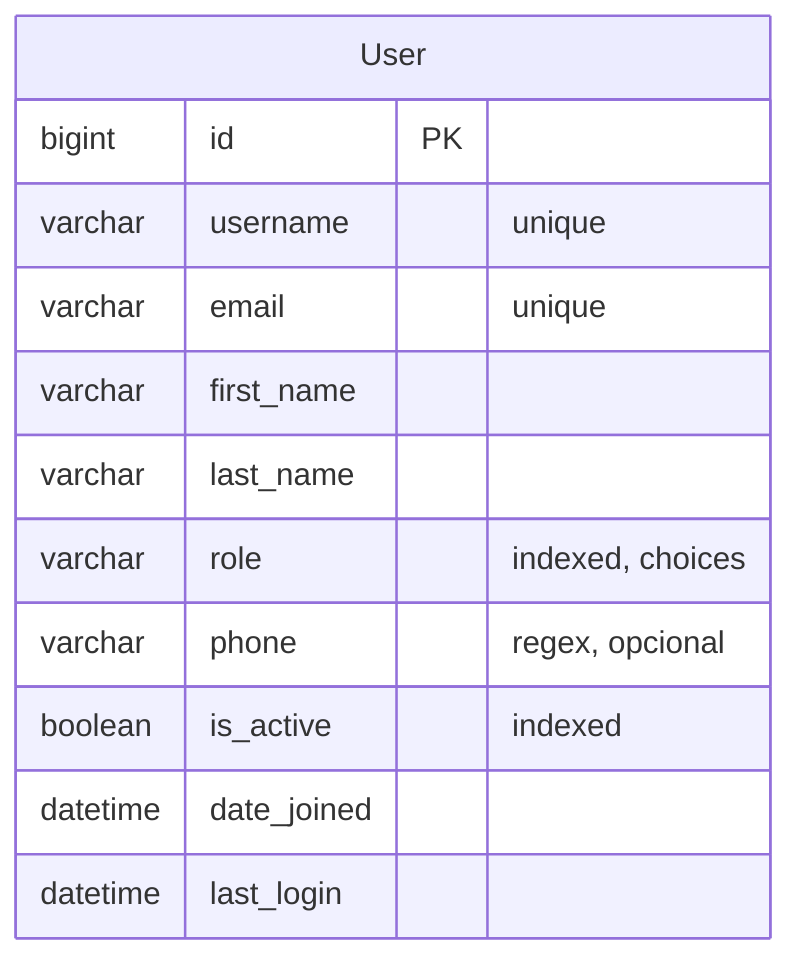

# Fase 02.5 — Usuarios y Roles (Users)

> Estado: Pendiente
> Insertada entre la fase 02 (Branches) y la fase 03 (Equipment) porque varios endpoints futuros (asignación de mantenimientos, técnicos por equipo, auditoría) referencian al usuario autenticado y su rol.

## 1. Objetivo y alcance

Modelo de **usuarios** con un único campo `role` (de un set fijo de 5 roles) que reemplaza al `auth.User` por defecto de Django. Los nombres de modelo y código en inglés (`User`, `Role`); los textos visibles al usuario, validaciones y errores en español. Endpoints REST para CRUD + perfil propio (`/me/`) + cambio de contraseña.

Roles soportados (`TextChoices`):

| Code (DB)     | Label (UI español)  | Descripción funcional                                                               |
| ------------- | ------------------- | ----------------------------------------------------------------------------------- |
| `superadmin`  | Superadministrador  | Control total. Único rol que puede crear/editar otros `superadmin` o `admin`.       |
| `admin`       | Administrador       | Gestión de usuarios (excepto `superadmin`), sedes, equipos, mantenimientos, fallos. |
| `coordinador` | Coordinador         | Programa mantenimientos, asigna ingenieros/técnicos. (Permisos finos en fase 05.)   |
| `ingeniero`   | Ingeniero biomédico | Ejecuta mantenimientos preventivos/correctivos, registra historial.                 |
| `tecnico`     | Técnico             | Reporta fallos, ejecuta mantenimientos preventivos básicos.                         |

**Out of scope (esta fase):**

- FK `branch` en el usuario (asignación a una sede). Se añadirá cuando se definan reglas de permisos por sede.
- Permisos por objeto / por sede.
- Reset de contraseña por correo (se hará en fase de email + Celery).
- Activación de cuenta vía token / verificación de correo.
- Multi-rol o pertenencia a `Group`.
- Login social.

## 2. Stack y dependencias específicas

No introduce dependencias nuevas. Reutiliza:

- `django.contrib.auth.models.AbstractUser` y `BaseUserManager`.
- `rest_framework_simplejwt` para JWT (ya instalado en fase 01).
- `factory-boy` + `pytest-django` para tests.

Settings tocados:

- `LOCAL_APPS` en `config/settings/base.py`: añadir `"apps.users"` **antes** de `"apps.branches"`.
- Nueva clave `AUTH_USER_MODEL = "users.User"` en `base.py`.

> ⚠️ **Cambio de `AUTH_USER_MODEL` requiere reset de DB en dev.** Como Django ya aplicó migraciones de `auth.User`, se ejecuta `docker compose down -v` para borrar el volumen `postgres_data`, luego `docker compose up`. Las migraciones se reaplican con el nuevo `User` desde cero. Los datos locales de `branches` se pierden (no hay nada importante que conservar todavía).

## 3. Modelo de datos

### 3.1 Modelo `User` (`apps/users/models.py`)

Extiende `AbstractUser` (mantiene `username`, `password`, `first_name`, `last_name`, `is_staff`, `is_superuser`, `is_active`, `date_joined`, `last_login`). Sobre eso:

| Campo        | Tipo                | Constraints                                  | Descripción                          | Visible al usuario       |
| ------------ | ------------------- | -------------------------------------------- | ------------------------------------ | ------------------------ |
| `id`         | `BigAutoField`      | PK                                           | Identificador                        | "ID"                     |
| `username`   | `CharField(150)`    | `unique=True`, `UnicodeUsernameValidator`    | Nombre de usuario para login         | `_("Nombre de usuario")` |
| `email`      | `EmailField`        | `unique=True`, **requerido**                 | Correo institucional                 | `_("Correo electrónico")`|
| `first_name` | `CharField(150)`    | `blank=False` (override)                     | Nombres                              | `_("Nombres")`           |
| `last_name`  | `CharField(150)`    | `blank=False` (override)                     | Apellidos                            | `_("Apellidos")`         |
| `role`       | `CharField(20)`     | `choices=Role.choices`, `default=TECNICO`, indexado | Rol del usuario               | `_("Rol")`               |
| `phone`      | `CharField(30)`     | regex (mismo de Branch), `blank=True`        | Teléfono de contacto                 | `_("Teléfono")`          |
| `is_active`  | `BooleanField`      | `default=True` (heredado, indexado explícito)| Si la cuenta puede iniciar sesión    | `_("Activo")`            |
| `date_joined`| `DateTimeField`     | `auto_now_add` (heredado)                    | Fecha de creación                    | `_("Fecha de alta")`     |
| `last_login` | `DateTimeField`     | (heredado, lo setea Django al login)         | Último acceso                        | `_("Último acceso")`     |

Notas:

- `email` se vuelve `required` y `unique` (override de `AbstractUser` donde es `blank=True` y no único).
- `REQUIRED_FIELDS = ["email", "first_name", "last_name", "role"]` (campos que pide `createsuperuser` además de `username` y `password`).
- `USERNAME_FIELD = "username"` (default de `AbstractUser`).

Meta:

- `verbose_name = _("Usuario")`, `verbose_name_plural = _("Usuarios")`
- `ordering = ["username"]`
- Índices: `user_role_idx` (role), `user_is_active_idx` (is_active), `user_email_idx` (email — además del unique).

### 3.2 Choices/Enums

```python
class Role(models.TextChoices):
    SUPERADMIN = "superadmin", _("Superadministrador")
    ADMIN = "admin", _("Administrador")
    COORDINADOR = "coordinador", _("Coordinador")
    INGENIERO = "ingeniero", _("Ingeniero biomédico")
    TECNICO = "tecnico", _("Técnico")
```

### 3.3 Manager (`apps/users/managers.py`)

Combina la chainable QuerySet (patrón Branch) con `BaseUserManager` (necesario para `create_user` / `create_superuser`):

- `UserQuerySet`: `.active()`, `.inactive()`, `.by_role(role)`, `.staff_roles()` (devuelve `superadmin` + `admin`).
- `UserManager(BaseUserManager.from_queryset(UserQuerySet))`:
  - `_create_user(username, email, password, **extra)` — privado, normaliza email, setea password con `set_password`, `save`.
  - `create_user(...)` — defaults `is_staff=False`, `is_superuser=False`, `role=TECNICO`.
  - `create_superuser(...)` — defaults `is_staff=True`, `is_superuser=True`, `role=SUPERADMIN`. Valida que esos flags estén en `True`.
  - `use_in_migrations = True`.

### 3.4 Relaciones



(En fases siguientes: `Equipment.assigned_user → User`, `Maintenance.engineer → User`, `Failure.reported_by → User`.)

## 4. Capa API

### 4.1 Endpoints

Montados en `/api/v1/users/` por router DRF (`DefaultRouter` con `basename="user"`, namespace `v1:users`).

| Método | Path                                  | Descripción                       | Permisos                                              | Status codes              |
| ------ | ------------------------------------- | --------------------------------- | ----------------------------------------------------- | ------------------------- |
| GET    | `/api/v1/users/`                      | Lista paginada                    | `IsAdminRole` (admin, superadmin)                     | 200, 401, 403             |
| POST   | `/api/v1/users/`                      | Crear usuario                     | `IsAdminRole`                                         | 201, 400, 401, 403        |
| GET    | `/api/v1/users/{id}/`                 | Detalle                           | `IsAdminRole` o `self`                                | 200, 401, 403, 404        |
| PUT    | `/api/v1/users/{id}/`                 | Reemplazo total                   | `IsAdminRole`                                         | 200, 400, 401, 403, 404   |
| PATCH  | `/api/v1/users/{id}/`                 | Actualización parcial             | `IsAdminRole` o `self` (sin cambiar `role`/`is_active`)| 200, 400, 401, 403, 404  |
| DELETE | `/api/v1/users/{id}/`                 | Eliminación física                | `IsAdminRole` (no puede borrarse a sí mismo)          | 204, 401, 403, 404, 409   |
| GET    | `/api/v1/users/me/`                   | Perfil propio                     | `IsAuthenticated`                                     | 200, 401                  |
| POST   | `/api/v1/users/{id}/set_password/`    | Cambiar contraseña                | `IsAdminRole` o `self`                                | 204, 400, 401, 403, 404   |

### 4.2 Filtros, search, ordering

- **Filter** (`UserFilter`): `?role=` (exact), `?is_active=` (true/false).
- **Search** (`?search=`): sobre `username`, `email`, `first_name`, `last_name` (icontains).
- **Ordering** (`?ordering=`): `username`, `email`, `role`, `date_joined`. Default `username`.
- **Paginación**: heredada (page size 20).

### 4.3 Serializers

- **`UserSerializer`** (lectura/listado/detalle):
  - Campos: `id`, `username`, `email`, `first_name`, `last_name`, `role`, `role_display` (read-only — label en español), `phone`, `is_active`, `date_joined`, `last_login`.
  - `read_only_fields = ("id", "role_display", "date_joined", "last_login")`.

- **`UserCreateSerializer`** (POST):
  - Campos del anterior + `password` (write-only, `min_length=8`, validado con `django.contrib.auth.password_validation.validate_password`).
  - `email` y `username` validados case-insensitive únicos.
  - Si el caller no es `superadmin`, no puede crear otro `superadmin` → 400 `"Solo un superadministrador puede crear superadministradores."`.

- **`UserUpdateSerializer`** (PUT/PATCH):
  - Iguales a create pero `password` opcional/excluido (cambio se hace por `set_password`).
  - Mismas reglas de unicidad excluyendo el `instance` en update.
  - Si el caller no es `superadmin`, no puede asignar/quitar `role=superadmin`.

- **`PasswordChangeSerializer`** (`set_password` action):
  - Campos: `current_password` (requerido si el caller cambia su propia contraseña), `new_password` (requerido, validado con `validate_password`).
  - Si el caller es admin/superadmin cambiando contraseña de otro usuario, `current_password` no es requerido.

### 4.4 Permisos

Clase `IsAdminRole` en `api/v1/users/permissions.py`:

```python
class IsAdminRole(permissions.BasePermission):
    """Permite acceso a usuarios con rol superadmin o admin."""

    def has_permission(self, request, view):
        return (
            request.user
            and request.user.is_authenticated
            and request.user.role in {User.Role.SUPERADMIN, User.Role.ADMIN}
        )
```

Lógica fina en el viewset:

- `get_permissions()`: para `me` → `IsAuthenticated`; para `retrieve` y `set_password` → `IsAdminRole | IsSelf`; para el resto (`list`, `create`, `update`, `partial_update`, `destroy`) → `IsAdminRole`.
- `IsSelf`: `obj.pk == request.user.pk`.
- En `destroy`: si `request.user.pk == kwargs["pk"]`, devolver 409 con mensaje en español ("No puedes eliminar tu propia cuenta.").

## 5. Reglas de negocio

- **Unicidad case-insensitive** de `username` y `email` en serializers (Django solo asegura unicidad case-sensitive en Postgres).
- **Normalización**: `username.strip()`, `email = BaseUserManager.normalize_email(...).lower()`, `first_name`/`last_name` con `" ".join(value.split()).strip()`.
- **Cambio de rol a `superadmin`**: solo otro `superadmin` puede hacerlo (en create o update). Caso contrario → 400 con mensaje en español.
- **Validación de contraseña**: usa `AUTH_PASSWORD_VALIDATORS` ya configurado (mín 8, no común, no numérica pura, no similar a username/email).
- **Eliminación**: no permitir self-delete (409).
- **No exponer `password`** ni hash en ninguna respuesta. Setearlo solo via `create_user` o `set_password`.
- **`is_staff` / `is_superuser`**: no se exponen en la API. Se setean automáticamente en `createsuperuser`. La autoría queda en CLI/admin.
- Login se hace contra `username` (default JWT). El email **no** sirve como login en esta fase.

## 6. Snippets clave de implementación

### 6.1 Modelo (`apps/users/models.py`)

```python
from django.contrib.auth.models import AbstractUser
from django.core.validators import RegexValidator
from django.db import models
from django.utils.translation import gettext_lazy as _

from .managers import UserManager


phone_validator = RegexValidator(
    regex=r"^\+?[0-9\s\-()]{7,20}$",
    message=_("El teléfono no tiene un formato válido."),
)


class User(AbstractUser):
    class Role(models.TextChoices):
        SUPERADMIN = "superadmin", _("Superadministrador")
        ADMIN = "admin", _("Administrador")
        COORDINADOR = "coordinador", _("Coordinador")
        INGENIERO = "ingeniero", _("Ingeniero biomédico")
        TECNICO = "tecnico", _("Técnico")

    email = models.EmailField(_("Correo electrónico"), unique=True)
    first_name = models.CharField(_("Nombres"), max_length=150)
    last_name = models.CharField(_("Apellidos"), max_length=150)
    role = models.CharField(
        _("Rol"),
        max_length=20,
        choices=Role.choices,
        default=Role.TECNICO,
    )
    phone = models.CharField(
        _("Teléfono"),
        max_length=30,
        blank=True,
        validators=[phone_validator],
    )

    REQUIRED_FIELDS = ["email", "first_name", "last_name", "role"]

    objects = UserManager()

    class Meta:
        verbose_name = _("Usuario")
        verbose_name_plural = _("Usuarios")
        ordering = ["username"]
        indexes = [
            models.Index(fields=["role"], name="user_role_idx"),
            models.Index(fields=["is_active"], name="user_is_active_idx"),
            models.Index(fields=["email"], name="user_email_idx"),
        ]

    def __str__(self) -> str:
        return f"{self.username} ({self.get_role_display()})"

    @property
    def is_admin_role(self) -> bool:
        return self.role in {self.Role.SUPERADMIN, self.Role.ADMIN}
```

### 6.2 Manager (`apps/users/managers.py`)

```python
from django.contrib.auth.models import BaseUserManager
from django.db import models
from django.utils.translation import gettext_lazy as _


class UserQuerySet(models.QuerySet):
    def active(self):
        return self.filter(is_active=True)

    def inactive(self):
        return self.filter(is_active=False)

    def by_role(self, role):
        return self.filter(role=role)

    def staff_roles(self):
        return self.filter(role__in=["superadmin", "admin"])


class UserManager(BaseUserManager.from_queryset(UserQuerySet)):
    use_in_migrations = True

    def _create_user(self, username, email, password, **extra_fields):
        if not username:
            raise ValueError(_("El nombre de usuario es obligatorio."))
        if not email:
            raise ValueError(_("El correo electrónico es obligatorio."))
        email = self.normalize_email(email).lower()
        user = self.model(username=username, email=email, **extra_fields)
        user.set_password(password)
        user.save(using=self._db)
        return user

    def create_user(self, username, email=None, password=None, **extra_fields):
        extra_fields.setdefault("is_staff", False)
        extra_fields.setdefault("is_superuser", False)
        extra_fields.setdefault("role", "tecnico")
        return self._create_user(username, email, password, **extra_fields)

    def create_superuser(self, username, email=None, password=None, **extra_fields):
        extra_fields.setdefault("is_staff", True)
        extra_fields.setdefault("is_superuser", True)
        extra_fields.setdefault("role", "superadmin")
        if extra_fields.get("is_staff") is not True:
            raise ValueError(_("El superusuario debe tener is_staff=True."))
        if extra_fields.get("is_superuser") is not True:
            raise ValueError(_("El superusuario debe tener is_superuser=True."))
        return self._create_user(username, email, password, **extra_fields)
```

### 6.3 Serializers (`api/v1/users/serializers.py`)

`UserSerializer`, `UserCreateSerializer`, `UserUpdateSerializer`, `PasswordChangeSerializer`. Todos validan unicidad case-insensitive de `username` y `email`, normalizan strings, y validan que solo `superadmin` pueda asignar rol `superadmin`. La contraseña pasa por `validate_password` de Django.

### 6.4 Filter (`api/v1/users/filters.py`)

```python
from django_filters import rest_framework as filters

from apps.users.models import User


class UserFilter(filters.FilterSet):
    role = filters.ChoiceFilter(choices=User.Role.choices)
    is_active = filters.BooleanFilter()

    class Meta:
        model = User
        fields = ("role", "is_active")
```

### 6.5 Permisos (`api/v1/users/permissions.py`)

```python
from rest_framework import permissions

from apps.users.models import User


class IsAdminRole(permissions.BasePermission):
    message = "No tienes permisos para esta acción."

    def has_permission(self, request, view):
        u = request.user
        return bool(u and u.is_authenticated and u.role in {User.Role.SUPERADMIN, User.Role.ADMIN})


class IsSelf(permissions.BasePermission):
    def has_object_permission(self, request, view, obj):
        return obj.pk == request.user.pk
```

### 6.6 ViewSet (`api/v1/users/views.py`)

```python
class UserViewSet(viewsets.ModelViewSet):
    queryset = User.objects.all()
    permission_classes = (IsAuthenticated,)
    filterset_class = UserFilter
    search_fields = ("username", "email", "first_name", "last_name")
    ordering_fields = ("username", "email", "role", "date_joined")
    ordering = ("username",)

    def get_serializer_class(self):
        if self.action == "create":
            return UserCreateSerializer
        if self.action in ("update", "partial_update"):
            return UserUpdateSerializer
        if self.action == "set_password":
            return PasswordChangeSerializer
        return UserSerializer

    def get_permissions(self):
        if self.action == "me":
            return [IsAuthenticated()]
        if self.action in ("retrieve", "set_password"):
            return [IsAuthenticated(), (IsAdminRole | IsSelf)()]
        return [IsAuthenticated(), IsAdminRole()]

    def perform_destroy(self, instance):
        if instance.pk == self.request.user.pk:
            raise serializers.ValidationError(
                {"detail": _("No puedes eliminar tu propia cuenta.")},
                code="self_delete",
            )
        instance.delete()

    @action(detail=False, methods=["get"])
    def me(self, request):
        return Response(UserSerializer(request.user).data)

    @action(detail=True, methods=["post"], url_path="set_password")
    def set_password(self, request, pk=None):
        user = self.get_object()
        serializer = PasswordChangeSerializer(
            data=request.data,
            context={"request": request, "target_user": user},
        )
        serializer.is_valid(raise_exception=True)
        user.set_password(serializer.validated_data["new_password"])
        user.save(update_fields=["password"])
        return Response(status=status.HTTP_204_NO_CONTENT)
```

### 6.7 URLs (`api/v1/users/urls.py`)

```python
from rest_framework.routers import DefaultRouter

from .views import UserViewSet

app_name = "users"

router = DefaultRouter()
router.register(r"", UserViewSet, basename="user")

urlpatterns = router.urls
```

Y en `api/v1/urls.py` se añade **antes** de `branches`:

```python
path("users/", include(("api.v1.users.urls", "users"), namespace="users")),
```

### 6.8 Admin (`apps/users/admin.py`)

Hereda de `UserAdmin` para no perder UX nativa (form de password con hashing, `usable_password`, etc.):

```python
@admin.register(User)
class CustomUserAdmin(UserAdmin):
    list_display = ("username", "email", "first_name", "last_name", "role", "is_active", "date_joined")
    list_filter = ("role", "is_active", "is_staff")
    search_fields = ("username", "email", "first_name", "last_name")
    ordering = ("username",)
    fieldsets = (
        (None, {"fields": ("username", "password")}),
        (_("Información personal"), {"fields": ("first_name", "last_name", "email", "phone")}),
        (_("Rol y permisos"), {"fields": ("role", "is_active", "is_staff", "is_superuser", "groups", "user_permissions")}),
        (_("Fechas"), {"fields": ("last_login", "date_joined")}),
    )
    add_fieldsets = (
        (None, {
            "classes": ("wide",),
            "fields": ("username", "email", "first_name", "last_name", "role", "password1", "password2"),
        }),
    )
```

## 7. Tests

### 7.1 Estructura

```
apps/users/tests/
├── __init__.py
├── factories.py        # UserFactory + helpers superadmin_factory, admin_factory, ...
├── conftest.py         # api_client, user, superadmin, admin, tecnico, auth_client(role)
├── test_models.py      # TestUserModel, TestUserManager
└── test_api.py         # TestUserAuth, TestUserPermissions, TestUserList, TestUserCreate,
                        # TestUserUpdate, TestUserDelete, TestUserMe, TestSetPassword
```

### 7.2 Casos cubiertos

**Modelo:**

- `__str__` formato `username (Rol)`.
- `is_admin_role` → True para superadmin/admin, False para los demás.
- Default `role=TECNICO`.
- `phone` rechaza `"abc"`, acepta `"+57 300 555 1234"`.
- `email` único: crear dos con mismo email → IntegrityError.

**Manager:**

- `User.objects.active()` y `.inactive()`.
- `.by_role("ingeniero")` filtra solo ingenieros.
- `.staff_roles()` devuelve superadmin + admin.
- `create_user("juan", "j@x.com", "pwd")` setea password hasheado, `is_staff=False`, `role=tecnico`.
- `create_superuser(...)` setea `is_staff=is_superuser=True`, `role=superadmin`.
- `create_user(username="")` → ValueError mensaje en español.
- `create_user(username="x", email="")` → ValueError mensaje en español.

**API auth:**

- Listado sin token → 401.
- `/me/` sin token → 401.

**API permisos:**

- `tecnico` listando → 403.
- `tecnico` creando → 403.
- `admin` creando otro `tecnico` → 201.
- `admin` creando `superadmin` → 400 mensaje "Solo un superadministrador puede crear superadministradores".
- `superadmin` creando `superadmin` → 201.
- `tecnico` GET `/api/v1/users/{otro_id}/` → 403.
- `tecnico` GET `/api/v1/users/{su_propio_id}/` → 200.
- `tecnico` PATCH otro usuario → 403.
- `tecnico` DELETE → 403.

**API list:**

- 200, paginado.
- Filtro `?role=ingeniero`.
- Filtro `?is_active=false`.
- Search `?search=juan` matchea username/email/first_name/last_name.
- Ordering `?ordering=-date_joined`.

**API create:**

- 201 + persiste usuario con password hasheado.
- Respuesta NO contiene `password`.
- Username duplicado (case-insensitive) → 400 "Ya existe un usuario con este nombre de usuario".
- Email duplicado (case-insensitive) → 400 "Ya existe un usuario con este correo".
- Password corto (< 8) → 400 con error de password.
- Sin campos requeridos → 400 por campo.
- Phone inválido → 400 "El teléfono no tiene un formato válido".

**API update (PATCH):**

- Admin cambia `first_name` de un técnico → 200.
- Admin intenta promover un usuario a `superadmin` → 400.
- Superadmin promueve a `superadmin` → 200.
- PATCH con su propio username actual → 200 (no error de duplicado contra sí mismo).
- Self PATCH propio campo `phone` → 200.
- Self PATCH propio `role` → 403 (un técnico no puede auto-promoverse).

**API delete:**

- Admin elimina técnico → 204.
- Admin intenta auto-eliminarse → 409 "No puedes eliminar tu propia cuenta".
- Inexistente → 404.

**API /me/:**

- Cualquier autenticado → 200 con su propia data.
- No incluye `password`.

**API set_password:**

- Self con `current_password` correcto + nuevo válido → 204; el usuario puede loguearse con la nueva.
- Self con `current_password` incorrecto → 400 "La contraseña actual es incorrecta".
- Self con nueva contraseña corta → 400.
- Admin cambia password de otro usuario sin `current_password` → 204.
- Tecnico intenta cambiar password de otro → 403.

### 7.3 Fixtures clave (`apps/users/tests/conftest.py`)

```python
@pytest.fixture
def superadmin(db):
    return UserFactory(role=User.Role.SUPERADMIN, is_staff=True, is_superuser=True)

@pytest.fixture
def admin(db):
    return UserFactory(role=User.Role.ADMIN)

@pytest.fixture
def tecnico(db):
    return UserFactory(role=User.Role.TECNICO)

@pytest.fixture
def auth_client(api_client):
    def _make(user):
        api_client.force_authenticate(user=user)
        return api_client
    return _make
```

### 7.4 Comandos

```bash
docker compose exec web pytest apps/users -v
docker compose exec web pytest apps/users --cov=apps.users --cov=api.v1.users
```

### 7.5 Impacto en tests existentes (branches)

`apps/branches/tests/factories.py` actualmente define un `UserFactory` local. Se mueve la implementación canónica a `apps/users/tests/factories.py` y `branches` lo importa:

```python
# apps/branches/tests/factories.py
from apps.users.tests.factories import UserFactory  # noqa: F401
```

Esto evita duplicación y mantiene un solo `UserFactory` con `role` por defecto válido.

## 8. Pruebas manuales con Postman

### 8.1 Variables de entorno Postman (heredadas + nuevas)

| Nombre               | Valor inicial                | Descripción                                |
| -------------------- | ---------------------------- | ------------------------------------------ |
| `base_url`           | `http://localhost:8000`      | Base URL del API                           |
| `access_token`       | (vacío, lo setea login)      | JWT de acceso                              |
| `refresh_token`      | (vacío, lo setea login)      | JWT de refresh                             |
| `user_id`            | (vacío, lo setea create)     | ID del usuario recién creado               |
| `branch_id`          | (vacío, fase 02)             | Heredada                                   |

### 8.2 Setup inicial

Antes de probar la colección, crear un superusuario en el contenedor:

```bash
docker compose exec web python manage.py createsuperuser
# username: admin
# email: admin@biometric.test
# first_name: Admin
# last_name: Principal
# role: superadmin (default al usar createsuperuser)
# password: AdminPass123!
```

### 8.3 Endpoints de la colección

#### Auth · Login

```http
POST {{base_url}}/api/v1/auth/token/
Content-Type: application/json

{"username": "admin", "password": "AdminPass123!"}
```

Test script (Postman):

```js
pm.test("status 200", () => pm.response.to.have.status(200));
const body = pm.response.json();
pm.environment.set("access_token", body.access);
pm.environment.set("refresh_token", body.refresh);
```

#### Auth · Refresh

```http
POST {{base_url}}/api/v1/auth/token/refresh/
Content-Type: application/json

{"refresh": "{{refresh_token}}"}
```

#### Users · List

```http
GET {{base_url}}/api/v1/users/?role=tecnico&ordering=username
Authorization: Bearer {{access_token}}
```

Response 200:

```json
{
  "count": 1,
  "next": null,
  "previous": null,
  "results": [
    {
      "id": 2,
      "username": "tecnico1",
      "email": "tecnico1@biometric.test",
      "first_name": "Pedro",
      "last_name": "Pérez",
      "role": "tecnico",
      "role_display": "Técnico",
      "phone": "+57 300 555 0001",
      "is_active": true,
      "date_joined": "2026-04-29T20:30:00Z",
      "last_login": null
    }
  ]
}
```

#### Users · Create

```http
POST {{base_url}}/api/v1/users/
Authorization: Bearer {{access_token}}
Content-Type: application/json

{
  "username": "ingeniero1",
  "email": "ingeniero1@biometric.test",
  "first_name": "María",
  "last_name": "Gómez",
  "role": "ingeniero",
  "phone": "+57 300 555 1111",
  "password": "IngePass123!"
}
```

Test script:

```js
pm.test("status 201", () => pm.response.to.have.status(201));
pm.environment.set("user_id", pm.response.json().id);
```

#### Users · Retrieve

```http
GET {{base_url}}/api/v1/users/{{user_id}}/
Authorization: Bearer {{access_token}}
```

#### Users · Update (PATCH)

```http
PATCH {{base_url}}/api/v1/users/{{user_id}}/
Authorization: Bearer {{access_token}}
Content-Type: application/json

{"phone": "+57 300 999 0000"}
```

#### Users · Me

```http
GET {{base_url}}/api/v1/users/me/
Authorization: Bearer {{access_token}}
```

#### Users · Set password

Self-cambio:

```http
POST {{base_url}}/api/v1/users/{{user_id}}/set_password/
Authorization: Bearer {{access_token}}
Content-Type: application/json

{"current_password": "IngePass123!", "new_password": "IngeNueva456!"}
```

Admin cambio (sin current_password):

```http
POST {{base_url}}/api/v1/users/{{user_id}}/set_password/
Authorization: Bearer {{access_token}}
Content-Type: application/json

{"new_password": "AdminReseteo789!"}
```

#### Users · Delete

```http
DELETE {{base_url}}/api/v1/users/{{user_id}}/
Authorization: Bearer {{access_token}}
```

#### Casos de error esperados

**Sin token (401):** `{"detail": "Authentication credentials were not provided."}`

**Permiso insuficiente (403):** `{"detail": "No tienes permisos para esta acción."}`

**Username duplicado (400):** `{"username": ["Ya existe un usuario con este nombre de usuario."]}`

**Email duplicado (400):** `{"email": ["Ya existe un usuario con este correo electrónico."]}`

**Password débil (400):** `{"password": ["La contraseña es demasiado corta. Debe contener al menos 8 caracteres."]}`

**Promoción sin permiso (400):** `{"role": ["Solo un superadministrador puede asignar el rol superadministrador."]}`

**Self-delete (409):** `{"detail": "No puedes eliminar tu propia cuenta."}`

### 8.4 Archivo entregable

`docs/postman/biometric_api.postman_collection.json` — formato Postman Collection v2.1.0, listo para `Import` en Postman. Incluye:

- Folder `Auth`: Login (con test que setea `access_token` y `refresh_token`), Refresh, Verify.
- Folder `Users`: Me, List, Create (con test que setea `user_id`), Retrieve, Update PATCH, Update PUT, Set Password (self), Set Password (admin), Delete.
- Folder `Branches`: List, Create, Retrieve, Update, Delete (heredados de fase 02).
- Variables de colección: `base_url`, `access_token`, `refresh_token`, `user_id`, `branch_id`.

## 9. Checklist de verificación

- [ ] `AUTH_USER_MODEL = "users.User"` en `config/settings/base.py`.
- [ ] `apps.users` registrada **antes** de `apps.branches` en `LOCAL_APPS`.
- [ ] `path("users/", ...)` presente en `api/v1/urls.py` antes de `branches/`.
- [ ] DB reseteada (`docker compose down -v && docker compose up`).
- [ ] Migración `apps/users/0001_initial.py` aplicada.
- [ ] `python manage.py createsuperuser` funciona y crea con `role=superadmin`.
- [ ] `pytest apps/users -v` pasa todos los tests.
- [ ] `pytest apps/branches -v` sigue verde después del cambio de `UserFactory`.
- [ ] Colección Postman importada y los flujos de auth + users + me + set_password funcionan.
- [ ] Swagger (`/api/docs/`) muestra los endpoints de users con sus permisos correctos.
- [ ] Errores en español verificados manualmente para los casos clave (duplicados, permisos, self-delete).

## 10. Posibles extensiones futuras / TODO

- FK `branch` en User (asignación a sede) cuando se decidan permisos por sede.
- Campo `national_id` (cédula/DNI) si se requiere identificación legal.
- Soft delete (`is_deleted` o `deleted_at`) cuando los mantenimientos referencien usuarios con histórico.
- Reset de contraseña vía email con token (fase 05, requiere Celery + email).
- Verificación de email con token al crear cuenta.
- Bloqueo de cuenta tras N intentos fallidos.
- Login por email además de username.
- Auditoría de login (último IP, user agent) — `django-axes` o middleware propio.
- Permisos finos por rol y por objeto (`django-guardian`) cuando crezca el dominio.
- Endpoint de invitación (admin envía invite con token; el usuario completa registro).
