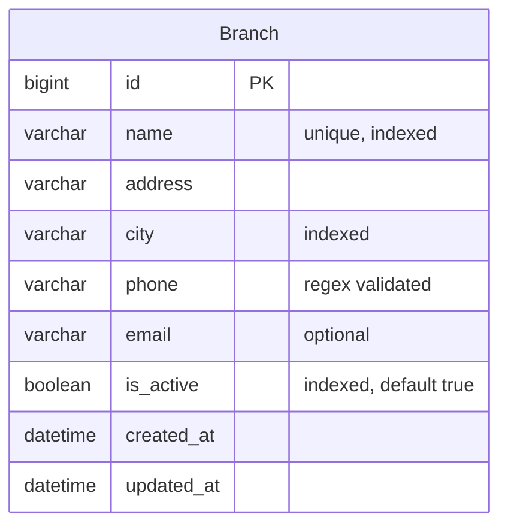

# Fase 02 — Sedes (Branches)

> Estado: Implementada
> Commit: ver `git log apps/branches api/v1/branches`

## 1. Objetivo y alcance

CRUD completo de **Sedes** (clínicas, ubicaciones físicas donde están los equipos). Cada equipo biomédico (fase 03) referencia una sede mediante FK con `PROTECT`. Los nombres de modelo y archivos están en inglés (`Branch`), pero los textos visibles al usuario y en admin están en español.

**Out of scope:**

- Gestión de personal por sede (responsable, contactos múltiples).
- Geolocalización (lat/long) y mapa.
- Bulk import desde CSV.
- Soft delete (la fase usa `DELETE` real porque aún no hay relaciones de dominio).

## 2. Stack y dependencias específicas

No introduce dependencias nuevas. Reutiliza:

- DRF + `django-filter` para filtros.
- `factory-boy` + `pytest-django` para tests.
- `IsAuthenticated` global (heredado de `REST_FRAMEWORK.DEFAULT_PERMISSION_CLASSES`).

Settings tocados:

- `INSTALLED_APPS` en `config/settings/base.py`: se añade `"apps.branches"`.
- `api/v1/urls.py`: se añade la línea
  ```python
  path("branches/", include(("api.v1.branches.urls", "branches"), namespace="branches")),
  ```

## 3. Modelo de datos

### 3.1 Modelo `Branch` (`apps/branches/models.py`)

| Campo        | Tipo            | Constraints                                  | Descripción                       | Visible al usuario          |
| ------------ | --------------- | -------------------------------------------- | --------------------------------- | --------------------------- |
| `id`         | `BigAutoField`  | PK                                           | Identificador                     | "ID"                        |
| `name`       | `CharField(120)`| `unique=True`, indexado                      | Nombre único de la sede           | `_("Nombre")`               |
| `address`    | `CharField(255)`|                                              | Dirección física                  | `_("Dirección")`            |
| `city`       | `CharField(80)` | `db_index=True`                              | Ciudad                            | `_("Ciudad")`               |
| `phone`      | `CharField(30)` | `RegexValidator` `^\+?[0-9\s\-()]{7,20}$`    | Teléfono de contacto              | `_("Teléfono")`             |
| `email`      | `EmailField`    | `blank=True`                                 | Correo de contacto (opcional)     | `_("Correo electrónico")`   |
| `is_active`  | `BooleanField`  | `default=True`, indexado                     | Si la sede está operativa         | `_("Activa")`               |
| `created_at` | `DateTimeField` | `auto_now_add=True`                          | Auditoría                         | `_("Creada")`               |
| `updated_at` | `DateTimeField` | `auto_now=True`                              | Auditoría                         | `_("Actualizada")`          |

Meta:
- `verbose_name = _("Sede")`, `verbose_name_plural = _("Sedes")`
- `ordering = ["name"]`
- Índices: `branch_name_idx` (name), `branch_city_idx` (city), `branch_is_active_idx` (is_active).

### 3.2 Choices/Enums

No aplica (no hay enums en este modelo).

### 3.3 Relaciones



(Las relaciones reales aparecen en fase 03 cuando `Equipment.branch → Branch (PROTECT)`.)

## 4. Capa API

### 4.1 Endpoints

Montados en `/api/v1/branches/` por router DRF (`DefaultRouter` con `basename="branch"`, namespace `v1:branches`).

| Método | Path                          | Descripción                  | Permisos        | Status codes              |
| ------ | ----------------------------- | ---------------------------- | --------------- | ------------------------- |
| GET    | `/api/v1/branches/`           | Lista paginada               | IsAuthenticated | 200, 401                  |
| POST   | `/api/v1/branches/`           | Crear sede                   | IsAuthenticated | 201, 400, 401             |
| GET    | `/api/v1/branches/{id}/`      | Detalle                      | IsAuthenticated | 200, 401, 404             |
| PUT    | `/api/v1/branches/{id}/`      | Reemplazo total              | IsAuthenticated | 200, 400, 401, 404        |
| PATCH  | `/api/v1/branches/{id}/`      | Actualización parcial        | IsAuthenticated | 200, 400, 401, 404        |
| DELETE | `/api/v1/branches/{id}/`      | Eliminación física           | IsAuthenticated | 204, 401, 404             |

### 4.2 Filtros, search, ordering

- **Filter** (`BranchFilter`): `?city=` (iexact), `?is_active=` (true/false).
- **Search** (`?search=`): sobre `name` y `address` (icontains).
- **Ordering** (`?ordering=`): `name`, `city`, `created_at`. Default `name`.
- **Paginación**: heredada de `PageNumberPagination` (page size 20). Query params `page`, `page_size`.

### 4.3 Validaciones de serializer

- `name`:
  - Se normaliza con `" ".join(value.split()).strip()` (colapsa espacios).
  - No puede quedar vacío después de normalizar → `_("El nombre no puede estar vacío.")`.
  - No puede duplicar otra sede (case-insensitive, excluyendo la propia en update) → `_("Ya existe una sede con este nombre.")`.
- `city`: se normaliza igual (espacios colapsados).
- `address`: solo `.strip()`.
- `phone`: validado por `RegexValidator` del modelo → `_("El teléfono no tiene un formato válido.")`.
- `email`: opcional, validación nativa de `EmailField`.

## 5. Reglas de negocio

- El nombre de la sede es único **case-insensitive**. La unicidad estricta de Django (`unique=True`) es case-sensitive en Postgres, por eso se complementa con la validación en serializer (`name__iexact`).
- En PATCH con el mismo nombre actual, **no debe** disparar el error de duplicado (se excluye `self.instance`).
- `is_active=False` no oculta la sede: el filtro `is_active` es opt-in. Esto permite que el admin la siga viendo y que pueda reactivarla. (Cuando se introduzca `Equipment`, decidir si los equipos de una sede inactiva siguen visibles.)
- `BranchManager.active() / inactive() / by_city()` están disponibles para uso interno (queries en otros servicios), no se exponen como endpoints separados.
- El admin organiza la sede en tres fieldsets en español: "Información general", "Contacto", "Auditoría". `created_at`/`updated_at` son `readonly_fields`.

## 6. Snippets clave de implementación

### 6.1 Modelo (`apps/branches/models.py`)

```python
from django.core.validators import RegexValidator
from django.db import models
from django.utils.translation import gettext_lazy as _

from .managers import BranchManager


phone_validator = RegexValidator(
    regex=r"^\+?[0-9\s\-()]{7,20}$",
    message=_("El teléfono no tiene un formato válido."),
)


class Branch(models.Model):
    name = models.CharField(_("Nombre"), max_length=120, unique=True,
                            help_text=_("Nombre único de la sede."))
    address = models.CharField(_("Dirección"), max_length=255)
    city = models.CharField(_("Ciudad"), max_length=80, db_index=True)
    phone = models.CharField(_("Teléfono"), max_length=30, validators=[phone_validator])
    email = models.EmailField(_("Correo electrónico"), blank=True)
    is_active = models.BooleanField(_("Activa"), default=True)
    created_at = models.DateTimeField(_("Creada"), auto_now_add=True)
    updated_at = models.DateTimeField(_("Actualizada"), auto_now=True)

    objects = BranchManager()

    class Meta:
        verbose_name = _("Sede")
        verbose_name_plural = _("Sedes")
        ordering = ["name"]
        indexes = [
            models.Index(fields=["name"], name="branch_name_idx"),
            models.Index(fields=["city"], name="branch_city_idx"),
            models.Index(fields=["is_active"], name="branch_is_active_idx"),
        ]

    def __str__(self) -> str:
        return self.name
```

### 6.2 Manager (`apps/branches/managers.py`)

```python
from django.db import models


class BranchQuerySet(models.QuerySet):
    def active(self) -> "BranchQuerySet":
        return self.filter(is_active=True)

    def inactive(self) -> "BranchQuerySet":
        return self.filter(is_active=False)

    def by_city(self, city: str) -> "BranchQuerySet":
        return self.filter(city__iexact=city)


class BranchManager(models.Manager.from_queryset(BranchQuerySet)):
    def get_queryset(self) -> BranchQuerySet:
        return BranchQuerySet(self.model, using=self._db)

    def active(self) -> BranchQuerySet:
        return self.get_queryset().active()

    def inactive(self) -> BranchQuerySet:
        return self.get_queryset().inactive()

    def by_city(self, city: str) -> BranchQuerySet:
        return self.get_queryset().by_city(city)
```

### 6.3 Serializer (`api/v1/branches/serializers.py`)

```python
from django.utils.translation import gettext_lazy as _
from rest_framework import serializers

from apps.branches.models import Branch


class BranchSerializer(serializers.ModelSerializer):
    class Meta:
        model = Branch
        fields = (
            "id", "name", "address", "city", "phone", "email",
            "is_active", "created_at", "updated_at",
        )
        read_only_fields = ("id", "created_at", "updated_at")

    def validate_name(self, value: str) -> str:
        normalized = " ".join(value.split()).strip()
        if not normalized:
            raise serializers.ValidationError(_("El nombre no puede estar vacío."))

        queryset = Branch.objects.filter(name__iexact=normalized)
        if self.instance is not None:
            queryset = queryset.exclude(pk=self.instance.pk)
        if queryset.exists():
            raise serializers.ValidationError(_("Ya existe una sede con este nombre."))
        return normalized

    def validate_city(self, value: str) -> str:
        return " ".join(value.split()).strip()

    def validate_address(self, value: str) -> str:
        return value.strip()
```

### 6.4 Filter (`api/v1/branches/filters.py`)

```python
from django_filters import rest_framework as filters

from apps.branches.models import Branch


class BranchFilter(filters.FilterSet):
    city = filters.CharFilter(field_name="city", lookup_expr="iexact")
    is_active = filters.BooleanFilter(field_name="is_active")

    class Meta:
        model = Branch
        fields = ("city", "is_active")
```

### 6.5 ViewSet (`api/v1/branches/views.py`)

```python
from rest_framework import viewsets
from rest_framework.permissions import IsAuthenticated

from apps.branches.models import Branch

from .filters import BranchFilter
from .serializers import BranchSerializer


class BranchViewSet(viewsets.ModelViewSet):
    """CRUD endpoints for clinic branches."""

    queryset = Branch.objects.all()
    serializer_class = BranchSerializer
    permission_classes = (IsAuthenticated,)
    filterset_class = BranchFilter
    search_fields = ("name", "address")
    ordering_fields = ("name", "city", "created_at")
    ordering = ("name",)
```

### 6.6 URLs (`api/v1/branches/urls.py`)

```python
from rest_framework.routers import DefaultRouter

from .views import BranchViewSet

app_name = "branches"

router = DefaultRouter()
router.register(r"", BranchViewSet, basename="branch")

urlpatterns = router.urls
```

Y la línea añadida en `api/v1/urls.py`:

```python
path("branches/", include(("api.v1.branches.urls", "branches"), namespace="branches")),
```

### 6.7 Migración (`apps/branches/migrations/0001_initial.py`)

`operations = [CreateModel(Branch, fields=…), AddIndex(name), AddIndex(city), AddIndex(is_active)]`. Coincide 1:1 con la definición del modelo. Ver el archivo real para los detalles del `RegexValidator` serializado.

### 6.8 Admin (`apps/branches/admin.py`)

```python
from django.contrib import admin
from django.utils.translation import gettext_lazy as _

from .models import Branch


@admin.register(Branch)
class BranchAdmin(admin.ModelAdmin):
    list_display = ("name", "city", "phone", "email", "is_active", "created_at")
    list_filter = ("is_active", "city")
    search_fields = ("name", "address", "city", "email", "phone")
    ordering = ("name",)
    readonly_fields = ("created_at", "updated_at")
    fieldsets = (
        (_("Información general"), {"fields": ("name", "address", "city", "is_active")}),
        (_("Contacto"), {"fields": ("phone", "email")}),
        (_("Auditoría"), {"fields": ("created_at", "updated_at")}),
    )
```

## 7. Tests

### 7.1 Estructura de archivos

```
apps/branches/tests/
├── __init__.py
├── conftest.py        # fixtures: api_client, auth_client, user, branch
├── factories.py       # UserFactory, BranchFactory
├── test_models.py     # TestBranchModel, TestBranchManager
└── test_api.py        # TestBranchAuth, TestBranchList, TestBranchRetrieve,
                       # TestBranchCreate, TestBranchUpdate, TestBranchDelete
```

### 7.2 Casos cubiertos

**Modelo:**
- `__str__` devuelve el nombre.
- Defaults: `is_active=True`, timestamps no-nulos.
- `phone` rechaza `"abc"` (`full_clean` levanta `ValidationError`).
- `phone` acepta `"+57 300 555 1234"`.

**Manager:**
- `Branch.objects.active()` filtra solo `is_active=True`.
- `Branch.objects.inactive()` filtra solo `is_active=False`.
- `by_city("Bogota")` es case-insensitive (matchea "bogota" y "Bogota").
- `Meta.ordering = ["name"]` produce queryset ordenado alfabéticamente.

**API auth:**
- Lista sin auth → 401.
- Create sin auth → 401.

**API list:**
- Listado paginado (`count`, `results` en el body).
- Filtro `?city=` cuenta correctamente.
- Filtro `?is_active=false`.
- Búsqueda `?search=` sobre `name`.
- Búsqueda `?search=` sobre `address`.
- Ordering `?ordering=city`.

**API retrieve:**
- Devuelve 200 con el body correcto.
- Inexistente → 404.

**API create:**
- 201 + persiste el objeto.
- Nombre duplicado → 400 con mensaje en español "Ya existe una sede con este nombre".
- Phone inválido → 400 con mensaje en español "El teléfono no tiene un formato válido".
- Nombre con espacios extras se normaliza ("   Sede   Norte   " → "Sede Norte").
- Sin campos requeridos → 400 con error por campo (`name`, `address`, `city`, `phone`).

**API update:**
- PUT reemplaza todos los campos.
- PATCH parcial cambia un solo campo.
- PATCH con nombre duplicado de otra sede → 400.
- PATCH con el mismo nombre actual → 200 (no disparar error de duplicado contra sí mismo).

**API delete:**
- 204 + elimina de la DB.
- Inexistente → 404.

### 7.3 Comandos para correrlos

```bash
docker compose exec web pytest apps/branches -v
docker compose exec web pytest apps/branches --cov=apps.branches --cov=api.v1.branches
```

## 8. Pruebas manuales con Postman

### 8.1 Variables de entorno Postman

Hereda las del setup. Se añade:

| Nombre        | Valor inicial | Descripción                                   |
| ------------- | ------------- | --------------------------------------------- |
| `branch_id`   | (vacío)       | Se llena tras crear la primera sede           |

### 8.2 Setup (obtener JWT)

```http
POST {{base_url}}/api/v1/auth/token/
Content-Type: application/json

{"username": "admin", "password": "adminpass"}
```

```js
pm.environment.set("access_token", pm.response.json().access);
```

### 8.3 Endpoints

#### List

```http
GET {{base_url}}/api/v1/branches/
Authorization: Bearer {{access_token}}
```

Response 200:

```json
{
  "count": 2,
  "next": null,
  "previous": null,
  "results": [
    {
      "id": 1,
      "name": "Sede Norte",
      "address": "Calle 100 #15-20",
      "city": "Bogota",
      "phone": "+57 300 555 1234",
      "email": "norte@clinic.test",
      "is_active": true,
      "created_at": "2026-04-29T14:00:00Z",
      "updated_at": "2026-04-29T14:00:00Z"
    }
  ]
}
```

#### List filtrada

```http
GET {{base_url}}/api/v1/branches/?city=Bogota&is_active=true&ordering=name
Authorization: Bearer {{access_token}}
```

#### Search

```http
GET {{base_url}}/api/v1/branches/?search=Norte
Authorization: Bearer {{access_token}}
```

#### Create

```http
POST {{base_url}}/api/v1/branches/
Authorization: Bearer {{access_token}}
Content-Type: application/json

{
  "name": "Sede Norte",
  "address": "Calle 100 #15-20",
  "city": "Bogota",
  "phone": "+57 300 555 1234",
  "email": "norte@clinic.test",
  "is_active": true
}
```

Response 201 con la sede creada. Test script:

```js
pm.test("status 201", () => pm.response.to.have.status(201));
pm.environment.set("branch_id", pm.response.json().id);
```

#### Retrieve

```http
GET {{base_url}}/api/v1/branches/{{branch_id}}/
Authorization: Bearer {{access_token}}
```

#### Update (PUT)

```http
PUT {{base_url}}/api/v1/branches/{{branch_id}}/
Authorization: Bearer {{access_token}}
Content-Type: application/json

{
  "name": "Sede Norte Actualizada",
  "address": "Calle 100 #15-20",
  "city": "Bogota",
  "phone": "+57 300 555 1234",
  "email": "norte@clinic.test",
  "is_active": false
}
```

#### Patch

```http
PATCH {{base_url}}/api/v1/branches/{{branch_id}}/
Authorization: Bearer {{access_token}}
Content-Type: application/json

{"is_active": true}
```

#### Delete

```http
DELETE {{base_url}}/api/v1/branches/{{branch_id}}/
Authorization: Bearer {{access_token}}
```

Response 204 (sin body).

#### Casos de error

**Sin token (401):**

```json
{"detail": "Authentication credentials were not provided."}
```

**Nombre duplicado (400):**

```json
{"name": ["Ya existe una sede con este nombre."]}
```

**Teléfono inválido (400):**

```json
{"phone": ["El teléfono no tiene un formato válido."]}
```

**No encontrado (404):**

```json
{"detail": "No encontrado."}
```

### 8.4 Casos especiales

- **Verificar normalización de `name`:** crear con `"   Sede   Norte   "` y confirmar que la response trae `"name": "Sede Norte"`.
- **Verificar case-insensitive en duplicado:** crear `"Sede Norte"`, luego intentar crear `"sede norte"` → debe fallar 400.
- **Verificar PATCH con el mismo nombre:** PATCH con `{"name": "Sede Norte"}` sobre la misma sede → 200 (no debe ver al objeto como duplicado de sí mismo).

## 9. Checklist de verificación

- [ ] Migración `apps/branches/0001_initial.py` aplicada.
- [ ] `apps.branches` registrada en `INSTALLED_APPS`.
- [ ] `path("branches/", ...)` presente en `api/v1/urls.py`.
- [ ] `pytest apps/branches -v` pasa todos los tests.
- [ ] Postman: CRUD completo OK.
- [ ] Postman: filtros, search y ordering devuelven resultados esperados.
- [ ] Errores en español en duplicado y teléfono inválido.
- [ ] Admin Django muestra Branch en la sección "Sedes" con los fieldsets correctos.
- [ ] Swagger (`/api/docs/`) lista los endpoints de branches.

## 10. Posibles extensiones futuras / TODO

- Soft delete (`is_deleted` o `deleted_at`) cuando los equipos referencien Branch con `PROTECT` y se quiera desactivar sin perder histórico.
- Endpoint `GET /api/v1/branches/{id}/equipment/` (delegado al app `equipment` en fase 03 o como nested route).
- Permisos por rol (admin vs personal de la sede): hoy todos los autenticados pueden CRUD.
- Geolocalización (`PointField` con PostGIS) si se quiere mapa.
- `manager.active()` se podría exponer como `?active=only` además del filtro booleano.
- Auditoría con `django-simple-history` cuando crezca el dominio.
- Validar formato de `email` corporativo (regex de dominio permitido) si se requiere.
