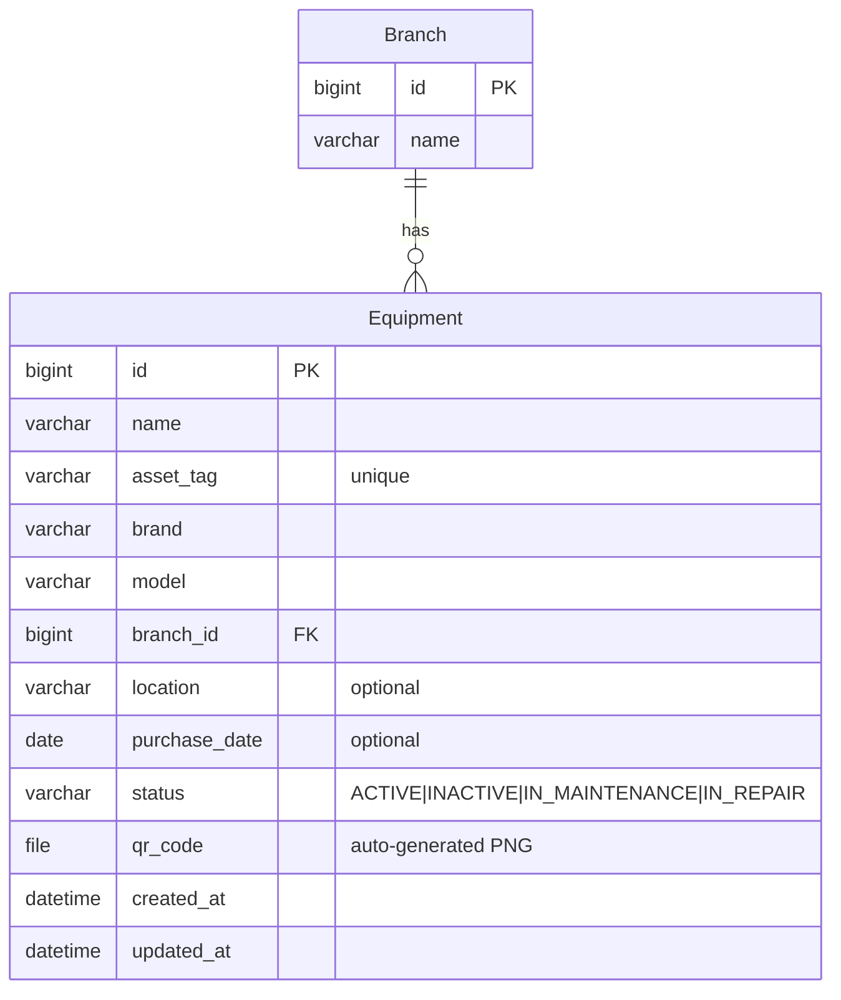

# Fase 03 — Equipos biomédicos (Equipment) + QR

> Estado: Pendiente
> Commit: pendiente

## 1. Objetivo y alcance

CRUD de equipos biomédicos con generación automática de **código QR** al crear un equipo. El QR codifica la URL del frontend para ese equipo (`{FRONTEND_BASE_URL}/equipment/{id}`) y se almacena como archivo PNG vía el `STORAGES["default"]` (S3 en prod, FileSystemStorage en dev).

**Out of scope:**

- Adjuntar imágenes del equipo (foto física).
- Historial de mantenimientos / fallas (fases 04 y 06 respectivamente).
- Programación de mantenimientos (fase 05).
- Gestión de garantías y proveedores.
- Asignación de equipos a personas.
- Bulk import desde CSV/Excel.

## 2. Stack y dependencias específicas

Ya están en `requirements/base.txt`:

```
qrcode[pil]==7.4.2
Pillow==10.3.0
django-storages==1.14.3
boto3==1.34.106
```

Settings consumidos:

- `FRONTEND_BASE_URL` (para componer la URL que codifica el QR).
- `STORAGES["default"]` (S3 si hay credenciales, FS local en dev).

Settings tocados:

- `INSTALLED_APPS` en `config/settings/base.py`: añadir `"apps.equipment"`.
- `api/v1/urls.py`: añadir `path("equipment/", include(("api.v1.equipment.urls", "equipment"), namespace="equipment"))`.

## 3. Modelo de datos

### 3.1 Modelo `Equipment` (`apps/equipment/models.py`)

| Campo            | Tipo                       | Constraints                              | Descripción                              | Visible al usuario               |
| ---------------- | -------------------------- | ---------------------------------------- | ---------------------------------------- | -------------------------------- |
| `id`             | `BigAutoField`             | PK                                       | Identificador inmutable (target del QR)  | "ID"                             |
| `name`           | `CharField(150)`           |                                          | Nombre del equipo                        | `_("Nombre")`                    |
| `asset_tag`      | `CharField(50)`            | `unique=True`, `db_index=True`           | Código interno (placa/etiqueta)          | `_("Código de inventario")`      |
| `brand`          | `CharField(80)`            |                                          | Marca                                    | `_("Marca")`                     |
| `model`          | `CharField(80)`            |                                          | Modelo                                   | `_("Modelo")`                    |
| `branch`         | `FK -> branches.Branch`    | `on_delete=PROTECT`, `related_name="equipment"` | Sede donde está el equipo         | `_("Sede")`                      |
| `location`       | `CharField(120)`           | `blank=True`                             | Ubicación dentro de la sede (sala, piso) | `_("Ubicación")`                 |
| `purchase_date`  | `DateField`                | `null=True`, `blank=True`                | Fecha de compra                          | `_("Fecha de compra")`           |
| `status`         | `CharField(20)` (choices)  | `default=ACTIVE`, `db_index=True`        | Estado operativo                         | `_("Estado")`                    |
| `qr_code`        | `FileField`                | `upload_to="equipment/qr/"`, `blank=True`| PNG del QR (auto-generado)               | `_("Código QR")`                 |
| `created_at`     | `DateTimeField`            | `auto_now_add=True`                      | Auditoría                                | `_("Creado")`                    |
| `updated_at`     | `DateTimeField`            | `auto_now=True`                          | Auditoría                                | `_("Actualizado")`               |

Meta:
- `verbose_name = _("Equipo biomédico")`, `verbose_name_plural = _("Equipos biomédicos")`
- `ordering = ["name"]`
- Indexes: `equipment_asset_tag_idx`, `equipment_branch_idx`, `equipment_status_idx`, `equipment_brand_idx`.

### 3.2 Choices/Enums

`EquipmentStatus(TextChoices)` en el mismo `models.py`:

| Value (inglés)     | Label (español)         | Cuándo se usa                                              |
| ------------------ | ----------------------- | ---------------------------------------------------------- |
| `ACTIVE`           | `_("Operativo")`        | Equipo en uso normal                                       |
| `INACTIVE`         | `_("Fuera de servicio")`| Equipo dado de baja o no en uso                            |
| `IN_MAINTENANCE`   | `_("En mantenimiento")` | Equipo bajo mantenimiento preventivo                       |
| `IN_REPAIR`        | `_("En reparación")`    | Equipo bajo mantenimiento correctivo o reparación de falla |

### 3.3 Relaciones



## 4. Capa API

### 4.1 Endpoints

| Método | Path                                          | Descripción                          | Permisos        | Status codes              |
| ------ | --------------------------------------------- | ------------------------------------ | --------------- | ------------------------- |
| GET    | `/api/v1/equipment/`                          | Lista paginada                       | IsAuthenticated | 200, 401                  |
| POST   | `/api/v1/equipment/`                          | Crear equipo (genera QR async-ish)   | IsAuthenticated | 201, 400, 401             |
| GET    | `/api/v1/equipment/{id}/`                     | Detalle (incluye URL del QR)         | IsAuthenticated | 200, 401, 404             |
| PUT    | `/api/v1/equipment/{id}/`                     | Update total                         | IsAuthenticated | 200, 400, 401, 404        |
| PATCH  | `/api/v1/equipment/{id}/`                     | Update parcial                       | IsAuthenticated | 200, 400, 401, 404        |
| DELETE | `/api/v1/equipment/{id}/`                     | Eliminar                             | IsAuthenticated | 204, 401, 404, 409 (*)    |
| GET    | `/api/v1/equipment/by-asset-tag/{tag}/`       | Buscar por `asset_tag`               | IsAuthenticated | 200, 401, 404             |
| POST   | `/api/v1/equipment/{id}/regenerate-qr/`       | Forzar regeneración del QR           | IsAuthenticated | 200, 401, 404             |

(*) 409 si se intenta eliminar un equipo con historial dependiente cuando se introduzcan FKs `PROTECT` desde fases 04/06. En la fase 03 pura, sería 204.

### 4.2 Filtros, search, ordering

- **Filter** (`EquipmentFilter`):
  - `?branch=` (id, exacto)
  - `?status=` (choices)
  - `?brand=` (icontains)
  - `?purchase_date_after=` y `?purchase_date_before=` (rango).
- **Search** (`?search=`): `name`, `asset_tag`, `model`.
- **Ordering** (`?ordering=`): `name`, `purchase_date`, `created_at`. Default `name`.
- Paginación heredada (page size 20).

### 4.3 Validaciones de serializer

- `asset_tag`:
  - `.strip().upper()` para normalizar.
  - Único (case-insensitive, exclude self en update) → `_("Ya existe un equipo con este código de inventario.")`.
- `name`: `.strip()`, no vacío → `_("El nombre no puede estar vacío.")`.
- `branch`: debe existir, debe estar activa → `_("La sede seleccionada no está activa.")`.
- `purchase_date`: si está, no puede ser futura → `_("La fecha de compra no puede ser futura.")`.
- `status`: debe ser uno de los choices (DRF lo valida solo).
- `qr_code`: `read_only=True` (nunca llega del cliente).

## 5. Reglas de negocio

- **El QR codifica `id`, no `asset_tag`.** Razón: el `id` es inmutable; el `asset_tag` puede corregirse y eso invalidaría QRs ya impresos. La URL codificada es `f"{settings.FRONTEND_BASE_URL}/equipment/{equipment.id}"`.
- **Generación automática del QR:** vía signal `post_save` en `apps/equipment/signals.py`. Se dispara solo cuando `created=True`, llama a `services.generate_qr_for_equipment(equipment)`, guarda el archivo en `equipment.qr_code` y hace `equipment.save(update_fields=["qr_code"])`.
- **Regeneración:** endpoint manual `POST /equipment/{id}/regenerate-qr/`. Útil si se cambia `FRONTEND_BASE_URL` o si el archivo se corrompe. No se regenera automáticamente al editar el equipo.
- **Borrar Equipment con archivo QR:** se debe borrar también el archivo del storage. Implementar con `pre_delete` signal: `equipment.qr_code.delete(save=False)`.
- **`branch` con `on_delete=PROTECT`:** no se permite eliminar una sede con equipos. Postgres devuelve 500 sin manejo, así que hay que capturarlo en una vista o vía un `delete()` override en `BranchViewSet` futuro. Para esta fase: documentar la restricción.
- **Status default:** `ACTIVE`. No se cambia automáticamente cuando se crea un `MaintenanceRecord` o `FailureRecord` (esa lógica vive en fases 04/06; si se quiere, agregar un service `equipment_services.transition_status(equipment, new_status)`).

## 6. Snippets clave de implementación

### 6.1 Modelo (`apps/equipment/models.py`)

```python
from django.db import models
from django.utils.translation import gettext_lazy as _

from apps.branches.models import Branch

from .managers import EquipmentManager


class EquipmentStatus(models.TextChoices):
    ACTIVE = "ACTIVE", _("Operativo")
    INACTIVE = "INACTIVE", _("Fuera de servicio")
    IN_MAINTENANCE = "IN_MAINTENANCE", _("En mantenimiento")
    IN_REPAIR = "IN_REPAIR", _("En reparación")


class Equipment(models.Model):
    name = models.CharField(_("Nombre"), max_length=150)
    asset_tag = models.CharField(
        _("Código de inventario"), max_length=50, unique=True, db_index=True
    )
    brand = models.CharField(_("Marca"), max_length=80)
    model = models.CharField(_("Modelo"), max_length=80)
    branch = models.ForeignKey(
        Branch,
        on_delete=models.PROTECT,
        related_name="equipment",
        verbose_name=_("Sede"),
    )
    location = models.CharField(_("Ubicación"), max_length=120, blank=True)
    purchase_date = models.DateField(_("Fecha de compra"), null=True, blank=True)
    status = models.CharField(
        _("Estado"),
        max_length=20,
        choices=EquipmentStatus.choices,
        default=EquipmentStatus.ACTIVE,
        db_index=True,
    )
    qr_code = models.FileField(
        _("Código QR"), upload_to="equipment/qr/", blank=True
    )
    created_at = models.DateTimeField(_("Creado"), auto_now_add=True)
    updated_at = models.DateTimeField(_("Actualizado"), auto_now=True)

    objects = EquipmentManager()

    class Meta:
        verbose_name = _("Equipo biomédico")
        verbose_name_plural = _("Equipos biomédicos")
        ordering = ["name"]
        indexes = [
            models.Index(fields=["asset_tag"], name="equipment_asset_tag_idx"),
            models.Index(fields=["branch"], name="equipment_branch_idx"),
            models.Index(fields=["status"], name="equipment_status_idx"),
            models.Index(fields=["brand"], name="equipment_brand_idx"),
        ]

    def __str__(self) -> str:
        return f"{self.name} ({self.asset_tag})"
```

### 6.2 Manager (`apps/equipment/managers.py`)

```python
from django.db import models


class EquipmentQuerySet(models.QuerySet):
    def active(self):
        return self.filter(status="ACTIVE")

    def in_repair(self):
        return self.filter(status__in=["IN_MAINTENANCE", "IN_REPAIR"])

    def for_branch(self, branch_id: int):
        return self.filter(branch_id=branch_id)


class EquipmentManager(models.Manager.from_queryset(EquipmentQuerySet)):
    def get_queryset(self):
        return EquipmentQuerySet(self.model, using=self._db).select_related("branch")
```

### 6.3 Service: generación de QR (`apps/equipment/services.py`)

```python
from io import BytesIO

import qrcode
from django.conf import settings
from django.core.files.base import ContentFile

from .models import Equipment


def build_qr_payload(equipment: Equipment) -> str:
    base = settings.FRONTEND_BASE_URL.rstrip("/")
    return f"{base}/equipment/{equipment.id}"


def generate_qr_for_equipment(equipment: Equipment) -> None:
    """Generate a PNG QR code and store it in `equipment.qr_code`.

    The encoded URL points to the frontend detail page for this equipment.
    Uses `id` (immutable) instead of `asset_tag` so re-tagging never
    invalidates printed QR codes.
    """
    payload = build_qr_payload(equipment)
    img = qrcode.make(payload)

    buffer = BytesIO()
    img.save(buffer, format="PNG")
    buffer.seek(0)

    filename = f"equipment_{equipment.id}.png"
    equipment.qr_code.save(filename, ContentFile(buffer.read()), save=False)
    equipment.save(update_fields=["qr_code", "updated_at"])
```

### 6.4 Signals (`apps/equipment/signals.py`)

```python
from django.db.models.signals import post_save, pre_delete
from django.dispatch import receiver

from .models import Equipment
from .services import generate_qr_for_equipment


@receiver(post_save, sender=Equipment)
def auto_generate_qr(sender, instance: Equipment, created: bool, **kwargs):
    if created and not instance.qr_code:
        generate_qr_for_equipment(instance)


@receiver(pre_delete, sender=Equipment)
def remove_qr_file(sender, instance: Equipment, **kwargs):
    if instance.qr_code:
        instance.qr_code.delete(save=False)
```

`AppConfig.ready()` debe importar los signals:

```python
# apps/equipment/apps.py
from django.apps import AppConfig
from django.utils.translation import gettext_lazy as _


class EquipmentConfig(AppConfig):
    default_auto_field = "django.db.models.BigAutoField"
    name = "apps.equipment"
    verbose_name = _("Equipos biomédicos")

    def ready(self) -> None:
        from . import signals  # noqa: F401
```

### 6.5 Serializer (`api/v1/equipment/serializers.py`)

```python
from django.utils import timezone
from django.utils.translation import gettext_lazy as _
from rest_framework import serializers

from apps.branches.models import Branch
from apps.equipment.models import Equipment


class EquipmentSerializer(serializers.ModelSerializer):
    branch_name = serializers.CharField(source="branch.name", read_only=True)
    qr_code_url = serializers.SerializerMethodField()

    class Meta:
        model = Equipment
        fields = (
            "id", "name", "asset_tag", "brand", "model",
            "branch", "branch_name",
            "location", "purchase_date", "status",
            "qr_code", "qr_code_url",
            "created_at", "updated_at",
        )
        read_only_fields = ("id", "qr_code", "qr_code_url", "created_at", "updated_at")

    def get_qr_code_url(self, obj: Equipment) -> str | None:
        if not obj.qr_code:
            return None
        request = self.context.get("request")
        url = obj.qr_code.url
        return request.build_absolute_uri(url) if request else url

    def validate_asset_tag(self, value: str) -> str:
        normalized = value.strip().upper()
        if not normalized:
            raise serializers.ValidationError(
                _("El código de inventario no puede estar vacío.")
            )
        qs = Equipment.objects.filter(asset_tag__iexact=normalized)
        if self.instance is not None:
            qs = qs.exclude(pk=self.instance.pk)
        if qs.exists():
            raise serializers.ValidationError(
                _("Ya existe un equipo con este código de inventario.")
            )
        return normalized

    def validate_name(self, value: str) -> str:
        normalized = " ".join(value.split()).strip()
        if not normalized:
            raise serializers.ValidationError(_("El nombre no puede estar vacío."))
        return normalized

    def validate_branch(self, value: Branch) -> Branch:
        if not value.is_active:
            raise serializers.ValidationError(
                _("La sede seleccionada no está activa.")
            )
        return value

    def validate_purchase_date(self, value):
        if value and value > timezone.localdate():
            raise serializers.ValidationError(
                _("La fecha de compra no puede ser futura.")
            )
        return value
```

### 6.6 Filter (`api/v1/equipment/filters.py`)

```python
from django_filters import rest_framework as filters

from apps.equipment.models import Equipment


class EquipmentFilter(filters.FilterSet):
    branch = filters.NumberFilter(field_name="branch_id")
    status = filters.CharFilter(field_name="status", lookup_expr="iexact")
    brand = filters.CharFilter(field_name="brand", lookup_expr="icontains")
    purchase_date_after = filters.DateFilter(field_name="purchase_date", lookup_expr="gte")
    purchase_date_before = filters.DateFilter(field_name="purchase_date", lookup_expr="lte")

    class Meta:
        model = Equipment
        fields = ("branch", "status", "brand", "purchase_date_after", "purchase_date_before")
```

### 6.7 ViewSet (`api/v1/equipment/views.py`)

```python
from django.shortcuts import get_object_or_404
from rest_framework import status, viewsets
from rest_framework.decorators import action
from rest_framework.permissions import IsAuthenticated
from rest_framework.response import Response

from apps.equipment.models import Equipment
from apps.equipment.services import generate_qr_for_equipment

from .filters import EquipmentFilter
from .serializers import EquipmentSerializer


class EquipmentViewSet(viewsets.ModelViewSet):
    queryset = Equipment.objects.all()
    serializer_class = EquipmentSerializer
    permission_classes = (IsAuthenticated,)
    filterset_class = EquipmentFilter
    search_fields = ("name", "asset_tag", "model")
    ordering_fields = ("name", "purchase_date", "created_at")
    ordering = ("name",)

    @action(detail=False, methods=["get"], url_path=r"by-asset-tag/(?P<tag>[^/.]+)")
    def by_asset_tag(self, request, tag: str = ""):
        equipment = get_object_or_404(Equipment, asset_tag__iexact=tag.strip())
        serializer = self.get_serializer(equipment)
        return Response(serializer.data)

    @action(detail=True, methods=["post"], url_path="regenerate-qr")
    def regenerate_qr(self, request, pk: int = None):
        equipment = self.get_object()
        # Borrar el archivo viejo si existe
        if equipment.qr_code:
            equipment.qr_code.delete(save=False)
        generate_qr_for_equipment(equipment)
        equipment.refresh_from_db()
        return Response(self.get_serializer(equipment).data, status=status.HTTP_200_OK)
```

### 6.8 URLs (`api/v1/equipment/urls.py`)

```python
from rest_framework.routers import DefaultRouter

from .views import EquipmentViewSet

app_name = "equipment"

router = DefaultRouter()
router.register(r"", EquipmentViewSet, basename="equipment")

urlpatterns = router.urls
```

Línea a añadir en `api/v1/urls.py`:

```python
path("equipment/", include(("api.v1.equipment.urls", "equipment"), namespace="equipment")),
```

### 6.9 Migración (esquema, `apps/equipment/migrations/0001_initial.py`)

```python
operations = [
    migrations.CreateModel(
        name="Equipment",
        fields=[
            ("id", models.BigAutoField(primary_key=True, serialize=False)),
            ("name", models.CharField(max_length=150, verbose_name=_("Nombre"))),
            ("asset_tag", models.CharField(max_length=50, unique=True, db_index=True,
                                            verbose_name=_("Código de inventario"))),
            ("brand", models.CharField(max_length=80, verbose_name=_("Marca"))),
            ("model", models.CharField(max_length=80, verbose_name=_("Modelo"))),
            ("location", models.CharField(blank=True, max_length=120, verbose_name=_("Ubicación"))),
            ("purchase_date", models.DateField(blank=True, null=True, verbose_name=_("Fecha de compra"))),
            ("status", models.CharField(
                choices=[("ACTIVE", _("Operativo")), ("INACTIVE", _("Fuera de servicio")),
                         ("IN_MAINTENANCE", _("En mantenimiento")), ("IN_REPAIR", _("En reparación"))],
                default="ACTIVE", db_index=True, max_length=20, verbose_name=_("Estado"))),
            ("qr_code", models.FileField(blank=True, upload_to="equipment/qr/",
                                          verbose_name=_("Código QR"))),
            ("created_at", models.DateTimeField(auto_now_add=True, verbose_name=_("Creado"))),
            ("updated_at", models.DateTimeField(auto_now=True, verbose_name=_("Actualizado"))),
            ("branch", models.ForeignKey(
                on_delete=models.PROTECT, related_name="equipment",
                to="branches.branch", verbose_name=_("Sede"))),
        ],
        options={
            "verbose_name": _("Equipo biomédico"),
            "verbose_name_plural": _("Equipos biomédicos"),
            "ordering": ["name"],
        },
    ),
    migrations.AddIndex(model_name="equipment",
                        index=models.Index(fields=["asset_tag"], name="equipment_asset_tag_idx")),
    migrations.AddIndex(model_name="equipment",
                        index=models.Index(fields=["branch"], name="equipment_branch_idx")),
    migrations.AddIndex(model_name="equipment",
                        index=models.Index(fields=["status"], name="equipment_status_idx")),
    migrations.AddIndex(model_name="equipment",
                        index=models.Index(fields=["brand"], name="equipment_brand_idx")),
]
```

## 7. Tests

### 7.1 Estructura de archivos

```
apps/equipment/tests/
├── __init__.py
├── conftest.py              # fixtures: equipment, multiple_equipment
├── factories.py             # EquipmentFactory
├── test_models.py           # __str__, defaults, manager
├── test_services.py         # generate_qr_for_equipment, build_qr_payload
├── test_signals.py          # post_save genera QR, pre_delete borra archivo
└── test_api.py              # CRUD + by-asset-tag + regenerate-qr
```

### 7.2 Casos cubiertos

**Modelo / Manager:**
- `__str__` devuelve `"Nombre (TAG)"`.
- `default status == ACTIVE`.
- `Equipment.objects.active()` retorna solo `ACTIVE`.
- `Equipment.objects.in_repair()` retorna `IN_MAINTENANCE` + `IN_REPAIR`.
- `EquipmentQuerySet.select_related("branch")` evita N+1 (verificar con `assertNumQueries`).

**Services / Signals:**
- Crear `Equipment` dispara `auto_generate_qr` y deja `equipment.qr_code` no vacío.
- `build_qr_payload` retorna `f"{FRONTEND_BASE_URL}/equipment/{id}"`.
- El contenido del archivo PNG decodificado con `qrcode` da la URL esperada.
- `pre_delete` borra el archivo (mock storage o verificar con `MEDIA_ROOT` temporal).
- En tests usar `override_settings(STORAGES={"default": ...FileSystemStorage..., ...})` o `tmp_path` como `MEDIA_ROOT`.

**API:**
- 401 sin auth.
- 201 al crear, response incluye `qr_code_url` no nulo.
- 400 con `asset_tag` duplicado (case-insensitive) → mensaje en español.
- 400 con `purchase_date` futura.
- 400 si se envía a una sede con `is_active=False`.
- 200 en list, filtros funcionan: `?branch=`, `?status=`, `?brand=`, `?purchase_date_after=` + `?purchase_date_before=`.
- 200 search por `name`/`asset_tag`/`model`.
- 200 `GET /equipment/by-asset-tag/{tag}/` (case-insensitive).
- 404 cuando el tag no existe.
- 200 `POST /equipment/{id}/regenerate-qr/` reemplaza el archivo (verificar timestamp del archivo).
- 204 en delete + el archivo del QR ya no está en el storage.
- Intentar borrar la `Branch` referenciada → debe respetar `PROTECT` (Postgres `IntegrityError`).

### 7.3 Comandos para correrlos

```bash
docker compose exec web pytest apps/equipment -v
docker compose exec web pytest apps/equipment --cov=apps.equipment --cov=api.v1.equipment
```

Para tests con archivos, usar fixture:

```python
@pytest.fixture
def media_storage(tmp_path, settings):
    settings.MEDIA_ROOT = tmp_path
    settings.STORAGES = {
        "default": {"BACKEND": "django.core.files.storage.FileSystemStorage"},
        "staticfiles": {"BACKEND": "django.contrib.staticfiles.storage.StaticFilesStorage"},
    }
    yield tmp_path
```

## 8. Pruebas manuales con Postman

### 8.1 Variables de entorno Postman

Heredadas + nuevas:

| Nombre              | Valor inicial | Descripción                                  |
| ------------------- | ------------- | -------------------------------------------- |
| `equipment_id`      | (vacío)       | Se llena al crear el primer equipo           |
| `asset_tag_sample`  | `EQ-0001`     | Tag para pruebas de `by-asset-tag`           |

### 8.2 Setup

JWT como en fase 02. Asegurar que existe al menos un `branch_id` (crear si es necesario).

### 8.3 Endpoints

#### Create

```http
POST {{base_url}}/api/v1/equipment/
Authorization: Bearer {{access_token}}
Content-Type: application/json

{
  "name": "Monitor de signos vitales",
  "asset_tag": "EQ-0001",
  "brand": "Philips",
  "model": "MX450",
  "branch": {{branch_id}},
  "location": "UCI - cama 3",
  "purchase_date": "2024-08-15",
  "status": "ACTIVE"
}
```

Response 201:

```json
{
  "id": 1,
  "name": "Monitor de signos vitales",
  "asset_tag": "EQ-0001",
  "brand": "Philips",
  "model": "MX450",
  "branch": 1,
  "branch_name": "Sede Norte",
  "location": "UCI - cama 3",
  "purchase_date": "2024-08-15",
  "status": "ACTIVE",
  "qr_code": "/media/equipment/qr/equipment_1.png",
  "qr_code_url": "http://localhost:8000/media/equipment/qr/equipment_1.png",
  "created_at": "2026-04-29T15:00:00Z",
  "updated_at": "2026-04-29T15:00:00Z"
}
```

Tests:

```js
pm.test("status 201", () => pm.response.to.have.status(201));
const body = pm.response.json();
pm.environment.set("equipment_id", body.id);
pm.test("qr_code_url is present", () => pm.expect(body.qr_code_url).to.be.a("string").and.not.empty);
```

#### List + filtros

```http
GET {{base_url}}/api/v1/equipment/?branch={{branch_id}}&status=ACTIVE&ordering=name
Authorization: Bearer {{access_token}}
```

```http
GET {{base_url}}/api/v1/equipment/?purchase_date_after=2024-01-01&purchase_date_before=2024-12-31
Authorization: Bearer {{access_token}}
```

#### Search

```http
GET {{base_url}}/api/v1/equipment/?search=MX450
Authorization: Bearer {{access_token}}
```

#### Retrieve

```http
GET {{base_url}}/api/v1/equipment/{{equipment_id}}/
Authorization: Bearer {{access_token}}
```

#### By asset tag

```http
GET {{base_url}}/api/v1/equipment/by-asset-tag/{{asset_tag_sample}}/
Authorization: Bearer {{access_token}}
```

Response 200 con el equipo. 404 si el tag no existe:

```json
{"detail": "No encontrado."}
```

#### Regenerate QR

```http
POST {{base_url}}/api/v1/equipment/{{equipment_id}}/regenerate-qr/
Authorization: Bearer {{access_token}}
```

Response 200 con el equipo y `qr_code_url` apuntando al nuevo archivo.

#### Patch (cambiar status)

```http
PATCH {{base_url}}/api/v1/equipment/{{equipment_id}}/
Authorization: Bearer {{access_token}}
Content-Type: application/json

{"status": "IN_MAINTENANCE"}
```

#### Delete

```http
DELETE {{base_url}}/api/v1/equipment/{{equipment_id}}/
Authorization: Bearer {{access_token}}
```

#### Casos de error

**`asset_tag` duplicado (400):**

```json
{"asset_tag": ["Ya existe un equipo con este código de inventario."]}
```

**Sede inactiva (400):**

```json
{"branch": ["La sede seleccionada no está activa."]}
```

**`purchase_date` futura (400):**

```json
{"purchase_date": ["La fecha de compra no puede ser futura."]}
```

### 8.4 Casos especiales — verificación visual del QR

1. Después del POST, copiar el valor de `qr_code_url` en el navegador. Debe descargar/mostrar un PNG.
2. Escanear el PNG con un lector de QR (móvil) → debe abrir `http://localhost:3000/equipment/{id}` (asumiendo `FRONTEND_BASE_URL=http://localhost:3000`).
3. Cambiar `FRONTEND_BASE_URL` en `.env`, reiniciar el contenedor, llamar `regenerate-qr`, verificar que el QR ahora apunta al nuevo dominio.
4. Si se usa S3 en dev (con `AWS_QUERYSTRING_AUTH=True`), `qr_code_url` viene firmada con expiración. Verificar que se abre antes de que expire la firma.

```bash
# Descargar el QR desde curl para inspección
curl -o /tmp/eq.png "http://localhost:8000/media/equipment/qr/equipment_1.png"
file /tmp/eq.png   # debe ser "PNG image data"
```

## 9. Checklist de verificación

- [ ] Migración aplicada (`apps.equipment.0001_initial`).
- [ ] `apps.equipment` registrada en `INSTALLED_APPS`.
- [ ] `path("equipment/", ...)` en `api/v1/urls.py`.
- [ ] `apps/equipment/apps.py` carga signals en `ready()`.
- [ ] Tests `pytest apps/equipment` pasan.
- [ ] POST crea el equipo y `qr_code_url` apunta a un PNG válido.
- [ ] Escanear el QR abre la URL del frontend con el `id` del equipo.
- [ ] `regenerate-qr` reemplaza el archivo (mtime cambia, contenido cambia si cambió `FRONTEND_BASE_URL`).
- [ ] `by-asset-tag/<tag>` resuelve case-insensitive.
- [ ] DELETE elimina el archivo del storage.
- [ ] `Branch` con equipos no se puede borrar (PROTECT).

## 10. Posibles extensiones futuras / TODO

- Mover la generación del QR a una tarea Celery (`generate_qr_task.delay(equipment_id)`) para no bloquear el POST con I/O al storage.
- Endpoint público (sin auth) para que el frontend resuelva el `id` del QR sin token, devolviendo solo datos no-sensibles.
- Foto del equipo (`ImageField`) y campos de garantía (`warranty_until`, `supplier`).
- Bulk import desde CSV con generación de QRs masiva.
- Versionar QRs (mantener histórico de archivos viejos).
- Endpoint `GET /equipment/{id}/qr/download/` que sirva el archivo con `Content-Disposition: attachment`.
- Filtro `?has_open_failures=true` (cuando exista FailureRecord).
- Soft delete + auditoría con `django-simple-history`.
