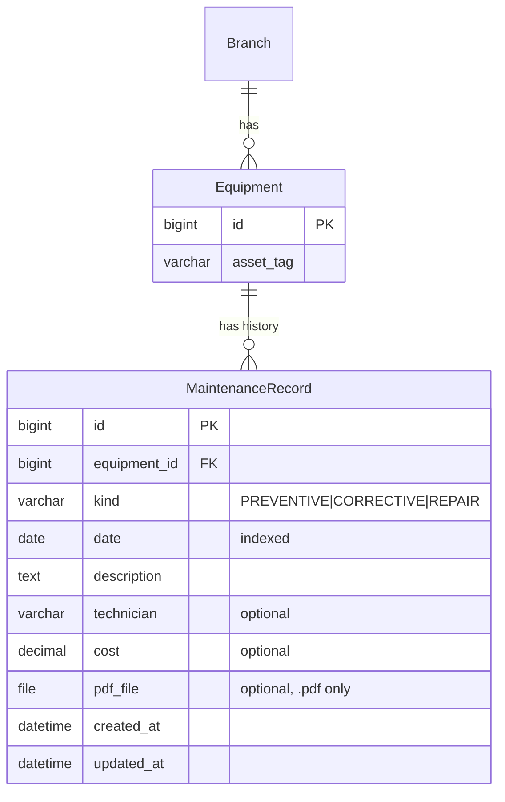

# Fase 04 — Historial de mantenimientos y reparaciones

> Estado: Pendiente
> Commit: pendiente

## 1. Objetivo y alcance

Registrar el **historial** (registros pasados) de mantenimientos preventivos, correctivos y reparaciones de cada equipo, con la posibilidad de adjuntar un PDF (informe técnico, factura, certificado) almacenado en S3.

**Out of scope:**

- Programar mantenimientos futuros (eso es la fase 05).
- Notificaciones por email (fase 05).
- Aprobaciones / workflow multi-rol.
- Generación automática de informes PDF (solo permite subir uno).
- Vinculación con `FailureRecord` (fase 06; en su momento se podrá agregar un FK opcional).

## 2. Stack y dependencias específicas

Sin dependencias nuevas. Reutiliza:

- `FileField` con `STORAGES["default"]` (S3 en prod, FS local en dev).
- DRF `MultiPartParser` para el upload del PDF.
- Validación de extensión vía `FileExtensionValidator`.

Settings tocados:

- `INSTALLED_APPS`: añadir `"apps.maintenance"`.
- `api/v1/urls.py`: añadir `path("maintenance/", include(...))`.

## 3. Modelo de datos

### 3.1 Modelo `MaintenanceRecord` (`apps/maintenance/models.py`)

| Campo         | Tipo                       | Constraints                                    | Descripción                                | Visible al usuario          |
| ------------- | -------------------------- | ---------------------------------------------- | ------------------------------------------ | --------------------------- |
| `id`          | `BigAutoField`             | PK                                             | Identificador                              | "ID"                        |
| `equipment`   | `FK -> equipment.Equipment`| `on_delete=PROTECT`, `related_name="maintenance_records"` | Equipo al que pertenece           | `_("Equipo")`               |
| `kind`        | `CharField(20)` (choices)  | `db_index=True`                                | Tipo de mantenimiento                      | `_("Tipo")`                 |
| `date`        | `DateField`                | `db_index=True`                                | Fecha en que se realizó                    | `_("Fecha")`                |
| `description` | `TextField`                |                                                | Detalle del trabajo realizado              | `_("Descripción")`          |
| `technician`  | `CharField(120)`           | `blank=True`                                   | Nombre del técnico responsable             | `_("Técnico")`              |
| `cost`        | `DecimalField(10,2)`       | `null=True`, `blank=True`                      | Costo total                                | `_("Costo")`                |
| `pdf_file`    | `FileField`                | `upload_to="maintenance/pdf/"`, `blank=True`, validador `.pdf` | Informe PDF opcional               | `_("Archivo PDF")`          |
| `created_at`  | `DateTimeField`            | `auto_now_add=True`                            | Auditoría                                  | `_("Creado")`               |
| `updated_at`  | `DateTimeField`            | `auto_now=True`                                | Auditoría                                  | `_("Actualizado")`          |

Meta:
- `verbose_name = _("Registro de mantenimiento")`, `verbose_name_plural = _("Registros de mantenimiento")`
- `ordering = ["-date", "-created_at"]`
- Indexes: `(equipment, date)` compuesto para query por equipo ordenado, `kind`, `date`.

### 3.2 Choices/Enums

`MaintenanceKind(TextChoices)`:

| Value (inglés) | Label (español)               | Cuándo se usa                                              |
| -------------- | ----------------------------- | ---------------------------------------------------------- |
| `PREVENTIVE`   | `_("Mantenimiento preventivo")` | Mantenimiento programado, no por falla                     |
| `CORRECTIVE`   | `_("Mantenimiento correctivo")` | Reparación posterior a una falla operacional               |
| `REPAIR`       | `_("Reparación mayor")`         | Intervención de fondo (cambio de partes críticas, calibración mayor) |

> Si el equipo entra al historial sin distinguir entre correctivo y reparación, se usa `CORRECTIVE`. La fase 05 (scheduling) reusa este enum pero limita choices a `PREVENTIVE` y `REPAIR`.

### 3.3 Relaciones



## 4. Capa API

### 4.1 Endpoints

| Método | Path                                              | Descripción                              | Permisos        | Status codes       |
| ------ | ------------------------------------------------- | ---------------------------------------- | --------------- | ------------------ |
| GET    | `/api/v1/maintenance/records/`                    | Lista paginada                           | IsAuthenticated | 200, 401           |
| POST   | `/api/v1/maintenance/records/`                    | Crear registro (multipart si hay PDF)    | IsAuthenticated | 201, 400, 401      |
| GET    | `/api/v1/maintenance/records/{id}/`               | Detalle                                  | IsAuthenticated | 200, 401, 404      |
| PUT    | `/api/v1/maintenance/records/{id}/`               | Update total                             | IsAuthenticated | 200, 400, 401, 404 |
| PATCH  | `/api/v1/maintenance/records/{id}/`               | Update parcial                           | IsAuthenticated | 200, 400, 401, 404 |
| DELETE | `/api/v1/maintenance/records/{id}/`               | Eliminar                                 | IsAuthenticated | 204, 401, 404      |
| GET    | `/api/v1/equipment/{id}/history/`                 | Historial filtrado por equipo (action)   | IsAuthenticated | 200, 401, 404      |

### 4.2 Decisión: nested vs action

Se opta por un **action en `EquipmentViewSet`** (definido como `@action(detail=True, methods=["get"], url_path="history")`) en vez de usar `drf-nested-routers`. Razones:

- No introduce dependencia adicional.
- El otro CRUD (sobre `MaintenanceRecord`) ya vive en su propio prefix `/api/v1/maintenance/records/`.
- Mantiene la URL legible: `GET /equipment/{id}/history/` retorna los registros del equipo.

### 4.3 Filtros, search, ordering

- **Filter** (`MaintenanceRecordFilter`):
  - `?equipment=` (id)
  - `?kind=` (choices)
  - `?date_after=`, `?date_before=` (rango)
  - `?branch=` (vía `equipment__branch_id`) — útil para reportes por sede.
- **Search** (`?search=`): `description`, `technician`, `equipment__asset_tag`.
- **Ordering** (`?ordering=`): `date`, `created_at`, `cost`. Default `-date`.

### 4.4 Validaciones de serializer

- `equipment`: debe existir (FK valida sola).
- `date`: no puede ser futura → `_("La fecha no puede ser futura.")`.
- `description`: `.strip()`, no vacía → `_("La descripción es obligatoria.")`.
- `pdf_file`: opcional. Si se envía:
  - extensión `.pdf` (validador del modelo) → `_("El archivo debe tener extensión .pdf.")`.
  - tamaño máximo 10 MB → `_("El archivo no puede superar los 10 MB.")` (validación en serializer).
  - content_type `application/pdf` (validación adicional opcional vía `python-magic` si se quiere endurecer).
- `cost`: si está, `>= 0` → `_("El costo no puede ser negativo.")`.

## 5. Reglas de negocio

- **`PROTECT` en FK a Equipment:** no se permite borrar un equipo con historial. Si se quiere desactivarlo, usar `status=INACTIVE`. Si se quiere borrar, antes hay que borrar manualmente el historial (decisión consciente — hay valor regulatorio en mantener el histórico).
- **`pdf_file` opcional:** muchos mantenimientos rutinarios no tienen documentación física. Si se sube, se almacena en `maintenance/pdf/` (S3 o FS local).
- **No se modifica `Equipment.status` automáticamente al crear un MaintenanceRecord histórico.** El historial es un registro de hechos pasados; cambiar el estado del equipo es responsabilidad de la fase 05 (scheduling) o de un PATCH explícito.
- **Borrar un MaintenanceRecord** debe borrar también el archivo PDF asociado (signal `pre_delete`).
- **Idempotencia del upload:** si se hace PATCH con un nuevo `pdf_file`, el archivo viejo se reemplaza. Hay que borrar el archivo anterior manualmente en el `update()` del serializer para no dejar huérfanos en el storage.

## 6. Snippets clave de implementación

### 6.1 Modelo (`apps/maintenance/models.py`)

```python
from django.core.validators import FileExtensionValidator, MinValueValidator
from django.db import models
from django.utils.translation import gettext_lazy as _

from apps.equipment.models import Equipment


class MaintenanceKind(models.TextChoices):
    PREVENTIVE = "PREVENTIVE", _("Mantenimiento preventivo")
    CORRECTIVE = "CORRECTIVE", _("Mantenimiento correctivo")
    REPAIR = "REPAIR", _("Reparación mayor")


class MaintenanceRecord(models.Model):
    equipment = models.ForeignKey(
        Equipment,
        on_delete=models.PROTECT,
        related_name="maintenance_records",
        verbose_name=_("Equipo"),
    )
    kind = models.CharField(
        _("Tipo"), max_length=20, choices=MaintenanceKind.choices, db_index=True
    )
    date = models.DateField(_("Fecha"), db_index=True)
    description = models.TextField(_("Descripción"))
    technician = models.CharField(_("Técnico"), max_length=120, blank=True)
    cost = models.DecimalField(
        _("Costo"), max_digits=10, decimal_places=2,
        null=True, blank=True, validators=[MinValueValidator(0)],
    )
    pdf_file = models.FileField(
        _("Archivo PDF"),
        upload_to="maintenance/pdf/",
        blank=True,
        validators=[FileExtensionValidator(allowed_extensions=["pdf"])],
    )
    created_at = models.DateTimeField(_("Creado"), auto_now_add=True)
    updated_at = models.DateTimeField(_("Actualizado"), auto_now=True)

    class Meta:
        verbose_name = _("Registro de mantenimiento")
        verbose_name_plural = _("Registros de mantenimiento")
        ordering = ["-date", "-created_at"]
        indexes = [
            models.Index(fields=["equipment", "-date"], name="maint_eq_date_idx"),
            models.Index(fields=["kind"], name="maint_kind_idx"),
            models.Index(fields=["date"], name="maint_date_idx"),
        ]

    def __str__(self) -> str:
        return f"{self.get_kind_display()} - {self.equipment.asset_tag} - {self.date}"
```

### 6.2 Manager (`apps/maintenance/managers.py`)

```python
from django.db import models


class MaintenanceRecordQuerySet(models.QuerySet):
    def for_equipment(self, equipment_id: int):
        return self.filter(equipment_id=equipment_id)

    def preventive(self):
        return self.filter(kind="PREVENTIVE")

    def in_range(self, start, end):
        return self.filter(date__gte=start, date__lte=end)
```

(Puede o no usarse `.from_queryset()`. Mismo patrón que `BranchManager`.)

### 6.3 Serializer (`api/v1/maintenance/serializers.py`)

```python
from django.utils import timezone
from django.utils.translation import gettext_lazy as _
from rest_framework import serializers

from apps.maintenance.models import MaintenanceRecord

MAX_PDF_BYTES = 10 * 1024 * 1024  # 10 MB


class MaintenanceRecordSerializer(serializers.ModelSerializer):
    equipment_asset_tag = serializers.CharField(source="equipment.asset_tag", read_only=True)
    pdf_file_url = serializers.SerializerMethodField()

    class Meta:
        model = MaintenanceRecord
        fields = (
            "id", "equipment", "equipment_asset_tag",
            "kind", "date", "description", "technician", "cost",
            "pdf_file", "pdf_file_url",
            "created_at", "updated_at",
        )
        read_only_fields = ("id", "pdf_file_url", "created_at", "updated_at")

    def get_pdf_file_url(self, obj):
        if not obj.pdf_file:
            return None
        request = self.context.get("request")
        url = obj.pdf_file.url
        return request.build_absolute_uri(url) if request else url

    def validate_date(self, value):
        if value > timezone.localdate():
            raise serializers.ValidationError(_("La fecha no puede ser futura."))
        return value

    def validate_description(self, value):
        if not value.strip():
            raise serializers.ValidationError(_("La descripción es obligatoria."))
        return value.strip()

    def validate_pdf_file(self, value):
        if value and value.size > MAX_PDF_BYTES:
            raise serializers.ValidationError(
                _("El archivo no puede superar los 10 MB.")
            )
        return value

    def update(self, instance, validated_data):
        # Si llega un nuevo PDF y había uno previo, borrar el anterior del storage.
        new_pdf = validated_data.get("pdf_file")
        if new_pdf and instance.pdf_file and instance.pdf_file != new_pdf:
            instance.pdf_file.delete(save=False)
        return super().update(instance, validated_data)
```

### 6.4 Filter (`api/v1/maintenance/filters.py`)

```python
from django_filters import rest_framework as filters

from apps.maintenance.models import MaintenanceRecord


class MaintenanceRecordFilter(filters.FilterSet):
    equipment = filters.NumberFilter(field_name="equipment_id")
    branch = filters.NumberFilter(field_name="equipment__branch_id")
    kind = filters.CharFilter(field_name="kind", lookup_expr="iexact")
    date_after = filters.DateFilter(field_name="date", lookup_expr="gte")
    date_before = filters.DateFilter(field_name="date", lookup_expr="lte")

    class Meta:
        model = MaintenanceRecord
        fields = ("equipment", "branch", "kind", "date_after", "date_before")
```

### 6.5 ViewSet (`api/v1/maintenance/views.py`)

```python
from rest_framework import viewsets
from rest_framework.parsers import FormParser, JSONParser, MultiPartParser
from rest_framework.permissions import IsAuthenticated

from apps.maintenance.models import MaintenanceRecord

from .filters import MaintenanceRecordFilter
from .serializers import MaintenanceRecordSerializer


class MaintenanceRecordViewSet(viewsets.ModelViewSet):
    queryset = MaintenanceRecord.objects.select_related("equipment", "equipment__branch")
    serializer_class = MaintenanceRecordSerializer
    permission_classes = (IsAuthenticated,)
    parser_classes = (JSONParser, MultiPartParser, FormParser)
    filterset_class = MaintenanceRecordFilter
    search_fields = ("description", "technician", "equipment__asset_tag")
    ordering_fields = ("date", "created_at", "cost")
    ordering = ("-date",)
```

Y la action en `EquipmentViewSet` (parche a `api/v1/equipment/views.py`):

```python
from apps.maintenance.models import MaintenanceRecord
from api.v1.maintenance.serializers import MaintenanceRecordSerializer

class EquipmentViewSet(viewsets.ModelViewSet):
    ...

    @action(detail=True, methods=["get"], url_path="history")
    def history(self, request, pk=None):
        equipment = self.get_object()
        qs = MaintenanceRecord.objects.filter(equipment=equipment).order_by("-date")
        page = self.paginate_queryset(qs)
        serializer = MaintenanceRecordSerializer(
            page if page is not None else qs, many=True, context={"request": request},
        )
        if page is not None:
            return self.get_paginated_response(serializer.data)
        return Response(serializer.data)
```

### 6.6 URLs (`api/v1/maintenance/urls.py`)

```python
from rest_framework.routers import DefaultRouter

from .views import MaintenanceRecordViewSet

app_name = "maintenance"

router = DefaultRouter()
router.register(r"records", MaintenanceRecordViewSet, basename="record")

urlpatterns = router.urls
```

Línea a añadir en `api/v1/urls.py`:

```python
path("maintenance/", include(("api.v1.maintenance.urls", "maintenance"), namespace="maintenance")),
```

### 6.7 Migración (esquema, `apps/maintenance/migrations/0001_initial.py`)

```python
operations = [
    migrations.CreateModel(
        name="MaintenanceRecord",
        fields=[
            ("id", models.BigAutoField(primary_key=True, serialize=False)),
            ("kind", models.CharField(
                choices=[("PREVENTIVE", _("Mantenimiento preventivo")),
                         ("CORRECTIVE", _("Mantenimiento correctivo")),
                         ("REPAIR", _("Reparación mayor"))],
                max_length=20, db_index=True, verbose_name=_("Tipo"))),
            ("date", models.DateField(db_index=True, verbose_name=_("Fecha"))),
            ("description", models.TextField(verbose_name=_("Descripción"))),
            ("technician", models.CharField(blank=True, max_length=120, verbose_name=_("Técnico"))),
            ("cost", models.DecimalField(blank=True, decimal_places=2, max_digits=10,
                                          null=True, validators=[MinValueValidator(0)],
                                          verbose_name=_("Costo"))),
            ("pdf_file", models.FileField(
                blank=True, upload_to="maintenance/pdf/",
                validators=[FileExtensionValidator(allowed_extensions=["pdf"])],
                verbose_name=_("Archivo PDF"))),
            ("created_at", models.DateTimeField(auto_now_add=True, verbose_name=_("Creado"))),
            ("updated_at", models.DateTimeField(auto_now=True, verbose_name=_("Actualizado"))),
            ("equipment", models.ForeignKey(
                on_delete=models.PROTECT, related_name="maintenance_records",
                to="equipment.equipment", verbose_name=_("Equipo"))),
        ],
        options={
            "verbose_name": _("Registro de mantenimiento"),
            "verbose_name_plural": _("Registros de mantenimiento"),
            "ordering": ["-date", "-created_at"],
        },
    ),
    migrations.AddIndex(model_name="maintenancerecord",
                        index=models.Index(fields=["equipment", "-date"], name="maint_eq_date_idx")),
    migrations.AddIndex(model_name="maintenancerecord",
                        index=models.Index(fields=["kind"], name="maint_kind_idx")),
    migrations.AddIndex(model_name="maintenancerecord",
                        index=models.Index(fields=["date"], name="maint_date_idx")),
]
```

### 6.8 Signal pre_delete (`apps/maintenance/signals.py`)

```python
from django.db.models.signals import pre_delete
from django.dispatch import receiver

from .models import MaintenanceRecord


@receiver(pre_delete, sender=MaintenanceRecord)
def remove_pdf_file(sender, instance: MaintenanceRecord, **kwargs):
    if instance.pdf_file:
        instance.pdf_file.delete(save=False)
```

Cargar en `AppConfig.ready()`.

## 7. Tests

### 7.1 Estructura de archivos

```
apps/maintenance/tests/
├── __init__.py
├── conftest.py           # fixtures: maintenance_record
├── factories.py          # MaintenanceRecordFactory
├── test_models.py
├── test_api.py           # CRUD + filtros + history action
└── test_uploads.py       # validación de PDF, replace, delete signal
```

### 7.2 Casos cubiertos

**Modelo:**
- `__str__` formato esperado.
- Default ordering `-date, -created_at`.

**API básica:**
- 401 sin auth.
- 201 al crear sin PDF (JSON).
- 201 al crear con PDF (multipart).
- 200 list con filtros: `equipment`, `kind`, `date_after`/`date_before`, `branch`.
- 200 search por `description`/`technician`/`equipment__asset_tag`.
- 200 ordering por `-date` (default), `cost`.

**Validaciones:**
- 400 si `date` futura → mensaje en español.
- 400 si `description` vacía o solo whitespace.
- 400 si `pdf_file` no es `.pdf` (subir un `.txt`).
- 400 si `pdf_file` excede 10 MB (mock con archivo grande).
- 400 si `cost < 0`.

**Action `GET /equipment/{id}/history/`:**
- 200 con la lista paginada del historial.
- Solo devuelve registros del equipo solicitado.
- 404 si el equipo no existe.

**Storage:**
- Replace: PATCH con nuevo `pdf_file` borra el archivo anterior.
- Delete: borrar registro borra el archivo del storage.
- Tests con `tmp_path` como `MEDIA_ROOT` (override settings).

### 7.3 Comandos para correrlos

```bash
docker compose exec web pytest apps/maintenance -v
docker compose exec web pytest apps/maintenance --cov=apps.maintenance --cov=api.v1.maintenance
```

## 8. Pruebas manuales con Postman

### 8.1 Variables de entorno Postman

| Nombre                  | Valor inicial | Descripción                                     |
| ----------------------- | ------------- | ----------------------------------------------- |
| `maintenance_record_id` | (vacío)       | Se llena al crear                               |
| `sample_pdf_path`       | (file)        | Path local a un PDF para subir (en form-data)   |

### 8.2 Setup

JWT como en fase 02. Asegurar `equipment_id` y `branch_id` válidos.

### 8.3 Endpoints

#### Create (sin PDF, JSON)

```http
POST {{base_url}}/api/v1/maintenance/records/
Authorization: Bearer {{access_token}}
Content-Type: application/json

{
  "equipment": {{equipment_id}},
  "kind": "PREVENTIVE",
  "date": "2026-04-15",
  "description": "Limpieza general y calibración trimestral.",
  "technician": "Juan Perez",
  "cost": "150000.00"
}
```

Response 201:

```json
{
  "id": 1,
  "equipment": 1,
  "equipment_asset_tag": "EQ-0001",
  "kind": "PREVENTIVE",
  "date": "2026-04-15",
  "description": "Limpieza general y calibración trimestral.",
  "technician": "Juan Perez",
  "cost": "150000.00",
  "pdf_file": null,
  "pdf_file_url": null,
  "created_at": "2026-04-29T16:00:00Z",
  "updated_at": "2026-04-29T16:00:00Z"
}
```

Tests:

```js
pm.test("status 201", () => pm.response.to.have.status(201));
pm.environment.set("maintenance_record_id", pm.response.json().id);
```

#### Create con PDF (form-data)

En Postman → Body → form-data:

| Key            | Type | Value                                            |
| -------------- | ---- | ------------------------------------------------ |
| `equipment`    | Text | `{{equipment_id}}`                               |
| `kind`         | Text | `CORRECTIVE`                                     |
| `date`         | Text | `2026-04-20`                                     |
| `description`  | Text | `Cambio de batería y sensor SpO2`                |
| `technician`   | Text | `Maria Lopez`                                    |
| `cost`         | Text | `420000.00`                                      |
| `pdf_file`     | File | (seleccionar el PDF local)                       |

Equivalente con `curl`:

```bash
curl -X POST "{{base_url}}/api/v1/maintenance/records/" \
  -H "Authorization: Bearer {{access_token}}" \
  -F "equipment={{equipment_id}}" \
  -F "kind=CORRECTIVE" \
  -F "date=2026-04-20" \
  -F "description=Cambio de batería y sensor SpO2" \
  -F "technician=Maria Lopez" \
  -F "cost=420000.00" \
  -F "pdf_file=@/path/to/report.pdf"
```

Response 201 con `pdf_file_url` apuntando al archivo.

#### List con filtros

```http
GET {{base_url}}/api/v1/maintenance/records/?equipment={{equipment_id}}&kind=PREVENTIVE&date_after=2026-01-01&date_before=2026-12-31&ordering=-date
Authorization: Bearer {{access_token}}
```

#### Historial por equipo (action en EquipmentViewSet)

```http
GET {{base_url}}/api/v1/equipment/{{equipment_id}}/history/
Authorization: Bearer {{access_token}}
```

Response 200 paginada con todos los registros del equipo.

#### Update (replace PDF)

```bash
curl -X PATCH "{{base_url}}/api/v1/maintenance/records/{{maintenance_record_id}}/" \
  -H "Authorization: Bearer {{access_token}}" \
  -F "pdf_file=@/path/to/new_report.pdf"
```

#### Delete

```http
DELETE {{base_url}}/api/v1/maintenance/records/{{maintenance_record_id}}/
Authorization: Bearer {{access_token}}
```

#### Casos de error

**Fecha futura (400):**

```json
{"date": ["La fecha no puede ser futura."]}
```

**Archivo no PDF (400):**

```json
{"pdf_file": ["El archivo debe tener extensión .pdf."]}
```

(Mensaje exacto puede venir de `FileExtensionValidator` en español si la traducción está cargada; en su defecto, validar con un validador propio que emita el mensaje en español.)

**PDF > 10 MB (400):**

```json
{"pdf_file": ["El archivo no puede superar los 10 MB."]}
```

**Costo negativo (400):**

```json
{"cost": ["Asegúrese de que este valor sea mayor o igual a 0."]}
```

### 8.4 Casos especiales

- **Verificar que el PDF realmente se subió:** abrir `pdf_file_url` en el navegador → debe descargar el PDF.
- **Reemplazo de PDF:** después del PATCH con un nuevo PDF, el archivo anterior debe ya no estar en `MEDIA_ROOT/maintenance/pdf/` (o en S3).
- **Borrado en cascada de archivo:** después de DELETE, listar `MEDIA_ROOT/maintenance/pdf/` → el archivo no debe estar.
- **Acceso al historial sin PDFs:** crear varios registros sin `pdf_file` y verificar `pdf_file_url: null` en cada uno.

## 9. Checklist de verificación

- [ ] Migración aplicada.
- [ ] `apps.maintenance` en `INSTALLED_APPS`.
- [ ] `path("maintenance/", ...)` en `api/v1/urls.py`.
- [ ] Action `history` registrada en `EquipmentViewSet`.
- [ ] `pytest apps/maintenance` pasa.
- [ ] Postman: CRUD y action `history` OK.
- [ ] Subida de PDF funciona y `pdf_file_url` es accesible.
- [ ] Replace de PDF borra el anterior.
- [ ] Delete de record borra el archivo.
- [ ] Validación de extensión `.pdf` rechaza otros tipos.

## 10. Posibles extensiones futuras / TODO

- Endpoint para descargar todos los PDFs de un equipo en un ZIP (`GET /equipment/{id}/history/pdfs.zip`).
- Vincular `MaintenanceRecord` con `FailureRecord` (FK opcional) cuando exista la fase 06.
- Auto-cierre de un `MaintenanceSchedule` (fase 05) cuando se crea un `MaintenanceRecord` con la misma fecha (workflow opcional).
- Validar `content_type` real del PDF con `python-magic` (más estricto que la extensión).
- Reportes agregados: costo total por sede/mes, conteo por tipo.
- Soft delete + auditoría con `django-simple-history`.
- `next_recommended_date` calculado en base al `kind` y al equipo (input para fase 05).
- Permisos por rol: técnicos solo pueden crear, admins pueden borrar.

## 11. Actualizaciones posteriores

- **Fase 09 (asignación de usuarios):** se añadieron al modelo dos FK opcionales a `users.User` —
  `assigned_engineer` (con `limit_choices_to={"role": "ingeniero", "is_active": True}`) y
  `assigned_technician` (con `limit_choices_to={"role": "tecnico", "is_active": True}`). Ambos con
  `on_delete=SET_NULL` para no perder el histórico si el usuario se elimina. Filtros nuevos en
  `MaintenanceRecordFilter`: `assigned_engineer`, `assigned_technician`, `unassigned`. Detalle del
  diseño y razones en [`09-user-assignment.md`](09-user-assignment.md).
