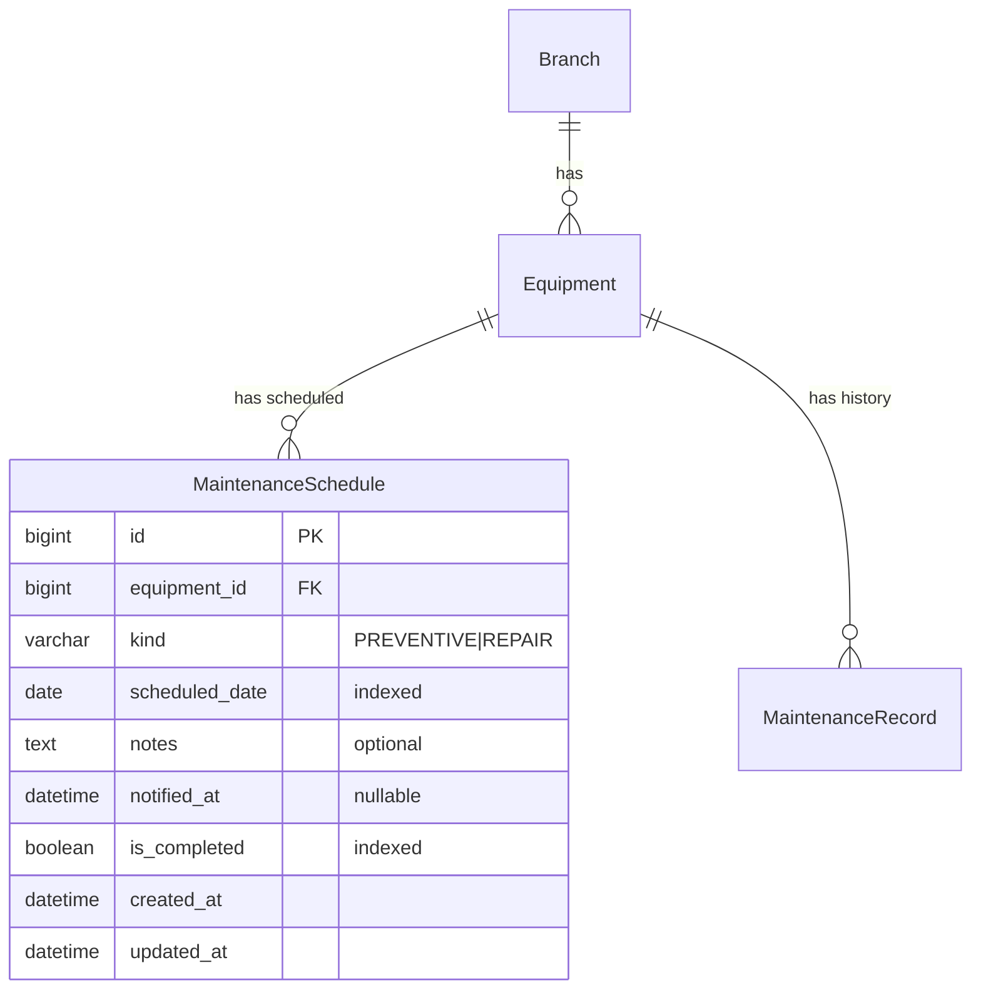

# Fase 05 — Programación de mantenimientos + notificación por email

> Estado: Implementado
> Commit: pendiente

## 1. Objetivo y alcance

Permitir **agendar mantenimientos futuros** por equipo y enviar un email al crear el agendamiento (y/o cuando un job programado lo descubra). El envío del email se hace en una **tarea Celery asíncrona** disparada por un signal `post_save`.

**Out of scope:**

- Re-programación automática recurrente (cron de "cada 90 días"). En esta fase, cada agendamiento es manual.
- Calendario iCal para integrar con Google Calendar / Outlook.
- Templates HTML elaborados (template básico, texto + HTML simple).
- Confirmaciones de lectura.
- SMS / WhatsApp (solo email).
- Aceptar/rechazar el agendamiento desde el correo (solo notifica).

## 2. Stack y dependencias específicas

Ya está en `requirements/base.txt`:

```
celery==5.4.0
redis==5.0.4
```

Y el broker está en `docker-compose.yml` (servicio `redis`). En esta fase se debe **descomentar** el servicio `celery_worker` en `docker-compose.yml`.

Settings nuevos (todos ya están en `.env.example`, solo reusar):

- `EMAIL_BACKEND` (en dev: `django.core.mail.backends.console.EmailBackend`).
- `EMAIL_HOST`, `EMAIL_PORT`, `EMAIL_USE_TLS`, `EMAIL_HOST_USER`, `EMAIL_HOST_PASSWORD`.
- `DEFAULT_FROM_EMAIL`.
- `CELERY_BROKER_URL`, `CELERY_RESULT_BACKEND`.
- `CELERY_TASK_ALWAYS_EAGER` (en dev se puede setear `True` para correr síncrono sin worker).

Settings nuevos de esta fase:

- `MAINTENANCE_NOTIFICATION_EMAILS` (lista CSV) — destinatarios fijos (mantenimiento, jefe técnico).
- `MAINTENANCE_NOTIFICATION_FROM_NAME` (opcional) — sobreescribe el `DEFAULT_FROM_EMAIL`.

Añadir al `.env.example`:

```
MAINTENANCE_NOTIFICATION_EMAILS=mantenimiento@clinic.test,jefe@clinic.test
```

Y en `config/settings/base.py`:

```python
MAINTENANCE_NOTIFICATION_EMAILS = env.list("MAINTENANCE_NOTIFICATION_EMAILS", default=[])
```

## 3. Modelo de datos

### 3.1 Modelo `MaintenanceSchedule` (`apps/scheduling/models.py`)

Se opta por crear una **app nueva** llamada `apps.scheduling` (no anidada dentro de `apps.maintenance`) para mantener separadas las preocupaciones de "historial" (fase 04) y "agendamiento" (fase 05). Razón: cada una crece independiente, tiene tasks/signals propios y se puede desactivar una sin desactivar la otra.

| Campo            | Tipo                       | Constraints                                       | Descripción                                | Visible al usuario                |
| ---------------- | -------------------------- | ------------------------------------------------- | ------------------------------------------ | --------------------------------- |
| `id`             | `BigAutoField`             | PK                                                | Identificador                              | "ID"                              |
| `equipment`      | `FK -> equipment.Equipment`| `on_delete=PROTECT`, `related_name="schedules"`   | Equipo a mantener                          | `_("Equipo")`                     |
| `kind`           | `CharField(20)` (choices)  | `db_index=True`                                   | Tipo de mantenimiento programado           | `_("Tipo")`                       |
| `scheduled_date` | `DateField`                | `db_index=True`                                   | Fecha programada                           | `_("Fecha programada")`           |
| `notes`          | `TextField`                | `blank=True`                                      | Notas/instrucciones para el técnico        | `_("Notas")`                      |
| `notified_at`    | `DateTimeField`            | `null=True`, `blank=True`                         | Cuándo se envió el correo (auditoría)      | `_("Notificado el")`              |
| `is_completed`   | `BooleanField`             | `default=False`, `db_index=True`                  | Marca manual cuando se cumple              | `_("Completado")`                 |
| `created_at`     | `DateTimeField`            | `auto_now_add=True`                               | Auditoría                                  | `_("Creado")`                     |
| `updated_at`     | `DateTimeField`            | `auto_now=True`                                   | Auditoría                                  | `_("Actualizado")`                |

Meta:
- `verbose_name = _("Agendamiento de mantenimiento")`, `verbose_name_plural = _("Agendamientos de mantenimiento")`
- `ordering = ["scheduled_date"]`
- Indexes: `(equipment, scheduled_date)` y `(scheduled_date, is_completed)`.

### 3.2 Choices/Enums

`ScheduledMaintenanceKind(TextChoices)` — subset del enum de la fase 04:

| Value (inglés)  | Label (español)                    | Cuándo se usa                                   |
| --------------- | ---------------------------------- | ----------------------------------------------- |
| `PREVENTIVE`    | `_("Mantenimiento preventivo")`    | El más común: rutina periódica                  |
| `REPAIR`        | `_("Reparación programada")`       | Reparación planeada (no urgente)                |

> Nota: `CORRECTIVE` (de la fase 04) no aplica aquí porque las correcciones son reactivas, no se programan.

### 3.3 Relaciones



## 4. Capa API

### 4.1 Endpoints

| Método | Path                                                | Descripción                            | Permisos        | Status codes       |
| ------ | --------------------------------------------------- | -------------------------------------- | --------------- | ------------------ |
| GET    | `/api/v1/scheduling/maintenances/`                  | Lista paginada                         | IsAuthenticated | 200, 401           |
| POST   | `/api/v1/scheduling/maintenances/`                  | Crear (dispara email async)            | IsAuthenticated | 201, 400, 401      |
| GET    | `/api/v1/scheduling/maintenances/{id}/`             | Detalle                                | IsAuthenticated | 200, 401, 404      |
| PUT    | `/api/v1/scheduling/maintenances/{id}/`             | Update total                           | IsAuthenticated | 200, 400, 401, 404 |
| PATCH  | `/api/v1/scheduling/maintenances/{id}/`             | Update parcial                         | IsAuthenticated | 200, 400, 401, 404 |
| DELETE | `/api/v1/scheduling/maintenances/{id}/`             | Eliminar                               | IsAuthenticated | 204, 401, 404      |
| POST   | `/api/v1/scheduling/maintenances/{id}/complete/`    | Marca `is_completed=True`              | IsAuthenticated | 200, 401, 404      |
| POST   | `/api/v1/scheduling/maintenances/{id}/notify/`      | Re-envía el email manualmente          | IsAuthenticated | 200, 401, 404      |

### 4.2 Filtros, search, ordering

- **Filter**:
  - `?equipment=` (id)
  - `?kind=`
  - `?scheduled_date_after=`, `?scheduled_date_before=`
  - `?is_completed=` (bool)
  - `?branch=` (vía `equipment__branch_id`)
- **Search**: `notes`, `equipment__asset_tag`, `equipment__name`.
- **Ordering**: `scheduled_date`, `created_at`. Default `scheduled_date`.

### 4.3 Validaciones de serializer

- `equipment`: existir + `is_active=True` (status != `INACTIVE`) → `_("El equipo no está disponible para programación.")`.
- `scheduled_date`: no puede ser pasada al crear → `_("La fecha programada no puede ser pasada.")`. (Al hacer PATCH se permite si solo se está marcando `is_completed`.)
- `kind`: choices del subset (DRF lo valida solo).
- `notes`: opcional, se aplica `.strip()`.

## 5. Reglas de negocio

- **Trigger del email:** signal `post_save` en `MaintenanceSchedule` con `created=True` ⇒ encola tarea Celery `send_schedule_notification.delay(schedule_id)`. La tarea:
  1. Busca el schedule + equipo + sede.
  2. Renderiza `subject` y `body` (texto + HTML).
  3. Envía a `MAINTENANCE_NOTIFICATION_EMAILS` (CSV) + opcionalmente al `branch.email` si está definido.
  4. Setea `schedule.notified_at = timezone.now()` y `save(update_fields=["notified_at"])`.
- **Fallback síncrono en dev:** si `CELERY_TASK_ALWAYS_EAGER=True`, la tarea se ejecuta en el mismo proceso. Si Celery no está corriendo (p. ej. el worker no está levantado), `delay()` deja la tarea en la cola hasta que un worker la consuma. Para flujo de dev sin Celery: setear `CELERY_TASK_ALWAYS_EAGER=True` en `.env`.
- **`POST /complete/`:** marca `is_completed=True` y opcionalmente crea un `MaintenanceRecord` (fase 04) con la misma `kind` y `date=scheduled_date`. Esa creación cruzada se documenta como **TODO** opcional para no acoplar fases (ver sección 10).
- **`POST /notify/`:** vuelve a encolar el email (útil si el email original falló, p. ej. SMTP caído). Reutiliza la misma task.
- **`PROTECT` en FK:** no permite borrar un Equipment con schedules. Coherente con el patrón ya establecido.
- **Cancelación:** un schedule cancelado simplemente se borra (`DELETE`). No hay flag `is_cancelled` en esta fase para mantener simple. Si se necesita auditoría, es una extensión futura.

## 6. Snippets clave de implementación

### 6.1 Modelo (`apps/scheduling/models.py`)

```python
from django.db import models
from django.utils.translation import gettext_lazy as _

from apps.equipment.models import Equipment


class ScheduledMaintenanceKind(models.TextChoices):
    PREVENTIVE = "PREVENTIVE", _("Mantenimiento preventivo")
    REPAIR = "REPAIR", _("Reparación programada")


class MaintenanceSchedule(models.Model):
    equipment = models.ForeignKey(
        Equipment,
        on_delete=models.PROTECT,
        related_name="schedules",
        verbose_name=_("Equipo"),
    )
    kind = models.CharField(
        _("Tipo"), max_length=20, choices=ScheduledMaintenanceKind.choices, db_index=True
    )
    scheduled_date = models.DateField(_("Fecha programada"), db_index=True)
    notes = models.TextField(_("Notas"), blank=True)
    notified_at = models.DateTimeField(_("Notificado el"), null=True, blank=True)
    is_completed = models.BooleanField(_("Completado"), default=False, db_index=True)
    created_at = models.DateTimeField(_("Creado"), auto_now_add=True)
    updated_at = models.DateTimeField(_("Actualizado"), auto_now=True)

    class Meta:
        verbose_name = _("Agendamiento de mantenimiento")
        verbose_name_plural = _("Agendamientos de mantenimiento")
        ordering = ["scheduled_date"]
        indexes = [
            models.Index(fields=["equipment", "scheduled_date"], name="sched_eq_date_idx"),
            models.Index(fields=["scheduled_date", "is_completed"], name="sched_date_comp_idx"),
        ]

    def __str__(self) -> str:
        return f"{self.get_kind_display()} - {self.equipment.asset_tag} - {self.scheduled_date}"
```

### 6.2 Celery app (`config/celery.py`) — si no existe aún

```python
import os

from celery import Celery

os.environ.setdefault("DJANGO_SETTINGS_MODULE", "config.settings.dev")

app = Celery("biometric")
app.config_from_object("django.conf:settings", namespace="CELERY")
app.autodiscover_tasks()
```

Y en `config/__init__.py`:

```python
from .celery import app as celery_app

__all__ = ("celery_app",)
```

### 6.3 Task (`apps/scheduling/tasks.py`)

```python
from __future__ import annotations

from celery import shared_task
from django.conf import settings
from django.core.mail import EmailMultiAlternatives
from django.template.loader import render_to_string
from django.utils import timezone


@shared_task(bind=True, max_retries=3, default_retry_delay=60)
def send_schedule_notification(self, schedule_id: int) -> str:
    from .models import MaintenanceSchedule  # avoid circular import

    try:
        schedule = (
            MaintenanceSchedule.objects
            .select_related("equipment", "equipment__branch")
            .get(pk=schedule_id)
        )
    except MaintenanceSchedule.DoesNotExist:
        return "schedule_not_found"

    equipment = schedule.equipment
    branch = equipment.branch

    recipients = list(settings.MAINTENANCE_NOTIFICATION_EMAILS)
    if branch.email:
        recipients.append(branch.email)
    recipients = list({r for r in recipients if r})  # dedupe + drop empties
    if not recipients:
        return "no_recipients"

    context = {
        "schedule": schedule,
        "equipment": equipment,
        "branch": branch,
    }
    subject = (
        f"[Biometric] Mantenimiento programado: {equipment.asset_tag} "
        f"({schedule.scheduled_date.isoformat()})"
    )
    body_text = render_to_string("scheduling/email/schedule_notification.txt", context)
    body_html = render_to_string("scheduling/email/schedule_notification.html", context)

    message = EmailMultiAlternatives(
        subject=subject,
        body=body_text,
        from_email=settings.DEFAULT_FROM_EMAIL,
        to=recipients,
    )
    message.attach_alternative(body_html, "text/html")

    try:
        message.send(fail_silently=False)
    except Exception as exc:
        raise self.retry(exc=exc)

    schedule.notified_at = timezone.now()
    schedule.save(update_fields=["notified_at", "updated_at"])
    return "sent"
```

### 6.4 Templates de email

`templates/scheduling/email/schedule_notification.txt`:

```
Hola,

Se ha programado un mantenimiento para el siguiente equipo:

  Sede:           {{ branch.name }} ({{ branch.city }})
  Equipo:         {{ equipment.name }}
  Código:         {{ equipment.asset_tag }}
  Marca/Modelo:   {{ equipment.brand }} {{ equipment.model }}
  Tipo:           {{ schedule.get_kind_display }}
  Fecha:          {{ schedule.scheduled_date|date:"d/m/Y" }}

Notas:
{{ schedule.notes }}

Por favor confirme la asignación con el equipo de mantenimiento.

— Biometric API
```

`templates/scheduling/email/schedule_notification.html`:

```html
<!doctype html>
<html lang="es">
<body style="font-family:sans-serif">
  <h2>Mantenimiento programado</h2>
  <table cellpadding="6">
    <tr><th align="left">Sede</th><td>{{ branch.name }} ({{ branch.city }})</td></tr>
    <tr><th align="left">Equipo</th><td>{{ equipment.name }}</td></tr>
    <tr><th align="left">Código</th><td>{{ equipment.asset_tag }}</td></tr>
    <tr><th align="left">Marca / Modelo</th><td>{{ equipment.brand }} {{ equipment.model }}</td></tr>
    <tr><th align="left">Tipo</th><td>{{ schedule.get_kind_display }}</td></tr>
    <tr><th align="left">Fecha</th><td>{{ schedule.scheduled_date|date:"d/m/Y" }}</td></tr>
  </table>
  
    <p><strong>Notas:</strong></p>
    <p>{{ schedule.notes|linebreaksbr }}</p>
  
  <p>— Biometric API</p>
</body>
</html>
```

### 6.5 Signals (`apps/scheduling/signals.py`)

```python
from django.db.models.signals import post_save
from django.dispatch import receiver

from .models import MaintenanceSchedule
from .tasks import send_schedule_notification


@receiver(post_save, sender=MaintenanceSchedule)
def trigger_schedule_notification(sender, instance: MaintenanceSchedule, created: bool, **kwargs):
    if created:
        send_schedule_notification.delay(instance.pk)
```

### 6.6 Serializer (`api/v1/scheduling/serializers.py`)

```python
from django.utils import timezone
from django.utils.translation import gettext_lazy as _
from rest_framework import serializers

from apps.scheduling.models import MaintenanceSchedule


class MaintenanceScheduleSerializer(serializers.ModelSerializer):
    equipment_asset_tag = serializers.CharField(source="equipment.asset_tag", read_only=True)
    branch_name = serializers.CharField(source="equipment.branch.name", read_only=True)

    class Meta:
        model = MaintenanceSchedule
        fields = (
            "id", "equipment", "equipment_asset_tag", "branch_name",
            "kind", "scheduled_date", "notes",
            "notified_at", "is_completed",
            "created_at", "updated_at",
        )
        read_only_fields = ("id", "notified_at", "created_at", "updated_at")

    def validate_equipment(self, value):
        # Permitir solo equipos no dados de baja
        if value.status == "INACTIVE":
            raise serializers.ValidationError(
                _("El equipo no está disponible para programación.")
            )
        return value

    def validate_scheduled_date(self, value):
        # Solo en create. En PATCH puede ser válida si se está completando.
        if self.instance is None and value < timezone.localdate():
            raise serializers.ValidationError(
                _("La fecha programada no puede ser pasada.")
            )
        return value

    def validate_notes(self, value):
        return value.strip() if value else value
```

### 6.7 Filter, ViewSet, URLs

`api/v1/scheduling/filters.py`:

```python
from django_filters import rest_framework as filters

from apps.scheduling.models import MaintenanceSchedule


class MaintenanceScheduleFilter(filters.FilterSet):
    equipment = filters.NumberFilter(field_name="equipment_id")
    branch = filters.NumberFilter(field_name="equipment__branch_id")
    kind = filters.CharFilter(field_name="kind", lookup_expr="iexact")
    is_completed = filters.BooleanFilter(field_name="is_completed")
    scheduled_date_after = filters.DateFilter(field_name="scheduled_date", lookup_expr="gte")
    scheduled_date_before = filters.DateFilter(field_name="scheduled_date", lookup_expr="lte")

    class Meta:
        model = MaintenanceSchedule
        fields = ("equipment", "branch", "kind", "is_completed",
                  "scheduled_date_after", "scheduled_date_before")
```

`api/v1/scheduling/views.py`:

```python
from django.utils import timezone
from rest_framework import status, viewsets
from rest_framework.decorators import action
from rest_framework.permissions import IsAuthenticated
from rest_framework.response import Response

from apps.scheduling.models import MaintenanceSchedule
from apps.scheduling.tasks import send_schedule_notification

from .filters import MaintenanceScheduleFilter
from .serializers import MaintenanceScheduleSerializer


class MaintenanceScheduleViewSet(viewsets.ModelViewSet):
    queryset = MaintenanceSchedule.objects.select_related("equipment", "equipment__branch")
    serializer_class = MaintenanceScheduleSerializer
    permission_classes = (IsAuthenticated,)
    filterset_class = MaintenanceScheduleFilter
    search_fields = ("notes", "equipment__asset_tag", "equipment__name")
    ordering_fields = ("scheduled_date", "created_at")
    ordering = ("scheduled_date",)

    @action(detail=True, methods=["post"], url_path="complete")
    def complete(self, request, pk=None):
        schedule = self.get_object()
        schedule.is_completed = True
        schedule.save(update_fields=["is_completed", "updated_at"])
        return Response(self.get_serializer(schedule).data)

    @action(detail=True, methods=["post"], url_path="notify")
    def notify(self, request, pk=None):
        schedule = self.get_object()
        send_schedule_notification.delay(schedule.pk)
        return Response(
            {"detail": "notification_queued"}, status=status.HTTP_200_OK
        )
```

`api/v1/scheduling/urls.py`:

```python
from rest_framework.routers import DefaultRouter

from .views import MaintenanceScheduleViewSet

app_name = "scheduling"

router = DefaultRouter()
router.register(r"maintenances", MaintenanceScheduleViewSet, basename="maintenance")

urlpatterns = router.urls
```

Línea en `api/v1/urls.py`:

```python
path("scheduling/", include(("api.v1.scheduling.urls", "scheduling"), namespace="scheduling")),
```

### 6.8 docker-compose.yml — descomentar `celery_worker`

```yaml
  celery_worker:
    build:
      context: .
      dockerfile: docker/Dockerfile
      args:
        REQUIREMENTS: dev
    container_name: biometric_celery_worker
    restart: unless-stopped
    env_file:
      - .env
    volumes:
      - .:/app
    depends_on:
      db: {condition: service_healthy}
      redis: {condition: service_healthy}
    command: celery -A config worker -l info
```

### 6.9 Migración (esquema, `apps/scheduling/migrations/0001_initial.py`)

```python
operations = [
    migrations.CreateModel(
        name="MaintenanceSchedule",
        fields=[
            ("id", models.BigAutoField(primary_key=True, serialize=False)),
            ("kind", models.CharField(
                choices=[("PREVENTIVE", _("Mantenimiento preventivo")),
                         ("REPAIR", _("Reparación programada"))],
                max_length=20, db_index=True, verbose_name=_("Tipo"))),
            ("scheduled_date", models.DateField(db_index=True, verbose_name=_("Fecha programada"))),
            ("notes", models.TextField(blank=True, verbose_name=_("Notas"))),
            ("notified_at", models.DateTimeField(blank=True, null=True, verbose_name=_("Notificado el"))),
            ("is_completed", models.BooleanField(db_index=True, default=False, verbose_name=_("Completado"))),
            ("created_at", models.DateTimeField(auto_now_add=True, verbose_name=_("Creado"))),
            ("updated_at", models.DateTimeField(auto_now=True, verbose_name=_("Actualizado"))),
            ("equipment", models.ForeignKey(
                on_delete=models.PROTECT, related_name="schedules",
                to="equipment.equipment", verbose_name=_("Equipo"))),
        ],
        options={
            "verbose_name": _("Agendamiento de mantenimiento"),
            "verbose_name_plural": _("Agendamientos de mantenimiento"),
            "ordering": ["scheduled_date"],
        },
    ),
    migrations.AddIndex(model_name="maintenanceschedule",
                        index=models.Index(fields=["equipment", "scheduled_date"], name="sched_eq_date_idx")),
    migrations.AddIndex(model_name="maintenanceschedule",
                        index=models.Index(fields=["scheduled_date", "is_completed"], name="sched_date_comp_idx")),
]
```

## 7. Tests

### 7.1 Estructura de archivos

```
apps/scheduling/tests/
├── __init__.py
├── conftest.py
├── factories.py            # MaintenanceScheduleFactory
├── test_models.py
├── test_tasks.py           # send_schedule_notification con locmem backend
├── test_signals.py         # post_save encola la tarea (mock delay)
└── test_api.py             # CRUD + complete + notify
```

### 7.2 Casos cubiertos

**Modelo:**
- `__str__`.
- Default ordering por `scheduled_date`.

**API:**
- 401 sin auth.
- 201 create + `notified_at` queda nulo inmediatamente (la task aún no corrió si Celery no es eager).
- 400 `scheduled_date` pasada en create.
- 400 `equipment` con `status=INACTIVE`.
- 200 list con filtros (`equipment`, `branch`, `kind`, `is_completed`, rango fechas).
- `complete` action: cambia a `True` y devuelve 200.
- `notify` action: encola la task (mock `send_schedule_notification.delay`) y devuelve 200.

**Signals:**
- `post_save(created=True)` llama a `delay(instance.pk)`. Verificar con `mock.patch("apps.scheduling.signals.send_schedule_notification.delay")`.
- `post_save(created=False)` NO llama a `delay`.

**Tasks (con `EMAIL_BACKEND="django.core.mail.backends.locmem.EmailBackend"` en settings de test):**
- Después de `send_schedule_notification(schedule.pk)`:
  - `len(mail.outbox) == 1`.
  - `mail.outbox[0].subject` contiene el asset_tag y la fecha.
  - `mail.outbox[0].to` contiene los destinatarios configurados.
  - `mail.outbox[0].body` (plaintext) contiene el nombre del equipo y la sede.
  - El alternative HTML está presente.
  - `schedule.notified_at` ya no es `None`.
- Si `MAINTENANCE_NOTIFICATION_EMAILS` está vacío y `branch.email` también, no se envía y la task retorna `"no_recipients"`.

Para correr los tests con la task en modo síncrono, en `conftest.py`:

```python
@pytest.fixture(autouse=True)
def celery_eager(settings):
    settings.CELERY_TASK_ALWAYS_EAGER = True
    settings.CELERY_TASK_EAGER_PROPAGATES = True
    settings.EMAIL_BACKEND = "django.core.mail.backends.locmem.EmailBackend"
```

### 7.3 Comandos para correrlos

```bash
docker compose exec web pytest apps/scheduling -v
docker compose exec web pytest apps/scheduling --cov=apps.scheduling --cov=api.v1.scheduling
```

## 8. Pruebas manuales con Postman

### 8.1 Variables de entorno Postman

| Nombre              | Valor inicial                | Descripción                                |
| ------------------- | ---------------------------- | ------------------------------------------ |
| `schedule_id`       | (vacío)                      | Se llena al crear                          |
| `notification_emails` | `mantenimiento@clinic.test` | Para verificar configuración              |

### 8.2 Setup

```bash
# .env
EMAIL_BACKEND=django.core.mail.backends.console.EmailBackend
CELERY_TASK_ALWAYS_EAGER=True
MAINTENANCE_NOTIFICATION_EMAILS=mantenimiento@clinic.test,jefe@clinic.test
```

Levantar:

```bash
docker compose up --build -d
docker compose logs -f web    # para ver el email impreso
```

### 8.3 Endpoints

#### Create (dispara email)

```http
POST {{base_url}}/api/v1/scheduling/maintenances/
Authorization: Bearer {{access_token}}
Content-Type: application/json

{
  "equipment": {{equipment_id}},
  "kind": "PREVENTIVE",
  "scheduled_date": "2026-06-01",
  "notes": "Calibración trimestral según ficha técnica."
}
```

Response 201:

```json
{
  "id": 1,
  "equipment": 1,
  "equipment_asset_tag": "EQ-0001",
  "branch_name": "Sede Norte",
  "kind": "PREVENTIVE",
  "scheduled_date": "2026-06-01",
  "notes": "Calibración trimestral según ficha técnica.",
  "notified_at": "2026-04-29T17:30:05Z",
  "is_completed": false,
  "created_at": "2026-04-29T17:30:00Z",
  "updated_at": "2026-04-29T17:30:05Z"
}
```

Tests:

```js
pm.test("status 201", () => pm.response.to.have.status(201));
pm.environment.set("schedule_id", pm.response.json().id);
```

> Si Celery NO es eager (worker en otro contenedor), `notified_at` puede ser `null` en el momento de la creación; refrescar el GET tras 1-2s para verlo poblado.

#### List + filtros

```http
GET {{base_url}}/api/v1/scheduling/maintenances/?equipment={{equipment_id}}&is_completed=false&scheduled_date_after=2026-05-01&scheduled_date_before=2026-12-31
Authorization: Bearer {{access_token}}
```

#### Complete

```http
POST {{base_url}}/api/v1/scheduling/maintenances/{{schedule_id}}/complete/
Authorization: Bearer {{access_token}}
```

Response 200 con `is_completed: true`.

#### Re-enviar notificación

```http
POST {{base_url}}/api/v1/scheduling/maintenances/{{schedule_id}}/notify/
Authorization: Bearer {{access_token}}
```

Response 200:

```json
{"detail": "notification_queued"}
```

#### Casos de error

**Fecha pasada (400):**

```json
{"scheduled_date": ["La fecha programada no puede ser pasada."]}
```

**Equipo INACTIVE (400):**

```json
{"equipment": ["El equipo no está disponible para programación."]}
```

### 8.4 Verificar el email

**Opción A — `console` backend (default en dev):**

```bash
docker compose logs web | grep -A 30 "Subject:"
```

Verás el email impreso en stdout. Buscar:

```
Subject: [Biometric] Mantenimiento programado: EQ-0001 (2026-06-01)
From: Biometric API <noreply@biometric.local>
To: mantenimiento@clinic.test, jefe@clinic.test
```

Si Celery worker está activo:

```bash
docker compose logs celery_worker | grep -i "send_schedule_notification"
```

**Opción B — Mailpit (recomendado para dev visual):**

Añadir al `docker-compose.yml`:

```yaml
  mailpit:
    image: axllent/mailpit:latest
    container_name: biometric_mailpit
    ports: ["8025:8025", "1025:1025"]
```

Y en `.env`:

```
EMAIL_BACKEND=django.core.mail.backends.smtp.EmailBackend
EMAIL_HOST=mailpit
EMAIL_PORT=1025
EMAIL_USE_TLS=False
```

Abrir `http://localhost:8025/` para ver los emails capturados con UI web.

## 9. Checklist de verificación

- [ ] Migración aplicada.
- [ ] `apps.scheduling` en `INSTALLED_APPS`.
- [ ] `path("scheduling/", ...)` en `api/v1/urls.py`.
- [ ] `config/celery.py` y `config/__init__.py` configuran la app Celery.
- [ ] Servicio `celery_worker` levantado en `docker compose ps`.
- [ ] `pytest apps/scheduling` pasa con `EMAIL_BACKEND=locmem`.
- [ ] Crear schedule → email visible (en stdout o mailpit).
- [ ] `notified_at` se setea tras envío.
- [ ] `complete` y `notify` actions responden 200.
- [ ] PATCH con `scheduled_date` pasada en update funciona si solo se está marcando completado (validación condicional).
- [ ] Templates `templates/scheduling/email/*.txt|html` existen.

## 10. Posibles extensiones futuras / TODO

- Recurrencia: `recurrence_rule` (RRULE iCal) para auto-generar siguientes schedules al completar.
- Job periódico (Celery beat) que envíe **recordatorios 7 días antes** de la fecha programada.
- Workflow de aprobación (técnico responde "acepto/rechazo" desde el correo con tokens firmados).
- Crear automáticamente un `MaintenanceRecord` (fase 04) al hacer `complete` con datos copiados del schedule.
- Adjuntar el QR del equipo en el correo.
- Plantillas de correo configurables desde admin (django-anymail / django-templated-mail).
- Soporte SMS (Twilio) o WhatsApp Business.
- Métricas: % schedules cumplidos a tiempo, lead time promedio.
- Permisos: solo administradores pueden re-enviar `notify`.

## 11. Actualizaciones posteriores

- **Fase 09 (asignación de usuarios):** se añadieron al modelo `MaintenanceSchedule` dos FK opcionales
  a `users.User` — `assigned_engineer` (con `limit_choices_to={"role": "ingeniero", "is_active":
  True}`) y `assigned_technician` (con `limit_choices_to={"role": "tecnico", "is_active": True}`).
  Ambos con `on_delete=SET_NULL`. Los templates de email (`schedule_notification.txt` y `.html`)
  ahora muestran los datos del ingeniero y técnico asignados cuando están definidos. Filtros nuevos
  en `MaintenanceScheduleFilter`: `assigned_engineer`, `assigned_technician`, `unassigned`. Detalle
  del diseño y razones en [`09-user-assignment.md`](09-user-assignment.md).
