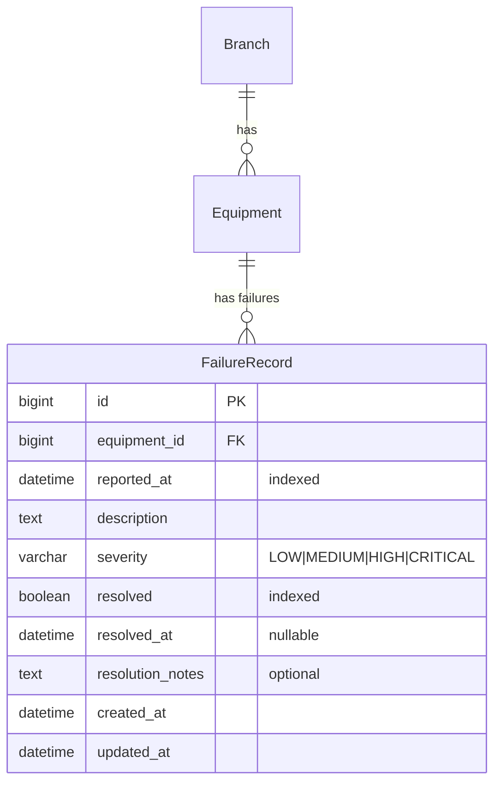

# Fase 06 — Historial de fallas (Failure history)

> Estado: Implementado (pendiente de commit)
> Commit: pendiente

## 1. Objetivo y alcance

Registrar las **fallas reportadas** sobre un equipo y permitir su resolución. Cada falla queda asociada al equipo, con su severidad, descripción, momento del reporte y, una vez atendida, las notas y la fecha de resolución.

**Out of scope:**

- Crear automáticamente un `MaintenanceRecord` cuando se resuelve una falla (queda como TODO opcional, ver sección 10).
- Vinculación con `MaintenanceSchedule` (fase 05).
- SLAs / tiempos de respuesta automáticos.
- Reportes desde el frontend público (en esta fase, todos los endpoints requieren autenticación).
- Comentarios o conversación dentro de la falla.

## 2. Stack y dependencias específicas

Sin dependencias nuevas. Solo Django + DRF + django-filter.

Settings tocados:

- `INSTALLED_APPS`: añadir `"apps.failures"`.
- `api/v1/urls.py`: añadir `path("failures/", include(...))`.

## 3. Modelo de datos

### 3.1 Modelo `FailureRecord` (`apps/failures/models.py`)

| Campo               | Tipo                       | Constraints                                          | Descripción                                | Visible al usuario        |
| ------------------- | -------------------------- | ---------------------------------------------------- | ------------------------------------------ | ------------------------- |
| `id`                | `BigAutoField`             | PK                                                   | Identificador                              | "ID"                      |
| `equipment`         | `FK -> equipment.Equipment`| `on_delete=PROTECT`, `related_name="failures"`       | Equipo afectado                            | `_("Equipo")`             |
| `reported_at`       | `DateTimeField`            | `default=timezone.now`, `db_index=True`              | Cuándo se reportó                          | `_("Reportada el")`       |
| `description`       | `TextField`                |                                                      | Detalle de la falla                        | `_("Descripción")`        |
| `severity`          | `CharField(10)` (choices)  | `db_index=True`                                      | Gravedad                                   | `_("Severidad")`          |
| `resolved`          | `BooleanField`             | `default=False`, `db_index=True`                     | Indica si está resuelta                    | `_("Resuelta")`           |
| `resolved_at`       | `DateTimeField`            | `null=True`, `blank=True`                            | Cuándo se resolvió                         | `_("Resuelta el")`        |
| `resolution_notes`  | `TextField`                | `blank=True`                                         | Notas de resolución                        | `_("Notas de resolución")`|
| `created_at`        | `DateTimeField`            | `auto_now_add=True`                                  | Auditoría                                  | `_("Creada")`             |
| `updated_at`        | `DateTimeField`            | `auto_now=True`                                      | Auditoría                                  | `_("Actualizada")`        |

Meta:
- `verbose_name = _("Reporte de falla")`, `verbose_name_plural = _("Reportes de falla")`
- `ordering = ["-reported_at"]`
- Indexes: `(equipment, -reported_at)`, `severity`, `resolved`.
- Constraint: `CheckConstraint(check=Q(resolved=False) | Q(resolved_at__isnull=False), name="failure_resolved_consistency")` — si `resolved=True`, debe haber `resolved_at`.

### 3.2 Choices/Enums

`FailureSeverity(TextChoices)`:

| Value (inglés) | Label (español)        | Cuándo se usa                                              |
| -------------- | ---------------------- | ---------------------------------------------------------- |
| `LOW`          | `_("Baja")`            | Cosmética / no afecta la operación (ej. ruido leve)        |
| `MEDIUM`       | `_("Media")`           | Afecta función secundaria (ej. alarma sonora intermitente) |
| `HIGH`         | `_("Alta")`            | Afecta función principal pero el equipo aún opera          |
| `CRITICAL`     | `_("Crítica")`         | El equipo no puede usarse / riesgo para el paciente        |

### 3.3 Relaciones



## 4. Capa API

### 4.1 Endpoints

| Método | Path                                   | Descripción                              | Permisos        | Status codes       |
| ------ | -------------------------------------- | ---------------------------------------- | --------------- | ------------------ |
| GET    | `/api/v1/failures/`                    | Lista paginada                           | IsAuthenticated | 200, 401           |
| POST   | `/api/v1/failures/`                    | Crear reporte                            | IsAuthenticated | 201, 400, 401      |
| GET    | `/api/v1/failures/{id}/`               | Detalle                                  | IsAuthenticated | 200, 401, 404      |
| PUT    | `/api/v1/failures/{id}/`               | Update total                             | IsAuthenticated | 200, 400, 401, 404 |
| PATCH  | `/api/v1/failures/{id}/`               | Update parcial                           | IsAuthenticated | 200, 400, 401, 404 |
| DELETE | `/api/v1/failures/{id}/`               | Eliminar                                 | IsAuthenticated | 204, 401, 404      |
| POST   | `/api/v1/failures/{id}/resolve/`       | Marca como resuelta (action)             | IsAuthenticated | 200, 400, 401, 404 |

### 4.2 Filtros, search, ordering

- **Filter** (`FailureRecordFilter`):
  - `?equipment=` (id)
  - `?branch=` (vía `equipment__branch_id`)
  - `?severity=` (choices)
  - `?resolved=` (bool)
  - `?reported_at_after=`, `?reported_at_before=` (rango de fechas)
- **Search** (`?search=`): `description`, `resolution_notes`, `equipment__asset_tag`.
- **Ordering** (`?ordering=`): `reported_at`, `severity`, `resolved_at`. Default `-reported_at`.

### 4.3 Validaciones de serializer

- `equipment`: existir (DRF lo valida).
- `description`: `.strip()`, no vacía → `_("La descripción es obligatoria.")`.
- `severity`: choices (DRF lo valida).
- `reported_at`: si se envía, no puede ser futuro → `_("La fecha de reporte no puede ser futura.")`. Default a `now()` si se omite.
- `resolved` y `resolved_at`: relación cruzada:
  - Si llega `resolved=True` sin `resolved_at`, el serializer lo setea automáticamente a `now()`.
  - Si llega `resolved=False` con `resolved_at` definido, error: `_("No se puede definir 'resuelta el' sin marcar la falla como resuelta.")`.
  - Si llega `resolved_at < reported_at`, error: `_("La fecha de resolución no puede ser anterior al reporte.")`.

## 5. Reglas de negocio

- **No se cambia `Equipment.status` automáticamente** al reportar/resolver una falla. Esa transición (a `IN_REPAIR`, etc.) es responsabilidad de un PATCH explícito o de un service futuro `equipment_services.transition_status`. Razón: separar responsabilidades; un mismo equipo puede tener múltiples fallas y la severidad afecta cómo (o si) se cambia el estado.
- **Action `resolve/`** es la forma idiomática de marcar una falla como resuelta:
  - Acepta `resolution_notes` opcional en el body.
  - Setea `resolved=True`, `resolved_at=now()`.
  - Idempotente: llamar dos veces no falla (devuelve 200 con la falla ya resuelta).
- **Constraint de DB:** `CheckConstraint` en `Meta.constraints` garantiza coherencia: `resolved=True ⇒ resolved_at IS NOT NULL`. Esto previene corrupción si alguien hace bulk update por fuera de la API.
- **`PROTECT` en FK:** consistente con el patrón. No se borra un equipo con fallas históricas.
- **CRITICAL → notificación:** opcional/extensión futura. En esta fase no se dispara nada al crear una falla `CRITICAL` (mantener simple). Documentar como TODO.

## 6. Snippets clave de implementación

### 6.1 Modelo (`apps/failures/models.py`)

```python
from django.db import models
from django.db.models import Q
from django.utils import timezone
from django.utils.translation import gettext_lazy as _

from apps.equipment.models import Equipment


class FailureSeverity(models.TextChoices):
    LOW = "LOW", _("Baja")
    MEDIUM = "MEDIUM", _("Media")
    HIGH = "HIGH", _("Alta")
    CRITICAL = "CRITICAL", _("Crítica")


class FailureRecord(models.Model):
    equipment = models.ForeignKey(
        Equipment,
        on_delete=models.PROTECT,
        related_name="failures",
        verbose_name=_("Equipo"),
    )
    reported_at = models.DateTimeField(
        _("Reportada el"), default=timezone.now, db_index=True
    )
    description = models.TextField(_("Descripción"))
    severity = models.CharField(
        _("Severidad"),
        max_length=10,
        choices=FailureSeverity.choices,
        db_index=True,
    )
    resolved = models.BooleanField(_("Resuelta"), default=False, db_index=True)
    resolved_at = models.DateTimeField(_("Resuelta el"), null=True, blank=True)
    resolution_notes = models.TextField(_("Notas de resolución"), blank=True)
    created_at = models.DateTimeField(_("Creada"), auto_now_add=True)
    updated_at = models.DateTimeField(_("Actualizada"), auto_now=True)

    class Meta:
        verbose_name = _("Reporte de falla")
        verbose_name_plural = _("Reportes de falla")
        ordering = ["-reported_at"]
        indexes = [
            models.Index(fields=["equipment", "-reported_at"], name="fail_eq_reported_idx"),
            models.Index(fields=["severity"], name="fail_severity_idx"),
            models.Index(fields=["resolved"], name="fail_resolved_idx"),
        ]
        constraints = [
            models.CheckConstraint(
                check=Q(resolved=False) | Q(resolved_at__isnull=False),
                name="failure_resolved_consistency",
            ),
        ]

    def __str__(self) -> str:
        return f"{self.get_severity_display()} - {self.equipment.asset_tag} - {self.reported_at:%Y-%m-%d}"

    def mark_resolved(self, notes: str = "") -> None:
        if self.resolved:
            return
        self.resolved = True
        self.resolved_at = timezone.now()
        if notes:
            self.resolution_notes = notes
        self.save(update_fields=["resolved", "resolved_at", "resolution_notes", "updated_at"])
```

### 6.2 Manager (`apps/failures/managers.py`)

```python
from django.db import models


class FailureRecordQuerySet(models.QuerySet):
    def open(self):
        return self.filter(resolved=False)

    def resolved(self):
        return self.filter(resolved=True)

    def critical(self):
        return self.filter(severity="CRITICAL")
```

### 6.3 Serializer (`api/v1/failures/serializers.py`)

```python
from django.utils import timezone
from django.utils.translation import gettext_lazy as _
from rest_framework import serializers

from apps.failures.models import FailureRecord


class FailureRecordSerializer(serializers.ModelSerializer):
    equipment_asset_tag = serializers.CharField(source="equipment.asset_tag", read_only=True)
    branch_name = serializers.CharField(source="equipment.branch.name", read_only=True)

    class Meta:
        model = FailureRecord
        fields = (
            "id", "equipment", "equipment_asset_tag", "branch_name",
            "reported_at", "description", "severity",
            "resolved", "resolved_at", "resolution_notes",
            "created_at", "updated_at",
        )
        read_only_fields = ("id", "created_at", "updated_at")

    def validate_description(self, value):
        if not value.strip():
            raise serializers.ValidationError(_("La descripción es obligatoria."))
        return value.strip()

    def validate_reported_at(self, value):
        if value > timezone.now():
            raise serializers.ValidationError(_("La fecha de reporte no puede ser futura."))
        return value

    def validate(self, attrs):
        resolved = attrs.get("resolved", getattr(self.instance, "resolved", False))
        resolved_at = attrs.get("resolved_at", getattr(self.instance, "resolved_at", None))
        reported_at = attrs.get("reported_at", getattr(self.instance, "reported_at", None))

        if resolved and resolved_at is None:
            attrs["resolved_at"] = timezone.now()
        if not resolved and resolved_at is not None:
            raise serializers.ValidationError(
                {"resolved_at": _("No se puede definir 'resuelta el' sin marcar la falla como resuelta.")}
            )
        if resolved_at and reported_at and resolved_at < reported_at:
            raise serializers.ValidationError(
                {"resolved_at": _("La fecha de resolución no puede ser anterior al reporte.")}
            )
        return attrs


class ResolveFailureSerializer(serializers.Serializer):
    """Body opcional del endpoint POST /failures/{id}/resolve/."""
    resolution_notes = serializers.CharField(required=False, allow_blank=True)
```

### 6.4 Filter (`api/v1/failures/filters.py`)

```python
from django_filters import rest_framework as filters

from apps.failures.models import FailureRecord


class FailureRecordFilter(filters.FilterSet):
    equipment = filters.NumberFilter(field_name="equipment_id")
    branch = filters.NumberFilter(field_name="equipment__branch_id")
    severity = filters.CharFilter(field_name="severity", lookup_expr="iexact")
    resolved = filters.BooleanFilter(field_name="resolved")
    reported_at_after = filters.DateTimeFilter(field_name="reported_at", lookup_expr="gte")
    reported_at_before = filters.DateTimeFilter(field_name="reported_at", lookup_expr="lte")

    class Meta:
        model = FailureRecord
        fields = ("equipment", "branch", "severity", "resolved",
                  "reported_at_after", "reported_at_before")
```

### 6.5 ViewSet (`api/v1/failures/views.py`)

```python
from rest_framework import viewsets
from rest_framework.decorators import action
from rest_framework.permissions import IsAuthenticated
from rest_framework.response import Response

from apps.failures.models import FailureRecord

from .filters import FailureRecordFilter
from .serializers import FailureRecordSerializer, ResolveFailureSerializer


class FailureRecordViewSet(viewsets.ModelViewSet):
    queryset = FailureRecord.objects.select_related("equipment", "equipment__branch")
    serializer_class = FailureRecordSerializer
    permission_classes = (IsAuthenticated,)
    filterset_class = FailureRecordFilter
    search_fields = ("description", "resolution_notes", "equipment__asset_tag")
    ordering_fields = ("reported_at", "severity", "resolved_at")
    ordering = ("-reported_at",)

    @action(detail=True, methods=["post"], url_path="resolve")
    def resolve(self, request, pk=None):
        failure = self.get_object()
        body = ResolveFailureSerializer(data=request.data)
        body.is_valid(raise_exception=True)
        notes = body.validated_data.get("resolution_notes", "")
        failure.mark_resolved(notes=notes)
        return Response(self.get_serializer(failure).data)
```

### 6.6 URLs (`api/v1/failures/urls.py`)

```python
from rest_framework.routers import DefaultRouter

from .views import FailureRecordViewSet

app_name = "failures"

router = DefaultRouter()
router.register(r"", FailureRecordViewSet, basename="failure")

urlpatterns = router.urls
```

Línea en `api/v1/urls.py`:

```python
path("failures/", include(("api.v1.failures.urls", "failures"), namespace="failures")),
```

### 6.7 Migración (esquema, `apps/failures/migrations/0001_initial.py`)

```python
operations = [
    migrations.CreateModel(
        name="FailureRecord",
        fields=[
            ("id", models.BigAutoField(primary_key=True, serialize=False)),
            ("reported_at", models.DateTimeField(db_index=True, default=timezone.now,
                                                  verbose_name=_("Reportada el"))),
            ("description", models.TextField(verbose_name=_("Descripción"))),
            ("severity", models.CharField(
                choices=[("LOW", _("Baja")), ("MEDIUM", _("Media")),
                         ("HIGH", _("Alta")), ("CRITICAL", _("Crítica"))],
                max_length=10, db_index=True, verbose_name=_("Severidad"))),
            ("resolved", models.BooleanField(db_index=True, default=False, verbose_name=_("Resuelta"))),
            ("resolved_at", models.DateTimeField(blank=True, null=True, verbose_name=_("Resuelta el"))),
            ("resolution_notes", models.TextField(blank=True, verbose_name=_("Notas de resolución"))),
            ("created_at", models.DateTimeField(auto_now_add=True, verbose_name=_("Creada"))),
            ("updated_at", models.DateTimeField(auto_now=True, verbose_name=_("Actualizada"))),
            ("equipment", models.ForeignKey(
                on_delete=models.PROTECT, related_name="failures",
                to="equipment.equipment", verbose_name=_("Equipo"))),
        ],
        options={
            "verbose_name": _("Reporte de falla"),
            "verbose_name_plural": _("Reportes de falla"),
            "ordering": ["-reported_at"],
        },
    ),
    migrations.AddIndex(model_name="failurerecord",
                        index=models.Index(fields=["equipment", "-reported_at"], name="fail_eq_reported_idx")),
    migrations.AddIndex(model_name="failurerecord",
                        index=models.Index(fields=["severity"], name="fail_severity_idx")),
    migrations.AddIndex(model_name="failurerecord",
                        index=models.Index(fields=["resolved"], name="fail_resolved_idx")),
    migrations.AddConstraint(
        model_name="failurerecord",
        constraint=models.CheckConstraint(
            check=Q(resolved=False) | Q(resolved_at__isnull=False),
            name="failure_resolved_consistency",
        ),
    ),
]
```

## 7. Tests

### 7.1 Estructura de archivos

```
apps/failures/tests/
├── __init__.py
├── conftest.py
├── factories.py            # FailureRecordFactory
├── test_models.py
└── test_api.py             # CRUD + resolve action + filtros
```

### 7.2 Casos cubiertos

**Modelo:**
- `__str__` formato.
- `mark_resolved()` setea flags y `resolved_at`.
- `mark_resolved()` es idempotente (segunda llamada no cambia `resolved_at`).
- Constraint de DB: intentar guardar `resolved=True` con `resolved_at=None` por bulk update levanta `IntegrityError` (verificar con raw SQL para eludir el serializer).

**API básica:**
- 401 sin auth.
- 201 al crear, `reported_at` por defecto a `now()` si se omite.
- Filtros: `equipment`, `branch`, `severity`, `resolved`, rango de `reported_at`.
- Search por `description`/`resolution_notes`/`asset_tag`.

**Validaciones:**
- 400 si `description` vacía.
- 400 si `reported_at` futura.
- 400 si `resolved=False` y se envía `resolved_at`.
- 400 si `resolved_at < reported_at`.
- Auto-fill: enviar `resolved=True` sin `resolved_at` → response trae `resolved_at` poblado.

**Action `resolve/`:**
- 200 marca como resuelta y devuelve la falla actualizada.
- 200 idempotente (segunda llamada no falla, `resolved_at` no se mueve).
- Acepta `resolution_notes` en el body y la persiste.
- 404 si no existe.

### 7.3 Comandos para correrlos

```bash
docker compose exec web pytest apps/failures -v
docker compose exec web pytest apps/failures --cov=apps.failures --cov=api.v1.failures
```

## 8. Pruebas manuales con Postman

### 8.1 Variables de entorno Postman

| Nombre        | Valor inicial | Descripción                          |
| ------------- | ------------- | ------------------------------------ |
| `failure_id`  | (vacío)       | Se llena tras crear                  |

### 8.2 Setup

JWT como en fase 02. `equipment_id` válido.

### 8.3 Endpoints

#### Create

```http
POST {{base_url}}/api/v1/failures/
Authorization: Bearer {{access_token}}
Content-Type: application/json

{
  "equipment": {{equipment_id}},
  "description": "El sensor de oxígeno marca valores erráticos.",
  "severity": "HIGH"
}
```

Response 201:

```json
{
  "id": 1,
  "equipment": 1,
  "equipment_asset_tag": "EQ-0001",
  "branch_name": "Sede Norte",
  "reported_at": "2026-04-29T18:00:00Z",
  "description": "El sensor de oxígeno marca valores erráticos.",
  "severity": "HIGH",
  "resolved": false,
  "resolved_at": null,
  "resolution_notes": "",
  "created_at": "2026-04-29T18:00:00Z",
  "updated_at": "2026-04-29T18:00:00Z"
}
```

Tests:

```js
pm.test("status 201", () => pm.response.to.have.status(201));
pm.test("starts unresolved", () => pm.expect(pm.response.json().resolved).to.eql(false));
pm.environment.set("failure_id", pm.response.json().id);
```

#### List + filtros

```http
GET {{base_url}}/api/v1/failures/?resolved=false&severity=HIGH&ordering=-reported_at
Authorization: Bearer {{access_token}}
```

```http
GET {{base_url}}/api/v1/failures/?equipment={{equipment_id}}&reported_at_after=2026-01-01T00:00:00Z
Authorization: Bearer {{access_token}}
```

#### Retrieve

```http
GET {{base_url}}/api/v1/failures/{{failure_id}}/
Authorization: Bearer {{access_token}}
```

#### Resolver (action)

```http
POST {{base_url}}/api/v1/failures/{{failure_id}}/resolve/
Authorization: Bearer {{access_token}}
Content-Type: application/json

{
  "resolution_notes": "Se reemplazó el sensor de oxígeno por uno nuevo. Calibración OK."
}
```

Response 200:

```json
{
  "id": 1,
  "equipment": 1,
  "equipment_asset_tag": "EQ-0001",
  "branch_name": "Sede Norte",
  "reported_at": "2026-04-29T18:00:00Z",
  "description": "El sensor de oxígeno marca valores erráticos.",
  "severity": "HIGH",
  "resolved": true,
  "resolved_at": "2026-04-29T19:30:00Z",
  "resolution_notes": "Se reemplazó el sensor de oxígeno por uno nuevo. Calibración OK.",
  "created_at": "2026-04-29T18:00:00Z",
  "updated_at": "2026-04-29T19:30:00Z"
}
```

Tests:

```js
pm.test("now resolved", () => {
  const body = pm.response.json();
  pm.expect(body.resolved).to.eql(true);
  pm.expect(body.resolved_at).to.be.a("string").and.not.empty;
});
```

#### Patch (cambios manuales)

```http
PATCH {{base_url}}/api/v1/failures/{{failure_id}}/
Authorization: Bearer {{access_token}}
Content-Type: application/json

{"severity": "CRITICAL"}
```

#### Delete

```http
DELETE {{base_url}}/api/v1/failures/{{failure_id}}/
Authorization: Bearer {{access_token}}
```

#### Casos de error

**Descripción vacía (400):**

```json
{"description": ["La descripción es obligatoria."]}
```

**`reported_at` futuro (400):**

```json
{"reported_at": ["La fecha de reporte no puede ser futura."]}
```

**`resolved=false` con `resolved_at` definido (400):**

```json
{"resolved_at": ["No se puede definir 'resuelta el' sin marcar la falla como resuelta."]}
```

**`resolved_at < reported_at` (400):**

```json
{"resolved_at": ["La fecha de resolución no puede ser anterior al reporte."]}
```

### 8.4 Caso de uso típico — crear y resolver

1. POST `/api/v1/failures/` con `severity=CRITICAL` → guardar `failure_id`.
2. (opcional) PATCH `/api/v1/equipment/{id}/` con `{"status":"IN_REPAIR"}` para reflejar la situación.
3. POST `/api/v1/failures/{failure_id}/resolve/` con notas.
4. (opcional) PATCH `/api/v1/equipment/{id}/` con `{"status":"ACTIVE"}` para reactivar el equipo.
5. GET `/api/v1/equipment/{id}/` y verificar que se ven sus fallas vía un futuro action `failures` (extensión).

## 9. Checklist de verificación

- [ ] Migración aplicada (incluye `CheckConstraint`).
- [ ] `apps.failures` en `INSTALLED_APPS`.
- [ ] `path("failures/", ...)` en `api/v1/urls.py`.
- [ ] Tests pasan.
- [ ] Postman: CRUD + `resolve` action OK.
- [ ] Constraint de DB: bulk update inválido falla con `IntegrityError`.
- [ ] Validación cruzada `resolved`/`resolved_at` funciona.
- [ ] Filtros `?resolved=false&severity=CRITICAL` devuelven solo críticas abiertas.

## 10. Posibles extensiones futuras / TODO

- **Crear automáticamente un `MaintenanceRecord`** (fase 04) al hacer `resolve/` con `kind=CORRECTIVE` y `description=resolution_notes`. Es opcional porque puede haber resoluciones que no requieran un MaintenanceRecord (ej. falsa alarma).
- **Notificación al crear `severity=CRITICAL`:** task Celery (similar a fase 05) que envíe email a `MAINTENANCE_NOTIFICATION_EMAILS` + email del jefe de sede.
- **Cambio automático de `Equipment.status`:** crear una `CRITICAL` no resuelta podría forzar `status=IN_REPAIR`. Resolver todas las fallas abiertas podría volver el estado a `ACTIVE`. Implementar como signal con un service.
- **SLA / tiempo de respuesta:** calcular `resolved_at - reported_at` y reportar promedios por severidad.
- **Adjuntar fotos** del problema (`ImageField` o `FileField` múltiple).
- **Comentarios / hilo de conversación** en una falla.
- **Permisos por rol:** técnicos solo crean, supervisores resuelven, admins editan/borran.
- **Endpoint público restringido** para que un operador reporte una falla sin login (con token QR-based).
- **Dashboard:** conteo de fallas abiertas por sede / severidad, equipos con más fallas históricas.
- **`reopen/` action** que vuelve `resolved=False`, dejando `resolved_at` y `resolution_notes` como histórico (cambiaría el contrato del modelo a un timeline; alternativa: una tabla `FailureEvent` separada).
