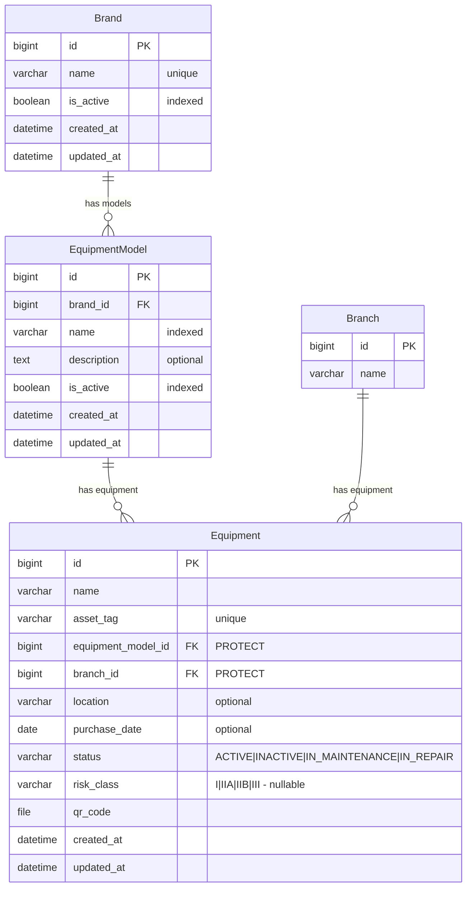

# Fase 08 — Catálogo de marcas y modelos + clasificación de riesgo INVIMA

> Estado: Pendiente
> Commit: pendiente

## 1. Objetivo y alcance

Normalizar la información de **marca** y **modelo** del equipo biomédico. Hoy `apps.equipment.models.Equipment` los almacena como dos `CharField` libres (`brand`, `model`), lo que abre la puerta a duplicados con tipografía distinta ("Philips", "philips", "PHILIPS ") y a inconsistencias entre equipos de la misma referencia. Esta fase introduce un catálogo en una nueva app `apps.catalog/` con dos entidades — `Brand` y `EquipmentModel` — y reemplaza los dos `CharField` por un único FK `equipment_model -> EquipmentModel`. Adicionalmente se añade en `Equipment` el campo opcional `risk_class` con la clasificación INVIMA (I, IIA, IIB, III) para permitir filtrado regulatorio y dashboards de "pendientes de clasificar".

**Out of scope:**

- Migración de datos: el usuario confirmó que no hay equipos en BD, así que la fase entra por **Ruta A** (esquema directo, sin `RunPython` ni backfill). Si en el futuro se necesita poblar a partir de strings, se documentará en una fase aparte.
- Catálogo de proveedores / fabricantes (más amplio que "marca").
- Catálogo de categorías clínicas (cardiología, imagenología, etc.) — queda como TODO.
- Códigos UMDNS / GMDN (nomenclaturas internacionales de dispositivos médicos).
- Adjuntar fichas técnicas o manuales (`FileField`) en `EquipmentModel`.
- Versionado / histórico de cambios sobre marcas y modelos.
- Endpoints públicos / sin auth.

## 2. Stack y dependencias específicas

Sin dependencias nuevas. Solo Django + DRF + django-filter (ya presentes).

Settings tocados:

- `LOCAL_APPS` en `config/settings/base.py`: añadir `"apps.catalog"`.
- `api/v1/urls.py`: añadir `path("catalog/", include(("api.v1.catalog.urls", "catalog"), namespace="catalog"))`.

URLs resultantes:

- `GET/POST /api/v1/catalog/brands/`
- `GET/PUT/PATCH/DELETE /api/v1/catalog/brands/{id}/`
- `GET/POST /api/v1/catalog/equipment-models/`
- `GET/PUT/PATCH/DELETE /api/v1/catalog/equipment-models/{id}/`

## 3. Modelo de datos

### 3.1 Modelo `Brand` (`apps/catalog/models.py`)

| Campo            | Tipo                       | Constraints                                       | Descripción                              | Visible al usuario              |
| ---------------- | -------------------------- | ------------------------------------------------- | ---------------------------------------- | ------------------------------- |
| `id`             | `BigAutoField`             | PK                                                | Identificador                            | "ID"                            |
| `name`           | `CharField(120)`           | `unique=True`, `db_index=True`                    | Nombre comercial de la marca             | `_("Nombre")`                   |
| `is_active`      | `BooleanField`             | `default=True`, `db_index=True`                   | Soft-disable (no se elimina, se desactiva) | `_("Activa")`                 |
| `created_at`     | `DateTimeField`            | `auto_now_add=True`                               | Auditoría                                | `_("Creada")`                   |
| `updated_at`     | `DateTimeField`            | `auto_now=True`                                   | Auditoría                                | `_("Actualizada")`              |

Meta:
- `verbose_name = _("Marca")`, `verbose_name_plural = _("Marcas")`
- `ordering = ["name"]`
- Indexes: `brand_name_idx`, `brand_is_active_idx`.

### 3.2 Modelo `EquipmentModel` (`apps/catalog/models.py`)

| Campo            | Tipo                       | Constraints                                                                   | Descripción                                  | Visible al usuario        |
| ---------------- | -------------------------- | ----------------------------------------------------------------------------- | -------------------------------------------- | ------------------------- |
| `id`             | `BigAutoField`             | PK                                                                            | Identificador                                | "ID"                      |
| `brand`          | `FK -> catalog.Brand`      | `on_delete=PROTECT`, `related_name="equipment_models"`                        | Marca a la que pertenece el modelo           | `_("Marca")`              |
| `name`           | `CharField(120)`           | `db_index=True`                                                               | Nombre/código del modelo (ej. "MX450")       | `_("Modelo")`             |
| `description`    | `TextField`                | `blank=True`                                                                  | Notas / descripción técnica corta            | `_("Descripción")`        |
| `is_active`      | `BooleanField`             | `default=True`, `db_index=True`                                               | Soft-disable                                 | `_("Activo")`             |
| `created_at`     | `DateTimeField`            | `auto_now_add=True`                                                           | Auditoría                                    | `_("Creado")`             |
| `updated_at`     | `DateTimeField`            | `auto_now=True`                                                               | Auditoría                                    | `_("Actualizado")`        |

Meta:
- `verbose_name = _("Modelo de equipo")`, `verbose_name_plural = _("Modelos de equipo")`
- `ordering = ["brand__name", "name"]`
- Constraint: `UniqueConstraint(fields=["brand", "name"], name="equipment_model_unique_per_brand")` — un mismo `name` puede repetirse entre marcas distintas, pero no dentro de la misma marca.
- Indexes: `eqmodel_brand_idx`, `eqmodel_name_idx`, `eqmodel_is_active_idx`.

### 3.3 Cambios en `apps/equipment/models.py`

Campos eliminados:

- `brand = CharField(80)` → eliminado (se reemplaza por el FK a través de `equipment_model.brand`).
- `model = CharField(80)` → eliminado (se reemplaza por `equipment_model`).

Campos agregados:

- `equipment_model = FK -> catalog.EquipmentModel` con `on_delete=PROTECT`, `related_name="equipment"`, `null=False`, `verbose_name=_("Modelo")`.
- `risk_class = CharField(4)` con `choices=RiskClass.choices`, `null=True`, `blank=True`, `db_index=True`, `verbose_name=_("Clasificación de riesgo INVIMA")`.

Indexes ajustados en `Equipment.Meta.indexes`:

- Eliminar: `equipment_brand_idx` (ya no existe `brand` libre).
- Mantener: `equipment_asset_tag_idx`, `equipment_branch_idx`, `equipment_status_idx`.
- Agregar: `equipment_model_idx` sobre `equipment_model`, `equipment_risk_class_idx` sobre `risk_class`.

### 3.4 Choices/Enums

`RiskClass(TextChoices)` en `apps/equipment/models.py` (vive con `Equipment` porque es atributo regulatorio del equipo, no del modelo del catálogo):

| Value | Label (español)                        | Cuándo se usa                                                        |
| ----- | -------------------------------------- | -------------------------------------------------------------------- |
| `I`   | `_("Clase I — riesgo bajo")`           | Equipos no invasivos, riesgo mínimo (ej. estetoscopios, camillas)    |
| `IIA` | `_("Clase IIA — riesgo moderado")`     | Riesgo moderado (ej. equipos de diagnóstico no invasivo, ECG)        |
| `IIB` | `_("Clase IIB — riesgo moderado-alto")`| Riesgo moderado-alto (ej. desfibriladores, ventiladores)             |
| `III` | `_("Clase III — riesgo alto")`         | Riesgo alto, generalmente invasivos (ej. marcapasos, prótesis)       |

Nota regulatoria: la clasificación INVIMA (Resolución 4002 de 2007 / Decreto 4725 de 2005) usa exactamente estas cuatro categorías. Mantener los valores en mayúsculas, sin acentos, para que sirvan como código estable en API y como sufijo en filtros.

### 3.5 Diagrama ER



## 4. Capa API

### 4.1 Endpoints — `Brand`

| Método | Path                                  | Descripción                          | Permisos        | Status codes              |
| ------ | ------------------------------------- | ------------------------------------ | --------------- | ------------------------- |
| GET    | `/api/v1/catalog/brands/`             | Lista paginada                       | IsAuthenticated | 200, 401                  |
| POST   | `/api/v1/catalog/brands/`             | Crear marca                          | IsAuthenticated | 201, 400, 401             |
| GET    | `/api/v1/catalog/brands/{id}/`        | Detalle                              | IsAuthenticated | 200, 401, 404             |
| PUT    | `/api/v1/catalog/brands/{id}/`        | Update total                         | IsAuthenticated | 200, 400, 401, 404        |
| PATCH  | `/api/v1/catalog/brands/{id}/`        | Update parcial                       | IsAuthenticated | 200, 400, 401, 404        |
| DELETE | `/api/v1/catalog/brands/{id}/`        | Eliminar (PROTECT si tiene modelos)  | IsAuthenticated | 204, 401, 404, 409        |

- **Filter** (`BrandFilter`): `?is_active=` (bool).
- **Search** (`?search=`): `name`.
- **Ordering** (`?ordering=`): `name`, `created_at`. Default `name`.

### 4.2 Endpoints — `EquipmentModel`

| Método | Path                                              | Descripción                              | Permisos        | Status codes              |
| ------ | ------------------------------------------------- | ---------------------------------------- | --------------- | ------------------------- |
| GET    | `/api/v1/catalog/equipment-models/`               | Lista paginada                           | IsAuthenticated | 200, 401                  |
| POST   | `/api/v1/catalog/equipment-models/`               | Crear modelo                             | IsAuthenticated | 201, 400, 401             |
| GET    | `/api/v1/catalog/equipment-models/{id}/`          | Detalle                                  | IsAuthenticated | 200, 401, 404             |
| PUT    | `/api/v1/catalog/equipment-models/{id}/`          | Update total                             | IsAuthenticated | 200, 400, 401, 404        |
| PATCH  | `/api/v1/catalog/equipment-models/{id}/`          | Update parcial                           | IsAuthenticated | 200, 400, 401, 404        |
| DELETE | `/api/v1/catalog/equipment-models/{id}/`          | Eliminar (PROTECT si tiene equipos)      | IsAuthenticated | 204, 401, 404, 409        |

- **Filter** (`EquipmentModelFilter`):
  - `?brand=` (id, exacto).
  - `?is_active=` (bool).
  - `?brand_is_active=` (bool, vía `brand__is_active`) — útil para listar solo modelos cuya marca también está activa.
- **Search** (`?search=`): `name`, `description`, `brand__name`.
- **Ordering** (`?ordering=`): `name`, `brand__name`, `created_at`. Default `brand__name,name`.

### 4.3 Delta sobre `/api/v1/equipment/`

- **Payload de create/update**:
  - Eliminar campos: `"brand"`, `"model"`.
  - Agregar campos: `"equipment_model"` (FK id, requerido), `"risk_class"` (string entre `I`, `IIA`, `IIB`, `III` — opcional, puede ser `null`).
  - El response incluye además dos read-only de conveniencia: `"equipment_model_name"` (alias `equipment_model.name`) y `"brand_name"` (alias `equipment_model.brand.name`) — esto evita que el frontend tenga que hacer un fetch extra al catálogo.

- **Filtros nuevos** en `EquipmentFilter`:
  - Eliminar: `brand` (icontains sobre CharField).
  - Agregar:
    - `?equipment_model=` (id exacto).
    - `?brand=` (id, vía `equipment_model__brand_id`).
    - `?risk_class=` (choice exacto, ej. `?risk_class=IIB`).
    - `?risk_class__isnull=` (bool, ej. `?risk_class__isnull=true` para listar pendientes de clasificar).

- **Search** en el ViewSet:
  - Reemplazar `"model"` por `"equipment_model__name"`.
  - Agregar `"equipment_model__brand__name"` para que `?search=Philips` siga funcionando.

### 4.4 Validaciones de serializer (en español, con `gettext_lazy`)

**`BrandSerializer`:**

- `name`:
  - `.strip()` + colapsar espacios.
  - No vacío → `_("El nombre no puede estar vacío.")`.
  - Único case-insensitive, excluyendo self → `_("Ya existe una marca con este nombre.")`.

**`EquipmentModelSerializer`:**

- `name`:
  - `.strip()` + colapsar espacios.
  - No vacío → `_("El nombre del modelo no puede estar vacío.")`.
- `brand`:
  - Debe estar activa → `_("La marca seleccionada no está activa.")`.
- `validate(attrs)`:
  - Unicidad de `(brand, name)` case-insensitive, excluyendo self → `_("Ya existe un modelo con este nombre para esta marca.")`.
- `description`: `.strip()`.

**`EquipmentSerializer` (delta):**

- `equipment_model`:
  - Debe estar `is_active=True` → `_("El modelo seleccionado no está activo.")`.
  - Su `brand` debe estar `is_active=True` → `_("La marca del modelo seleccionado no está activa.")`.
- `risk_class`:
  - `required=False`, `allow_null=True`. DRF valida que el valor pertenezca a `RiskClass.values` automáticamente. Si llega un valor inválido, mensaje DRF estándar; mantener.

## 5. Reglas de negocio

- **Soft-disable, no hard-delete:** desactivar (`is_active=False`) una `Brand` o `EquipmentModel` es la operación normal; `DELETE` queda como excepción y se permite **solo si no hay registros dependientes** (de lo contrario `PROTECT` devuelve 409). Razón: queremos preservar el histórico de equipos cuya marca/modelo dejó de ofertarse.
- **Validación de cadena `Brand → EquipmentModel → Equipment` activa:**
  - No se puede crear/editar un `EquipmentModel` apuntando a una `Brand` con `is_active=False`.
  - No se puede crear/editar un `Equipment` apuntando a un `EquipmentModel` con `is_active=False`, ni a uno cuya marca esté inactiva.
  - Esta validación vive en el serializer para devolver 400 con mensaje en español, **no** en el modelo (un modelo con `clean()` complicaría el admin y no aporta seguridad adicional cuando el único punto de entrada externo es la API).
- **`risk_class` no es obligatorio:** los equipos creados antes de tener clasificación quedan con `risk_class=None`. El filtro `?risk_class__isnull=true` alimenta el dashboard de "pendientes de clasificar".
- **`PROTECT` consistente:** ambos FK (`Equipment.equipment_model`, `EquipmentModel.brand`) usan `on_delete=PROTECT` igual que `Equipment.branch`. Cualquier intento de borrado con dependientes devuelve 409 con un payload `{"detail": "..."}` en lugar de un 500. Para esto el ViewSet captura `ProtectedError`.
- **Unicidad case-insensitive:**
  - `Brand.name` único globalmente case-insensitive (validación serializer; en la BD el `unique=True` es sensitive, así que el serializer es la primera línea de defensa).
  - `EquipmentModel(name)` único **por marca** case-insensitive (serializer) + `UniqueConstraint(brand, name)` exact-match en la BD (segunda línea, evita race conditions).
- **`Equipment.equipment_model` es `null=False`:** todo equipo debe tener modelo. La Ruta A asume que la BD está vacía, así que la migración de `AddField` no necesita default ni pasos intermedios.
- **`related_name="equipment_models"`** en `EquipmentModel.brand`: explícito para evitar choques con `django.db.models` y para que `brand.equipment_models.all()` lea natural en código.

## 6. Snippets clave de implementación

### 6.1 Modelo (`apps/catalog/models.py`)

```python
from django.db import models
from django.utils.translation import gettext_lazy as _

from .managers import BrandManager, EquipmentModelManager


class Brand(models.Model):
    name = models.CharField(
        _("Nombre"),
        max_length=120,
        unique=True,
        db_index=True,
        help_text=_("Nombre comercial único de la marca."),
    )
    is_active = models.BooleanField(_("Activa"), default=True, db_index=True)
    created_at = models.DateTimeField(_("Creada"), auto_now_add=True)
    updated_at = models.DateTimeField(_("Actualizada"), auto_now=True)

    objects = BrandManager()

    class Meta:
        verbose_name = _("Marca")
        verbose_name_plural = _("Marcas")
        ordering = ["name"]
        indexes = [
            models.Index(fields=["name"], name="brand_name_idx"),
            models.Index(fields=["is_active"], name="brand_is_active_idx"),
        ]

    def __str__(self) -> str:
        return self.name


class EquipmentModel(models.Model):
    brand = models.ForeignKey(
        Brand,
        on_delete=models.PROTECT,
        related_name="equipment_models",
        verbose_name=_("Marca"),
    )
    name = models.CharField(_("Modelo"), max_length=120, db_index=True)
    description = models.TextField(_("Descripción"), blank=True)
    is_active = models.BooleanField(_("Activo"), default=True, db_index=True)
    created_at = models.DateTimeField(_("Creado"), auto_now_add=True)
    updated_at = models.DateTimeField(_("Actualizado"), auto_now=True)

    objects = EquipmentModelManager()

    class Meta:
        verbose_name = _("Modelo de equipo")
        verbose_name_plural = _("Modelos de equipo")
        ordering = ["brand__name", "name"]
        constraints = [
            models.UniqueConstraint(
                fields=["brand", "name"],
                name="equipment_model_unique_per_brand",
            ),
        ]
        indexes = [
            models.Index(fields=["brand"], name="eqmodel_brand_idx"),
            models.Index(fields=["name"], name="eqmodel_name_idx"),
            models.Index(fields=["is_active"], name="eqmodel_is_active_idx"),
        ]

    def __str__(self) -> str:
        return f"{self.brand.name} {self.name}"
```

### 6.2 Manager (`apps/catalog/managers.py`)

```python
from django.db import models


class BrandQuerySet(models.QuerySet):
    def active(self) -> "BrandQuerySet":
        return self.filter(is_active=True)

    def inactive(self) -> "BrandQuerySet":
        return self.filter(is_active=False)


class BrandManager(models.Manager.from_queryset(BrandQuerySet)):
    def get_queryset(self) -> BrandQuerySet:
        return BrandQuerySet(self.model, using=self._db)

    def active(self) -> BrandQuerySet:
        return self.get_queryset().active()

    def inactive(self) -> BrandQuerySet:
        return self.get_queryset().inactive()


class EquipmentModelQuerySet(models.QuerySet):
    def active(self) -> "EquipmentModelQuerySet":
        return self.filter(is_active=True)

    def inactive(self) -> "EquipmentModelQuerySet":
        return self.filter(is_active=False)

    def for_brand(self, brand_id: int) -> "EquipmentModelQuerySet":
        return self.filter(brand_id=brand_id)

    def with_active_brand(self) -> "EquipmentModelQuerySet":
        return self.filter(brand__is_active=True)


class EquipmentModelManager(models.Manager.from_queryset(EquipmentModelQuerySet)):
    def get_queryset(self) -> EquipmentModelQuerySet:
        return EquipmentModelQuerySet(self.model, using=self._db).select_related("brand")

    def active(self) -> EquipmentModelQuerySet:
        return self.get_queryset().active()

    def inactive(self) -> EquipmentModelQuerySet:
        return self.get_queryset().inactive()

    def for_brand(self, brand_id: int) -> EquipmentModelQuerySet:
        return self.get_queryset().for_brand(brand_id)
```

### 6.3 Admin (`apps/catalog/admin.py`)

```python
from django.contrib import admin
from django.utils.translation import gettext_lazy as _

from .models import Brand, EquipmentModel


@admin.register(Brand)
class BrandAdmin(admin.ModelAdmin):
    list_display = ("name", "is_active", "created_at")
    list_filter = ("is_active",)
    search_fields = ("name",)
    ordering = ("name",)
    readonly_fields = ("created_at", "updated_at")
    fieldsets = (
        (_("Información general"), {"fields": ("name", "is_active")}),
        (_("Auditoría"), {"fields": ("created_at", "updated_at")}),
    )


@admin.register(EquipmentModel)
class EquipmentModelAdmin(admin.ModelAdmin):
    list_display = ("name", "brand", "is_active", "created_at")
    list_filter = ("is_active", "brand")
    search_fields = ("name", "description", "brand__name")
    ordering = ("brand__name", "name")
    autocomplete_fields = ("brand",)
    readonly_fields = ("created_at", "updated_at")
    fieldsets = (
        (_("Identificación"), {"fields": ("brand", "name", "description", "is_active")}),
        (_("Auditoría"), {"fields": ("created_at", "updated_at")}),
    )
```

### 6.4 AppConfig (`apps/catalog/apps.py`)

```python
from django.apps import AppConfig
from django.utils.translation import gettext_lazy as _


class CatalogConfig(AppConfig):
    default_auto_field = "django.db.models.BigAutoField"
    name = "apps.catalog"
    verbose_name = _("Catálogo de marcas y modelos")
```

### 6.5 Serializers (`api/v1/catalog/serializers.py`)

```python
from django.utils.translation import gettext_lazy as _
from rest_framework import serializers

from apps.catalog.models import Brand, EquipmentModel


class BrandSerializer(serializers.ModelSerializer):
    class Meta:
        model = Brand
        fields = (
            "id",
            "name",
            "is_active",
            "created_at",
            "updated_at",
        )
        read_only_fields = ("id", "created_at", "updated_at")
        extra_kwargs = {
            # El mensaje de unicidad lo controla validate_name (en español).
            "name": {"validators": []},
        }

    def validate_name(self, value: str) -> str:
        normalized = " ".join(value.split()).strip()
        if not normalized:
            raise serializers.ValidationError(_("El nombre no puede estar vacío."))

        queryset = Brand.objects.filter(name__iexact=normalized)
        if self.instance is not None:
            queryset = queryset.exclude(pk=self.instance.pk)
        if queryset.exists():
            raise serializers.ValidationError(
                _("Ya existe una marca con este nombre.")
            )
        return normalized


class EquipmentModelSerializer(serializers.ModelSerializer):
    brand_name = serializers.CharField(source="brand.name", read_only=True)

    class Meta:
        model = EquipmentModel
        fields = (
            "id",
            "brand",
            "brand_name",
            "name",
            "description",
            "is_active",
            "created_at",
            "updated_at",
        )
        read_only_fields = ("id", "brand_name", "created_at", "updated_at")

    def validate_name(self, value: str) -> str:
        normalized = " ".join(value.split()).strip()
        if not normalized:
            raise serializers.ValidationError(
                _("El nombre del modelo no puede estar vacío.")
            )
        return normalized

    def validate_brand(self, value: Brand) -> Brand:
        if not value.is_active:
            raise serializers.ValidationError(
                _("La marca seleccionada no está activa.")
            )
        return value

    def validate_description(self, value: str) -> str:
        return value.strip()

    def validate(self, attrs):
        brand = attrs.get("brand", getattr(self.instance, "brand", None))
        name = attrs.get("name", getattr(self.instance, "name", None))
        if brand is not None and name:
            queryset = EquipmentModel.objects.filter(brand=brand, name__iexact=name)
            if self.instance is not None:
                queryset = queryset.exclude(pk=self.instance.pk)
            if queryset.exists():
                raise serializers.ValidationError(
                    {"name": _("Ya existe un modelo con este nombre para esta marca.")}
                )
        return attrs
```

### 6.6 Filters (`api/v1/catalog/filters.py`)

```python
from django_filters import rest_framework as filters

from apps.catalog.models import Brand, EquipmentModel


class BrandFilter(filters.FilterSet):
    is_active = filters.BooleanFilter(field_name="is_active")

    class Meta:
        model = Brand
        fields = ("is_active",)


class EquipmentModelFilter(filters.FilterSet):
    brand = filters.NumberFilter(field_name="brand_id")
    is_active = filters.BooleanFilter(field_name="is_active")
    brand_is_active = filters.BooleanFilter(field_name="brand__is_active")

    class Meta:
        model = EquipmentModel
        fields = ("brand", "is_active", "brand_is_active")
```

### 6.7 ViewSets (`api/v1/catalog/views.py`)

```python
from django.db.models.deletion import ProtectedError
from django.utils.translation import gettext_lazy as _
from rest_framework import status, viewsets
from rest_framework.permissions import IsAuthenticated
from rest_framework.response import Response

from apps.catalog.models import Brand, EquipmentModel

from .filters import BrandFilter, EquipmentModelFilter
from .serializers import BrandSerializer, EquipmentModelSerializer


class BrandViewSet(viewsets.ModelViewSet):
    """CRUD de marcas. DELETE protegido si la marca tiene modelos asociados."""

    queryset = Brand.objects.all()
    serializer_class = BrandSerializer
    permission_classes = (IsAuthenticated,)
    filterset_class = BrandFilter
    search_fields = ("name",)
    ordering_fields = ("name", "created_at")
    ordering = ("name",)

    def destroy(self, request, *args, **kwargs):
        instance = self.get_object()
        try:
            instance.delete()
        except ProtectedError:
            return Response(
                {
                    "detail": _(
                        "No se puede eliminar la marca porque tiene modelos asociados."
                    )
                },
                status=status.HTTP_409_CONFLICT,
            )
        return Response(status=status.HTTP_204_NO_CONTENT)


class EquipmentModelViewSet(viewsets.ModelViewSet):
    """CRUD de modelos de equipo. DELETE protegido si el modelo tiene equipos."""

    queryset = EquipmentModel.objects.select_related("brand")
    serializer_class = EquipmentModelSerializer
    permission_classes = (IsAuthenticated,)
    filterset_class = EquipmentModelFilter
    search_fields = ("name", "description", "brand__name")
    ordering_fields = ("name", "brand__name", "created_at")
    ordering = ("brand__name", "name")

    def destroy(self, request, *args, **kwargs):
        instance = self.get_object()
        try:
            instance.delete()
        except ProtectedError:
            return Response(
                {
                    "detail": _(
                        "No se puede eliminar el modelo porque tiene equipos asociados."
                    )
                },
                status=status.HTTP_409_CONFLICT,
            )
        return Response(status=status.HTTP_204_NO_CONTENT)
```

### 6.8 URLs (`api/v1/catalog/urls.py`)

```python
from rest_framework.routers import DefaultRouter

from .views import BrandViewSet, EquipmentModelViewSet

app_name = "catalog"

router = DefaultRouter()
router.register(r"brands", BrandViewSet, basename="brand")
router.register(r"equipment-models", EquipmentModelViewSet, basename="equipment-model")

urlpatterns = router.urls
```

Línea a añadir en `api/v1/urls.py` (antes de `equipment/`, para que el catálogo se registre primero):

```python
path("catalog/", include(("api.v1.catalog.urls", "catalog"), namespace="catalog")),
```

### 6.9 Diff conceptual de `apps/equipment/models.py`

Eliminar:

```python
brand = models.CharField(_("Marca"), max_length=80)
model = models.CharField(_("Modelo"), max_length=80)
# y el índice asociado en Meta.indexes:
models.Index(fields=["brand"], name="equipment_brand_idx"),
```

Agregar (al inicio del archivo):

```python
from apps.catalog.models import EquipmentModel as EquipmentModelRef


class RiskClass(models.TextChoices):
    I = "I", _("Clase I — riesgo bajo")
    IIA = "IIA", _("Clase IIA — riesgo moderado")
    IIB = "IIB", _("Clase IIB — riesgo moderado-alto")
    III = "III", _("Clase III — riesgo alto")
```

> Nota: el alias `EquipmentModelRef` evita confusión con el patrón histórico `class Meta.model`. Si se prefiere claridad, se puede importar como `EquipmentModel` y usar `equipment_model = ForeignKey("catalog.EquipmentModel", ...)` con string para no tocar el espacio de nombres.

Reemplazar dentro de `class Equipment(models.Model)`:

```python
equipment_model = models.ForeignKey(
    "catalog.EquipmentModel",
    on_delete=models.PROTECT,
    related_name="equipment",
    verbose_name=_("Modelo"),
)
risk_class = models.CharField(
    _("Clasificación de riesgo INVIMA"),
    max_length=4,
    choices=RiskClass.choices,
    null=True,
    blank=True,
    db_index=True,
)
```

Actualizar `Meta.indexes`:

```python
indexes = [
    models.Index(fields=["asset_tag"], name="equipment_asset_tag_idx"),
    models.Index(fields=["branch"], name="equipment_branch_idx"),
    models.Index(fields=["status"], name="equipment_status_idx"),
    models.Index(fields=["equipment_model"], name="equipment_model_idx"),
    models.Index(fields=["risk_class"], name="equipment_risk_class_idx"),
]
```

Actualizar `__str__`:

```python
def __str__(self) -> str:
    return f"{self.name} ({self.asset_tag})"
```

(Sin cambios; el nombre + tag ya identifica al equipo. La info de marca/modelo se compone vía `self.equipment_model.brand.name`.)

### 6.10 Migración (`apps/catalog/migrations/0001_initial.py`)

```python
operations = [
    migrations.CreateModel(
        name="Brand",
        fields=[
            ("id", models.BigAutoField(primary_key=True, serialize=False)),
            ("name", models.CharField(db_index=True, max_length=120, unique=True,
                                       verbose_name=_("Nombre"))),
            ("is_active", models.BooleanField(db_index=True, default=True,
                                               verbose_name=_("Activa"))),
            ("created_at", models.DateTimeField(auto_now_add=True, verbose_name=_("Creada"))),
            ("updated_at", models.DateTimeField(auto_now=True, verbose_name=_("Actualizada"))),
        ],
        options={
            "verbose_name": _("Marca"),
            "verbose_name_plural": _("Marcas"),
            "ordering": ["name"],
        },
    ),
    migrations.CreateModel(
        name="EquipmentModel",
        fields=[
            ("id", models.BigAutoField(primary_key=True, serialize=False)),
            ("name", models.CharField(db_index=True, max_length=120, verbose_name=_("Modelo"))),
            ("description", models.TextField(blank=True, verbose_name=_("Descripción"))),
            ("is_active", models.BooleanField(db_index=True, default=True,
                                               verbose_name=_("Activo"))),
            ("created_at", models.DateTimeField(auto_now_add=True, verbose_name=_("Creado"))),
            ("updated_at", models.DateTimeField(auto_now=True, verbose_name=_("Actualizado"))),
            ("brand", models.ForeignKey(
                on_delete=models.PROTECT, related_name="equipment_models",
                to="catalog.brand", verbose_name=_("Marca"))),
        ],
        options={
            "verbose_name": _("Modelo de equipo"),
            "verbose_name_plural": _("Modelos de equipo"),
            "ordering": ["brand__name", "name"],
        },
    ),
    migrations.AddIndex(model_name="brand",
                        index=models.Index(fields=["name"], name="brand_name_idx")),
    migrations.AddIndex(model_name="brand",
                        index=models.Index(fields=["is_active"], name="brand_is_active_idx")),
    migrations.AddIndex(model_name="equipmentmodel",
                        index=models.Index(fields=["brand"], name="eqmodel_brand_idx")),
    migrations.AddIndex(model_name="equipmentmodel",
                        index=models.Index(fields=["name"], name="eqmodel_name_idx")),
    migrations.AddIndex(model_name="equipmentmodel",
                        index=models.Index(fields=["is_active"], name="eqmodel_is_active_idx")),
    migrations.AddConstraint(
        model_name="equipmentmodel",
        constraint=models.UniqueConstraint(
            fields=("brand", "name"), name="equipment_model_unique_per_brand"
        ),
    ),
]
```

### 6.11 Migración (`apps/equipment/migrations/0002_equipment_model_and_risk_class.py`)

> **Ruta A — sin data migration.** Asume `Equipment.objects.count() == 0`. El runner solicitará confirmación si detecta filas (Django ofrece default value, pero al ser `null=False` sin default, fallará y avisará — lo cual es la red de seguridad esperada).

```python
from django.db import migrations, models


class Migration(migrations.Migration):

    dependencies = [
        ("catalog", "0001_initial"),
        ("equipment", "0001_initial"),
    ]

    operations = [
        migrations.RemoveIndex(
            model_name="equipment",
            name="equipment_brand_idx",
        ),
        migrations.RemoveField(
            model_name="equipment",
            name="brand",
        ),
        migrations.RemoveField(
            model_name="equipment",
            name="model",
        ),
        migrations.AddField(
            model_name="equipment",
            name="equipment_model",
            field=models.ForeignKey(
                on_delete=models.PROTECT,
                related_name="equipment",
                to="catalog.equipmentmodel",
                verbose_name="Modelo",
            ),
        ),
        migrations.AddField(
            model_name="equipment",
            name="risk_class",
            field=models.CharField(
                blank=True,
                choices=[
                    ("I", "Clase I — riesgo bajo"),
                    ("IIA", "Clase IIA — riesgo moderado"),
                    ("IIB", "Clase IIB — riesgo moderado-alto"),
                    ("III", "Clase III — riesgo alto"),
                ],
                db_index=True,
                max_length=4,
                null=True,
                verbose_name="Clasificación de riesgo INVIMA",
            ),
        ),
        migrations.AddIndex(
            model_name="equipment",
            index=models.Index(fields=["equipment_model"], name="equipment_model_idx"),
        ),
        migrations.AddIndex(
            model_name="equipment",
            index=models.Index(fields=["risk_class"], name="equipment_risk_class_idx"),
        ),
    ]
```

### 6.12 Delta de `api/v1/equipment/serializers.py`

Eliminar:

```python
def validate_brand(self, value: str) -> str:
    return value.strip()

def validate_model(self, value: str) -> str:
    return value.strip()
```

Y de `Meta.fields`: quitar `"brand"` y `"model"`.

Agregar imports y dependencias:

```python
from apps.catalog.models import EquipmentModel
```

Modificar `Meta.fields` y agregar campos read-only en la clase:

```python
brand_name = serializers.CharField(source="equipment_model.brand.name", read_only=True)
equipment_model_name = serializers.CharField(source="equipment_model.name", read_only=True)

class Meta:
    model = Equipment
    fields = (
        "id",
        "name",
        "asset_tag",
        "equipment_model",
        "equipment_model_name",
        "brand_name",
        "branch",
        "branch_name",
        "location",
        "purchase_date",
        "status",
        "risk_class",
        "qr_code",
        "qr_code_url",
        "created_at",
        "updated_at",
    )
    read_only_fields = (
        "id",
        "equipment_model_name",
        "brand_name",
        "qr_code",
        "qr_code_url",
        "created_at",
        "updated_at",
    )
    extra_kwargs = {
        "asset_tag": {"validators": []},
        "risk_class": {"required": False, "allow_null": True},
    }
```

Agregar validación:

```python
def validate_equipment_model(self, value: EquipmentModel) -> EquipmentModel:
    if not value.is_active:
        raise serializers.ValidationError(
            _("El modelo seleccionado no está activo.")
        )
    if not value.brand.is_active:
        raise serializers.ValidationError(
            _("La marca del modelo seleccionado no está activa.")
        )
    return value
```

### 6.13 Delta de `api/v1/equipment/filters.py`

```python
from django_filters import rest_framework as filters

from apps.equipment.models import Equipment


class EquipmentFilter(filters.FilterSet):
    branch = filters.NumberFilter(field_name="branch_id")
    status = filters.CharFilter(field_name="status", lookup_expr="iexact")
    equipment_model = filters.NumberFilter(field_name="equipment_model_id")
    brand = filters.NumberFilter(field_name="equipment_model__brand_id")
    risk_class = filters.CharFilter(field_name="risk_class", lookup_expr="iexact")
    risk_class__isnull = filters.BooleanFilter(
        field_name="risk_class", lookup_expr="isnull"
    )
    purchase_date_after = filters.DateFilter(
        field_name="purchase_date", lookup_expr="gte"
    )
    purchase_date_before = filters.DateFilter(
        field_name="purchase_date", lookup_expr="lte"
    )

    class Meta:
        model = Equipment
        fields = (
            "branch",
            "status",
            "equipment_model",
            "brand",
            "risk_class",
            "risk_class__isnull",
            "purchase_date_after",
            "purchase_date_before",
        )
```

### 6.14 Delta de `api/v1/equipment/views.py`

Solo cambian `search_fields` y `queryset` (este último para el `select_related`):

```python
queryset = Equipment.objects.select_related(
    "branch", "equipment_model", "equipment_model__brand"
)
search_fields = (
    "name",
    "asset_tag",
    "equipment_model__name",
    "equipment_model__brand__name",
)
```

El resto del ViewSet (acciones `by_asset_tag`, `regenerate_qr`, `history`) no cambia.

### 6.15 Delta de `apps/equipment/managers.py`

Mantener métodos existentes y actualizar `get_queryset`:

```python
class EquipmentManager(models.Manager.from_queryset(EquipmentQuerySet)):
    def get_queryset(self) -> EquipmentQuerySet:
        return EquipmentQuerySet(self.model, using=self._db).select_related(
            "branch", "equipment_model", "equipment_model__brand"
        )
```

### 6.16 Delta de `apps/equipment/admin.py`

```python
list_display = (
    "name", "asset_tag", "equipment_model", "branch", "status", "risk_class", "created_at",
)
list_filter = ("status", "branch", "risk_class", "equipment_model__brand")
search_fields = (
    "name", "asset_tag", "equipment_model__name", "equipment_model__brand__name",
)
autocomplete_fields = ("branch", "equipment_model")
fieldsets = (
    (_("Identificación"), {"fields": ("name", "asset_tag", "equipment_model")}),
    (_("Ubicación y estado"), {
        "fields": ("branch", "location", "status", "risk_class", "purchase_date"),
    }),
    (_("Código QR"), {"fields": ("qr_code",)}),
    (_("Auditoría"), {"fields": ("created_at", "updated_at")}),
)
```

### 6.17 Cambios en `config/settings/base.py`

Añadir en `LOCAL_APPS`:

```python
LOCAL_APPS: list[str] = [
    "apps.users",
    "apps.branches",
    "apps.catalog",       # <- NUEVA
    "apps.equipment",
    "apps.maintenance",
    "apps.scheduling",
    "apps.failures",
]
```

`apps.catalog` debe ir **antes** de `apps.equipment` para que el orden de migraciones (y el discovery de `default_app_config`) sea natural. La dependencia explícita ya está en `0002_*` vía `dependencies = [("catalog", "0001_initial"), ...]`.

## 7. Tests

### 7.1 Estructura de archivos

```
apps/catalog/tests/
├── __init__.py
├── conftest.py             # fixtures: brand, equipment_model, auth_client, api_client, user
├── factories.py            # BrandFactory, EquipmentModelFactory
├── test_models.py          # __str__, manager (active/inactive/for_brand), unique_together
└── test_api.py             # CRUD + filtros + 409 PROTECT + validaciones español
```

Adicionalmente en `apps/equipment/tests/`:

```
apps/equipment/tests/
├── factories.py            # actualizar EquipmentFactory para usar SubFactory(EquipmentModelFactory)
├── test_api.py             # añadir cases: payload con equipment_model, risk_class, filtro ?risk_class__isnull
└── test_models.py          # añadir cases: choices RiskClass, default risk_class=None
```

### 7.2 Casos cubiertos

**Catálogo — Modelo / Manager:**

- `Brand.__str__` devuelve `name`.
- `EquipmentModel.__str__` devuelve `"<brand.name> <name>"`.
- `Brand.objects.active()` y `.inactive()` filtran por `is_active`.
- `EquipmentModel.objects.for_brand(brand_id)` retorna solo los de esa marca.
- `EquipmentModel.objects.with_active_brand()` excluye los cuya marca está inactiva.
- `UniqueConstraint(brand, name)`: insertar dos modelos con misma `(brand, name)` exact-match levanta `IntegrityError` (verificar con `ObjectDoesNotExist` o raw insert para eludir el serializer).

**Catálogo — API Brand:**

- 401 sin auth en list/create/retrieve/update/delete.
- 201 al crear, response trae `id`, `is_active=true`, audit fields.
- 400 con `name` duplicado case-insensitive → mensaje `"Ya existe una marca con este nombre."`.
- 400 con `name` solo whitespace → `"El nombre no puede estar vacío."`.
- 200 list con filtro `?is_active=false`.
- 200 search `?search=Phil` matchea `Philips`.
- 200 PATCH cambiando `is_active=False`.
- 204 DELETE de marca sin modelos asociados.
- 409 DELETE de marca con `EquipmentModel` asociado → `{"detail": "No se puede eliminar la marca porque tiene modelos asociados."}`.

**Catálogo — API EquipmentModel:**

- 401 sin auth.
- 201 al crear con `brand` activa.
- 400 al crear con `brand` inactiva → `"La marca seleccionada no está activa."`.
- 400 con `name` vacío → `"El nombre del modelo no puede estar vacío."`.
- 400 con `(brand, name)` duplicado case-insensitive → `"Ya existe un modelo con este nombre para esta marca."`.
- 201 con el mismo `name` pero distinta `brand` (caso permitido: "MX450" puede existir en Philips y en Mindray).
- 200 filtro `?brand={id}` retorna solo los de esa marca.
- 200 filtro `?brand_is_active=true` excluye modelos cuya marca está inactiva.
- 200 search `?search=MX450` y `?search=Philips`.
- 204 DELETE de modelo sin equipos asociados.
- 409 DELETE de modelo con `Equipment` asociado.

**Equipment — deltas:**

- 201 al crear con `equipment_model` válido y `risk_class="IIB"`.
- 201 al crear sin `risk_class` (queda `None`).
- 400 al crear con `equipment_model` cuya `is_active=False` → `"El modelo seleccionado no está activo."`.
- 400 al crear con `equipment_model` cuya `brand.is_active=False` → `"La marca del modelo seleccionado no está activa."`.
- 400 con `risk_class="X"` (valor fuera de choices) → mensaje DRF estándar.
- 200 filtro `?risk_class=IIB` retorna solo los de esa clase.
- 200 filtro `?risk_class__isnull=true` retorna solo los pendientes de clasificar.
- 200 filtro `?brand={brand_id}` retorna equipos cuyo `equipment_model.brand_id == brand_id`.
- Response incluye `equipment_model_name` y `brand_name` poblados.
- Search `?search=Philips` matchea vía `equipment_model__brand__name`.

### 7.3 Snippets de tests

**`apps/catalog/tests/factories.py`:**

```python
import factory
from factory.django import DjangoModelFactory

from apps.catalog.models import Brand, EquipmentModel


class BrandFactory(DjangoModelFactory):
    class Meta:
        model = Brand

    name = factory.Sequence(lambda n: f"Brand {n}")
    is_active = True


class EquipmentModelFactory(DjangoModelFactory):
    class Meta:
        model = EquipmentModel

    brand = factory.SubFactory(BrandFactory)
    name = factory.Sequence(lambda n: f"M-{n:04d}")
    description = factory.Faker("sentence", nb_words=8)
    is_active = True
```

**`apps/catalog/tests/conftest.py`:**

```python
import pytest
from rest_framework.test import APIClient

from apps.users.tests.factories import AdminFactory

from .factories import BrandFactory, EquipmentModelFactory


@pytest.fixture
def api_client():
    return APIClient()


@pytest.fixture
def admin_user(db):
    return AdminFactory()


@pytest.fixture
def auth_client(api_client, admin_user):
    api_client.force_authenticate(user=admin_user)
    return api_client


@pytest.fixture
def brand(db):
    return BrandFactory()


@pytest.fixture
def equipment_model(db, brand):
    return EquipmentModelFactory(brand=brand)
```

**`apps/catalog/tests/test_models.py`:**

```python
import pytest
from django.db import IntegrityError

from apps.catalog.models import Brand, EquipmentModel

from .factories import BrandFactory, EquipmentModelFactory

pytestmark = pytest.mark.django_db


class TestBrandModel:
    def test_str(self):
        b = BrandFactory(name="Philips")
        assert str(b) == "Philips"

    def test_active_inactive_managers(self):
        BrandFactory(name="A", is_active=True)
        BrandFactory(name="B", is_active=False)

        assert Brand.objects.active().count() == 1
        assert Brand.objects.inactive().count() == 1


class TestEquipmentModelModel:
    def test_str(self, brand):
        m = EquipmentModelFactory(brand=brand, name="MX450")
        assert str(m) == f"{brand.name} MX450"

    def test_unique_per_brand_constraint(self, brand):
        EquipmentModelFactory(brand=brand, name="MX450")
        with pytest.raises(IntegrityError):
            EquipmentModel.objects.create(brand=brand, name="MX450")

    def test_same_name_allowed_across_brands(self):
        b1 = BrandFactory(name="Philips")
        b2 = BrandFactory(name="Mindray")
        EquipmentModelFactory(brand=b1, name="MX450")
        # No debe levantar IntegrityError
        EquipmentModel.objects.create(brand=b2, name="MX450")

    def test_for_brand_manager(self, brand):
        EquipmentModelFactory.create_batch(3, brand=brand)
        EquipmentModelFactory()  # otra brand
        assert EquipmentModel.objects.for_brand(brand.id).count() == 3

    def test_with_active_brand_manager(self):
        active = BrandFactory(is_active=True)
        inactive = BrandFactory(is_active=False)
        EquipmentModelFactory(brand=active)
        EquipmentModelFactory(brand=inactive)
        assert EquipmentModel.objects.with_active_brand().count() == 1
```

**`apps/catalog/tests/test_api.py` (extracto representativo):**

```python
import pytest
from django.urls import reverse
from rest_framework import status

from apps.catalog.models import Brand, EquipmentModel

from .factories import BrandFactory, EquipmentModelFactory

pytestmark = pytest.mark.django_db


BRAND_LIST_URL = reverse("v1:catalog:brand-list")
MODEL_LIST_URL = reverse("v1:catalog:equipment-model-list")


def brand_detail_url(pk: int) -> str:
    return reverse("v1:catalog:brand-detail", args=[pk])


def model_detail_url(pk: int) -> str:
    return reverse("v1:catalog:equipment-model-detail", args=[pk])


class TestBrandAuth:
    def test_list_requires_auth(self, api_client):
        assert api_client.get(BRAND_LIST_URL).status_code == status.HTTP_401_UNAUTHORIZED


class TestBrandCreate:
    def test_create_brand(self, auth_client):
        response = auth_client.post(BRAND_LIST_URL, {"name": "Philips"}, format="json")
        assert response.status_code == status.HTTP_201_CREATED
        assert Brand.objects.count() == 1

    def test_duplicate_name_case_insensitive_returns_400(self, auth_client):
        BrandFactory(name="Philips")
        response = auth_client.post(BRAND_LIST_URL, {"name": "PHILIPS"}, format="json")
        assert response.status_code == status.HTTP_400_BAD_REQUEST
        assert "Ya existe una marca con este nombre" in response.json()["name"][0]

    def test_blank_name_returns_400(self, auth_client):
        response = auth_client.post(BRAND_LIST_URL, {"name": "   "}, format="json")
        assert response.status_code == status.HTTP_400_BAD_REQUEST
        assert "El nombre no puede estar vacío" in response.json()["name"][0]


class TestBrandDelete:
    def test_delete_without_models_returns_204(self, auth_client, brand):
        response = auth_client.delete(brand_detail_url(brand.id))
        assert response.status_code == status.HTTP_204_NO_CONTENT

    def test_delete_with_models_returns_409(self, auth_client, brand):
        EquipmentModelFactory(brand=brand)
        response = auth_client.delete(brand_detail_url(brand.id))
        assert response.status_code == status.HTTP_409_CONFLICT
        assert "No se puede eliminar la marca" in response.json()["detail"]


class TestEquipmentModelCreate:
    def test_create_with_active_brand(self, auth_client, brand):
        payload = {"brand": brand.id, "name": "MX450", "description": "Monitor multiparámetro"}
        response = auth_client.post(MODEL_LIST_URL, payload, format="json")
        assert response.status_code == status.HTTP_201_CREATED
        assert EquipmentModel.objects.count() == 1

    def test_create_with_inactive_brand_returns_400(self, auth_client):
        b = BrandFactory(is_active=False)
        payload = {"brand": b.id, "name": "MX450"}
        response = auth_client.post(MODEL_LIST_URL, payload, format="json")
        assert response.status_code == status.HTTP_400_BAD_REQUEST
        assert "La marca seleccionada no está activa" in response.json()["brand"][0]

    def test_duplicate_per_brand_returns_400(self, auth_client, brand):
        EquipmentModelFactory(brand=brand, name="MX450")
        payload = {"brand": brand.id, "name": "mx450"}
        response = auth_client.post(MODEL_LIST_URL, payload, format="json")
        assert response.status_code == status.HTTP_400_BAD_REQUEST
        assert "Ya existe un modelo con este nombre para esta marca" in response.json()["name"][0]

    def test_same_name_other_brand_succeeds(self, auth_client, brand):
        EquipmentModelFactory(brand=brand, name="MX450")
        other = BrandFactory()
        payload = {"brand": other.id, "name": "MX450"}
        response = auth_client.post(MODEL_LIST_URL, payload, format="json")
        assert response.status_code == status.HTTP_201_CREATED


class TestEquipmentModelFilters:
    def test_filter_by_brand(self, auth_client, brand):
        EquipmentModelFactory.create_batch(2, brand=brand)
        EquipmentModelFactory()  # otra brand

        response = auth_client.get(MODEL_LIST_URL, {"brand": brand.id})
        assert response.status_code == status.HTTP_200_OK
        assert response.json()["count"] == 2

    def test_filter_by_brand_is_active(self, auth_client):
        active = BrandFactory(is_active=True)
        inactive = BrandFactory(is_active=False)
        EquipmentModelFactory(brand=active)
        EquipmentModelFactory(brand=inactive)

        response = auth_client.get(MODEL_LIST_URL, {"brand_is_active": "true"})
        assert response.status_code == status.HTTP_200_OK
        assert response.json()["count"] == 1


class TestEquipmentModelDelete:
    def test_delete_with_equipment_returns_409(self, auth_client, equipment_model):
        from apps.equipment.tests.factories import EquipmentFactory

        EquipmentFactory(equipment_model=equipment_model)
        response = auth_client.delete(model_detail_url(equipment_model.id))
        assert response.status_code == status.HTTP_409_CONFLICT
        assert "No se puede eliminar el modelo" in response.json()["detail"]
```

**Delta para `apps/equipment/tests/factories.py`:**

```python
import factory
from factory.django import DjangoModelFactory

from apps.branches.tests.factories import BranchFactory
from apps.catalog.tests.factories import EquipmentModelFactory
from apps.equipment.models import Equipment, EquipmentStatus


class EquipmentFactory(DjangoModelFactory):
    class Meta:
        model = Equipment

    name = factory.Sequence(lambda n: f"Equipo {n}")
    asset_tag = factory.Sequence(lambda n: f"EQ-{n:04d}")
    equipment_model = factory.SubFactory(EquipmentModelFactory)
    branch = factory.SubFactory(BranchFactory)
    location = ""
    purchase_date = None
    status = EquipmentStatus.ACTIVE
    risk_class = None
```

**Delta para `apps/equipment/tests/test_api.py` (casos nuevos):**

```python
class TestEquipmentRiskClass:
    def test_create_without_risk_class_defaults_to_null(self, auth_client, branch, equipment_model):
        payload = {
            "name": "Monitor",
            "asset_tag": "EQ-9001",
            "branch": branch.id,
            "equipment_model": equipment_model.id,
        }
        response = auth_client.post(LIST_URL, payload, format="json")
        assert response.status_code == status.HTTP_201_CREATED
        assert response.json()["risk_class"] is None

    def test_create_with_valid_risk_class(self, auth_client, branch, equipment_model):
        payload = {
            "name": "Desfibrilador",
            "asset_tag": "EQ-9002",
            "branch": branch.id,
            "equipment_model": equipment_model.id,
            "risk_class": "IIB",
        }
        response = auth_client.post(LIST_URL, payload, format="json")
        assert response.status_code == status.HTTP_201_CREATED
        assert response.json()["risk_class"] == "IIB"

    def test_filter_by_risk_class_isnull_true(self, auth_client, branch, equipment_model):
        EquipmentFactory(branch=branch, equipment_model=equipment_model, risk_class=None)
        EquipmentFactory(branch=branch, equipment_model=equipment_model, risk_class="IIA")

        response = auth_client.get(LIST_URL, {"risk_class__isnull": "true"})
        assert response.status_code == status.HTTP_200_OK
        assert response.json()["count"] == 1


class TestEquipmentModelValidation:
    def test_create_with_inactive_model_returns_400(self, auth_client, branch):
        from apps.catalog.tests.factories import EquipmentModelFactory
        m = EquipmentModelFactory(is_active=False)
        payload = {
            "name": "X", "asset_tag": "EQ-9100",
            "branch": branch.id, "equipment_model": m.id,
        }
        response = auth_client.post(LIST_URL, payload, format="json")
        assert response.status_code == status.HTTP_400_BAD_REQUEST
        assert "El modelo seleccionado no está activo" in response.json()["equipment_model"][0]

    def test_create_with_inactive_brand_returns_400(self, auth_client, branch):
        from apps.catalog.tests.factories import BrandFactory, EquipmentModelFactory
        b = BrandFactory(is_active=False)
        m = EquipmentModelFactory(brand=b, is_active=True)
        payload = {
            "name": "X", "asset_tag": "EQ-9101",
            "branch": branch.id, "equipment_model": m.id,
        }
        response = auth_client.post(LIST_URL, payload, format="json")
        assert response.status_code == status.HTTP_400_BAD_REQUEST
        assert "La marca del modelo seleccionado no está activa" in response.json()["equipment_model"][0]
```

### 7.4 Comandos para correrlos

```bash
docker compose exec web pytest apps/catalog -v
docker compose exec web pytest apps/catalog --cov=apps.catalog --cov=api.v1.catalog
docker compose exec web pytest apps/equipment -v   # validar deltas
```

## 8. Pruebas manuales con Postman

### 8.1 Variables de entorno Postman

Agregar a las heredadas:

| Nombre               | Valor inicial | Descripción                                            |
| -------------------- | ------------- | ------------------------------------------------------ |
| `brand_id`           | (vacío)       | Se llena al crear la primera marca                     |
| `equipment_model_id` | (vacío)       | Se llena al crear el primer modelo                     |

### 8.2 Setup

JWT como en fase 02. Asegurar `branch_id` válido (crear sede si es necesario).

### 8.3 Flujo recomendado

**1) Login → obtener `access_token`** (heredado de fase 02).

**2) Crear marca:**

```http
POST {{base_url}}/api/v1/catalog/brands/
Authorization: Bearer {{access_token}}
Content-Type: application/json

{
  "name": "Philips"
}
```

Response 201:

```json
{
  "id": 1,
  "name": "Philips",
  "is_active": true,
  "created_at": "2026-05-04T15:00:00Z",
  "updated_at": "2026-05-04T15:00:00Z"
}
```

Tests:

```js
pm.test("status 201", () => pm.response.to.have.status(201));
pm.environment.set("brand_id", pm.response.json().id);
```

**3) Listar marcas con filtro:**

```http
GET {{base_url}}/api/v1/catalog/brands/?is_active=true&search=Phil
Authorization: Bearer {{access_token}}
```

**4) Crear modelo de equipo:**

```http
POST {{base_url}}/api/v1/catalog/equipment-models/
Authorization: Bearer {{access_token}}
Content-Type: application/json

{
  "brand": {{brand_id}},
  "name": "MX450",
  "description": "Monitor multiparámetro de signos vitales."
}
```

Response 201:

```json
{
  "id": 1,
  "brand": 1,
  "brand_name": "Philips",
  "name": "MX450",
  "description": "Monitor multiparámetro de signos vitales.",
  "is_active": true,
  "created_at": "2026-05-04T15:05:00Z",
  "updated_at": "2026-05-04T15:05:00Z"
}
```

Tests:

```js
pm.test("status 201", () => pm.response.to.have.status(201));
pm.environment.set("equipment_model_id", pm.response.json().id);
pm.test("brand_name expanded", () =>
  pm.expect(pm.response.json().brand_name).to.eql("Philips")
);
```

**5) Listar modelos filtrando por marca:**

```http
GET {{base_url}}/api/v1/catalog/equipment-models/?brand={{brand_id}}&brand_is_active=true&ordering=name
Authorization: Bearer {{access_token}}
```

**6) Crear equipo apuntando al modelo y con `risk_class`:**

```http
POST {{base_url}}/api/v1/equipment/
Authorization: Bearer {{access_token}}
Content-Type: application/json

{
  "name": "Monitor de signos vitales",
  "asset_tag": "EQ-0001",
  "equipment_model": {{equipment_model_id}},
  "branch": {{branch_id}},
  "location": "UCI - cama 3",
  "purchase_date": "2024-08-15",
  "status": "ACTIVE",
  "risk_class": "IIB"
}
```

Response 201:

```json
{
  "id": 1,
  "name": "Monitor de signos vitales",
  "asset_tag": "EQ-0001",
  "equipment_model": 1,
  "equipment_model_name": "MX450",
  "brand_name": "Philips",
  "branch": 1,
  "branch_name": "Sede Norte",
  "location": "UCI - cama 3",
  "purchase_date": "2024-08-15",
  "status": "ACTIVE",
  "risk_class": "IIB",
  "qr_code": "/media/equipment/qr/equipment_1.png",
  "qr_code_url": "http://localhost:8000/media/equipment/qr/equipment_1.png",
  "created_at": "2026-05-04T15:10:00Z",
  "updated_at": "2026-05-04T15:10:00Z"
}
```

**7) Crear equipo SIN `risk_class` (queda `null`):**

```http
POST {{base_url}}/api/v1/equipment/
Authorization: Bearer {{access_token}}
Content-Type: application/json

{
  "name": "Camilla móvil",
  "asset_tag": "EQ-0002",
  "equipment_model": {{equipment_model_id}},
  "branch": {{branch_id}},
  "status": "ACTIVE"
}
```

`risk_class` en la respuesta debe ser `null`.

**8) Dashboard de pendientes de clasificar:**

```http
GET {{base_url}}/api/v1/equipment/?risk_class__isnull=true
Authorization: Bearer {{access_token}}
```

**9) Filtrar equipos por clase de riesgo:**

```http
GET {{base_url}}/api/v1/equipment/?risk_class=IIB
Authorization: Bearer {{access_token}}
```

**10) Filtrar equipos por marca (vía catálogo):**

```http
GET {{base_url}}/api/v1/equipment/?brand={{brand_id}}
Authorization: Bearer {{access_token}}
```

### 8.4 Casos de error

**Marca duplicada (400):**

```http
POST {{base_url}}/api/v1/catalog/brands/
Content-Type: application/json
{ "name": "PHILIPS" }
```

```json
{"name": ["Ya existe una marca con este nombre."]}
```

**Modelo duplicado en la misma marca (400):**

```http
POST {{base_url}}/api/v1/catalog/equipment-models/
{"brand": {{brand_id}}, "name": "mx450"}
```

```json
{"name": ["Ya existe un modelo con este nombre para esta marca."]}
```

**Marca inactiva al crear modelo (400):**

Después de hacer `PATCH /catalog/brands/{id}/` con `{"is_active": false}`:

```json
{"brand": ["La marca seleccionada no está activa."]}
```

**Modelo inactivo al crear equipo (400):**

```json
{"equipment_model": ["El modelo seleccionado no está activo."]}
```

**Marca del modelo inactiva al crear equipo (400):**

```json
{"equipment_model": ["La marca del modelo seleccionado no está activa."]}
```

**Borrar marca con modelos asociados (409):**

```http
DELETE {{base_url}}/api/v1/catalog/brands/{{brand_id}}/
```

```json
{"detail": "No se puede eliminar la marca porque tiene modelos asociados."}
```

**Borrar modelo con equipos asociados (409):**

```json
{"detail": "No se puede eliminar el modelo porque tiene equipos asociados."}
```

**`risk_class` inválido (400):**

```http
POST {{base_url}}/api/v1/equipment/
{ ..., "risk_class": "X" }
```

```json
{"risk_class": ["\"X\" no es una elección válida."]}
```

(El mensaje exacto lo emite DRF con la traducción `es-co`.)

## 9. Checklist de verificación

- [ ] `apps/catalog/` creada con `models.py`, `managers.py`, `admin.py`, `apps.py`, `migrations/`, `tests/`.
- [ ] `apps.catalog` registrada en `LOCAL_APPS`, antes de `apps.equipment`.
- [ ] Migración `apps.catalog.0001_initial` aplicada.
- [ ] Migración `apps.equipment.0002_*` aplicada (sin equipos previos en BD).
- [ ] `path("catalog/", ...)` en `api/v1/urls.py`, antes o cerca de `equipment/`.
- [ ] `apps/equipment/admin.py` actualizado: `autocomplete_fields=("branch", "equipment_model")`, list/filter incluyen `risk_class`.
- [ ] `EquipmentSerializer` ya no expone `brand`/`model`, sí expone `equipment_model`, `equipment_model_name`, `brand_name`, `risk_class`.
- [ ] `EquipmentFilter` expone `?brand=`, `?equipment_model=`, `?risk_class=`, `?risk_class__isnull=`.
- [ ] Search del ViewSet incluye `equipment_model__name` y `equipment_model__brand__name`.
- [ ] `EquipmentManager.get_queryset()` usa `select_related("branch", "equipment_model", "equipment_model__brand")`.
- [ ] Tests `pytest apps/catalog` pasan.
- [ ] Tests `pytest apps/equipment` siguen pasando (con factory actualizada).
- [ ] Postman: flujo `crear marca → crear modelo → crear equipo` OK.
- [ ] Postman: 409 al borrar marca con modelos.
- [ ] Postman: 409 al borrar modelo con equipos.
- [ ] Postman: dashboard `?risk_class__isnull=true` lista los pendientes de clasificar.
- [ ] Swagger (`/api/docs/`) muestra correctamente los nuevos endpoints `catalog/brands/` y `catalog/equipment-models/` y los campos nuevos en `equipment`.

## 10. Posibles extensiones futuras / TODO

- **Backfill posterior** si se decide mantener un dump previo: crear una `0003_data_migration.py` con `RunPython` que parsee strings `brand`/`model` históricos a `EquipmentModel` y popule el FK.
- **Catálogo de proveedores/distribuidores** (`Supplier`) y FK opcional `EquipmentModel.supplier`. Útil para garantías y tickets de soporte.
- **Categoría clínica** (`Category`: cardiología, imagenología, etc.) como FK opcional en `EquipmentModel` o `Equipment`.
- **Catálogo de codificaciones internacionales** (UMDNS, GMDN, ECRI). Una tabla `EquipmentModelCode(equipment_model, scheme, code)` cubre el caso multi-esquema.
- **Histórico de cambios** sobre `Brand` y `EquipmentModel` con `django-simple-history` (importante para auditoría regulatoria).
- **Validación INVIMA por modelo, no por equipo**: si dos clínicas tienen el mismo `EquipmentModel`, su `risk_class` regulatoria es la misma. Mover `risk_class` a `EquipmentModel` y derivarlo en `Equipment` (vía `property` o annotated field). Decisión actual: dejarlo en `Equipment` para permitir excepciones documentadas y que un equipo pueda quedar "pendiente de clasificar" sin afectar al catálogo.
- **Filtros agregados** para reportes regulatorios: `?risk_class__in=IIB,III` (django-filter `BaseInFilter`), conteos por sede + clase de riesgo.
- **Endpoint `GET /catalog/equipment-models/{id}/equipment/`** que liste los equipos de ese modelo, paginado (similar al `history` action de `EquipmentViewSet`).
- **Bulk import** de catálogo desde CSV/Excel para precargar marcas y modelos comunes (Philips, GE, Mindray, Siemens + sus líneas más usadas).
- **Permisos diferenciados**: un rol `catalog_editor` que pueda mantener `Brand`/`EquipmentModel` separado del rol que solo crea equipos. Hoy todos pueden con `IsAuthenticated`.
- **Slug field** en `Brand` (para URLs amigables si en el futuro hay un endpoint público).
- **Soft-delete completo** en lugar de DELETE + 409. Hoy preferimos `is_active=False` documentalmente; si se quiere reforzar, sobrescribir `delete()` para que siempre desactive y nunca borre, salvo flag `?hard=true`.
