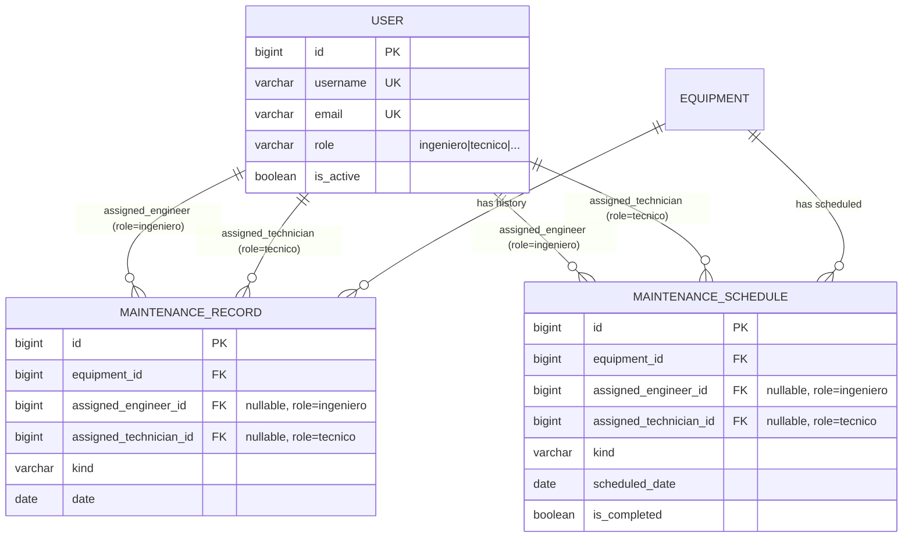

# Fase 09 — Asignación de ingeniero/técnico a mantenimientos y agendamientos

> Estado: Implementado
> Commit: pendiente

## 1. Objetivo y alcance

Permitir que cada **registro histórico de mantenimiento** (fase 04) y cada **agendamiento de
mantenimiento** (fase 05) sea asignable de manera **opcional** a:

- un **usuario ingeniero biomédico** (rol `User.Role.INGENIERO`),
- un **usuario técnico** (rol `User.Role.TECNICO`).

Ambos campos son independientes: se puede asignar solo ingeniero, solo técnico, ambos, o ninguno.

**Out of scope:**

- Notificaciones individuales por email a cada asignado (en esta fase, los correos siguen yendo a
  `MAINTENANCE_NOTIFICATION_EMAILS` + `branch.email`; los datos del asignado solo se *muestran* en
  el cuerpo).
- Permisos por rol diferenciados (ej. "el técnico solo puede ver sus propios mantenimientos").
- Workflow de aceptación/rechazo por parte del asignado.
- Reasignación masiva o asignación automática por sede.
- Notificación al asignado cuando se le asigna o desasigna un trabajo.

## 2. Decisión arquitectónica

### Opciones evaluadas

| Opción | Pro | Contra |
|---|---|---|
| **A. FK a `User` con `limit_choices_to={"role": ...}`** *(elegida)* | Idiomático Django; se aprovecha el campo `role` ya existente; admin filtra el dropdown automáticamente; un solo modelo; consultas con `select_related` directas. | `limit_choices_to` no se aplica a nivel de BD; hay que reforzar la validación en el serializer. |
| B. Proxy models (`Engineer`, `Technician`) | Permite managers especializados. | No agrega valor a una FK; complejidad sin beneficio claro; sigue siendo el mismo modelo `User` por debajo. |
| C. Grupos de Django | Patrón estándar. | Choca con el campo `role` ya definido; duplicaría la fuente de verdad. |

### Elegida: opción A

Razones:

1. El proyecto **ya** centraliza el rol del usuario en `User.role` (`TextChoices`). Crear grupos
   paralelos sería redundante y rompería la convención.
2. `limit_choices_to` filtra dropdowns en Admin **gratis** y exhibe la intención del modelo en el
   código.
3. Mantenibilidad: una sola lectura del modelo y se entiende qué se asigna a quién.
4. Los tests pueden usar las factories ya existentes (`IngenieroFactory`, `TecnicoFactory`).
5. La validación del rol en el serializer es trivial y emite mensajes en español, alineados con la
   convención del repo.

### Configuración del FK

| Atributo | Valor | Razón |
|---|---|---|
| `on_delete` | `SET_NULL` | Si el usuario se elimina, el registro histórico **no debe perderse**; solo se desasigna. Coherente con `null=True`. |
| `null=True, blank=True` | sí | Asignación opcional. |
| `related_name` | `engineering_records` / `technician_records` (maintenance) y `engineering_schedules` / `technician_schedules` (scheduling) | Nombres distintos para evitar colisión y permitir consultas inversas: `user.engineering_records.all()`. |
| `limit_choices_to` | `{"role": "ingeniero", "is_active": True}` / `{"role": "tecnico", "is_active": True}` | Filtra dropdowns en el Admin a usuarios con el rol correcto y activos. |

## 3. Modelo de datos

### 3.1 Cambios en `MaintenanceRecord` (fase 04)

Se agregan dos campos:

```python
assigned_engineer = models.ForeignKey(
    settings.AUTH_USER_MODEL,
    on_delete=models.SET_NULL,
    null=True, blank=True,
    related_name="engineering_records",
    limit_choices_to={"role": "ingeniero", "is_active": True},
    verbose_name=_("Ingeniero asignado"),
)
assigned_technician = models.ForeignKey(
    settings.AUTH_USER_MODEL,
    on_delete=models.SET_NULL,
    null=True, blank=True,
    related_name="technician_records",
    limit_choices_to={"role": "tecnico", "is_active": True},
    verbose_name=_("Técnico asignado"),
)
```

Índices nuevos en `Meta.indexes`:

- `maint_engineer_idx` sobre `assigned_engineer`
- `maint_technician_idx` sobre `assigned_technician`

> **Nota:** el campo `technician` (CharField libre) **se conserva** por compatibilidad y para
> registros históricos importados/heredados que no necesariamente coinciden con un usuario del
> sistema. La FK `assigned_technician` es la fuente "estructurada".

### 3.2 Cambios en `MaintenanceSchedule` (fase 05)

Se agregan los mismos dos campos con `related_name="engineering_schedules"` y
`"technician_schedules"`. Índices `sched_engineer_idx` y `sched_technician_idx`.

### 3.3 Diagrama ER



## 4. Capa API

### 4.1 Cambios en serializers

Ambos serializers (`MaintenanceRecordSerializer` y `MaintenanceScheduleSerializer`) exponen:

- `assigned_engineer` (PK, escribible — `null` admitido para desasignar).
- `assigned_engineer_detail` (read-only, anidado: `id`, `username`, `full_name`, `role`,
  `role_display`).
- `assigned_technician` (PK, escribible).
- `assigned_technician_detail` (read-only, anidado).

### 4.2 Validación de rol e is_active en serializers

```python
def validate_assigned_engineer(self, value):
    if value is None:
        return value
    if not value.is_active:
        raise serializers.ValidationError(_("El usuario asignado no está activo."))
    if value.role != User.Role.INGENIERO:
        raise serializers.ValidationError(
            _("El usuario asignado debe tener el rol de ingeniero biomédico.")
        )
    return value
```

Mismo patrón para `validate_assigned_technician`.

> **Por qué doble validación (BD + serializer):** `limit_choices_to` solo restringe los dropdowns
> del Admin/ModelForm. El ORM no lo enforce: una llamada directa `record.assigned_engineer = some_user`
> y `save()` permitiría cualquier user. La validación en serializer cierra esa puerta para el flujo
> API.

### 4.3 Filtros nuevos

Tanto `MaintenanceRecordFilter` como `MaintenanceScheduleFilter` exponen:

| Query param | Tipo | Ejemplo | Descripción |
|---|---|---|---|
| `?assigned_engineer=` | int | `?assigned_engineer=12` | Filtra por ID del ingeniero asignado. |
| `?assigned_technician=` | int | `?assigned_technician=7` | Filtra por ID del técnico asignado. |
| `?unassigned=true` | bool | `?unassigned=true` | Solo registros sin ningún asignado. |
| `?unassigned=false` | bool | `?unassigned=false` | Solo registros con al menos un asignado. |

### 4.4 Search ampliado

`search_fields` ahora incluye también:

- `assigned_engineer__username`, `assigned_engineer__first_name`, `assigned_engineer__last_name`
- `assigned_technician__username`, `assigned_technician__first_name`, `assigned_technician__last_name`

Permite buscar por nombre del asignado: `?search=Carolina` encuentra todos los mantenimientos
asignados a Carolina (sea como ingeniera o técnica).

## 5. Manager / QuerySet scopes

Se añaden los siguientes métodos a `MaintenanceRecordQuerySet` y a `MaintenanceScheduleQuerySet`:

```python
def assigned_to_engineer(self, user_id: int):
    return self.filter(assigned_engineer_id=user_id)

def assigned_to_technician(self, user_id: int):
    return self.filter(assigned_technician_id=user_id)

def unassigned(self):
    return self.filter(assigned_engineer__isnull=True, assigned_technician__isnull=True)
```

El `select_related` del manager se amplía para incluir `assigned_engineer` y
`assigned_technician`, evitando N+1 al serializar el detalle anidado.

## 6. Templates de email (scheduling)

Se actualizaron `templates/scheduling/email/schedule_notification.txt` y `.html` para incluir
condicionalmente las líneas del ingeniero/técnico asignados, con nombre completo y email.

`txt` (extracto):

```
  Tipo:           {{ schedule.get_kind_display }}
  Fecha:          {{ schedule.scheduled_date|date:"d/m/Y" }}
  Ingeniero:      {{ schedule.assigned_engineer.first_name }} {{ schedule.assigned_engineer.last_name }} ({{ schedule.assigned_engineer.email }})
  Técnico:        {{ schedule.assigned_technician.first_name }} {{ schedule.assigned_technician.last_name }} ({{ schedule.assigned_technician.email }})

```

Si no hay asignación, no se muestran las líneas.

## 7. Migraciones

Dos migraciones nuevas (una por app), ambas dependen de `AUTH_USER_MODEL`:

- `apps/maintenance/migrations/0002_assigned_engineer_assigned_technician.py`
- `apps/scheduling/migrations/0002_assigned_engineer_assigned_technician.py`

Cada una añade los dos `ForeignKey` y los dos índices. Como los campos son `null=True, blank=True`,
**no requieren default** y son seguras de aplicar en producción sin downtime.

## 8. Tests

### 8.1 Estructura

- `apps/maintenance/tests/test_assignment.py` (nuevo)
- `apps/scheduling/tests/test_assignment.py` (nuevo)

Las factories ya existentes en `apps/users/tests/factories.py` se reutilizan
(`IngenieroFactory`, `TecnicoFactory`, `CoordinadorFactory`).

### 8.2 Casos cubiertos

**Create:**
- 201 con ambos asignados.
- 201 sin asignación (campos quedan `None`).
- 201 con solo uno de los dos.
- 400 si `assigned_engineer` apunta a un usuario con rol distinto → mensaje en español.
- 400 si `assigned_technician` apunta a un usuario con rol distinto.
- 400 si el usuario está inactivo.
- 400 si el usuario tiene rol "coordinador" u otro.

**Update:**
- PATCH asigna correctamente.
- PATCH con `null` desasigna.

**Filtros:**
- `?assigned_engineer=N` filtra por ingeniero.
- `?assigned_technician=N` filtra por técnico.
- `?unassigned=true` retorna solo registros sin asignación.
- `?unassigned=false` retorna registros con al menos un asignado.
- `?search=Nombre` encuentra registros por nombre del asignado.

**Manager:**
- `assigned_to_engineer(id)` y `assigned_to_technician(id)` filtran correctamente.
- `unassigned()` filtra correctamente.

**Comportamiento on_delete=SET_NULL:**
- Borrar el usuario asignado deja `assigned_*` en `None` y mantiene el registro.

**Email (solo scheduling):**
- Si hay asignados, sus nombres y emails aparecen en el body (texto + HTML).
- Si no hay asignados, las líneas se omiten.

### 8.3 Ejecución

```bash
docker compose exec web pytest apps/maintenance apps/scheduling -v
docker compose exec web pytest apps/maintenance/tests/test_assignment.py -v
docker compose exec web pytest apps/scheduling/tests/test_assignment.py -v
```

## 9. Postman

Se actualizó `docs/postman/biometric_api.postman_collection.json`:

- En `Maintenance › Create (JSON, sin PDF)`, `Update (PATCH)` y `Update (PUT)`: payloads
  parametrizables incluyen `assigned_engineer` y `assigned_technician` (deshabilitados por defecto
  en form-data; con valores opcionales en JSON).
- Nuevo request: `Maintenance › List filtered by assignment` (con filtros `assigned_engineer`,
  `assigned_technician`, `unassigned`).
- En `Scheduling › Create (dispara email)`, `Update (PATCH)` y `Update (PUT)`: payloads incluyen
  `assigned_engineer` y `assigned_technician`.
- Nuevo request: `Scheduling › List filtered by assignment`.
- Variables nuevas: `engineer_user_id`, `technician_user_id`. El usuario debe poblarlas a partir
  de `Users › Create` o `Users › List` filtrando por rol.

## 10. Checklist de verificación

- [x] Migraciones aplicadas (`maintenance.0002`, `scheduling.0002`).
- [x] FKs en ambos modelos con `limit_choices_to` y `on_delete=SET_NULL`.
- [x] Validación serializer-level en español.
- [x] Filtros `assigned_engineer`, `assigned_technician`, `unassigned` en ambos `FilterSet`.
- [x] Search ampliado a nombres de los asignados.
- [x] Manager scopes nuevos + `select_related` ampliado.
- [x] Admin con columnas y filtros.
- [x] Templates de email actualizados.
- [x] Tests específicos en cada app (`test_assignment.py`).
- [x] Postman con ejemplos de asignación.

## 11. Posibles extensiones futuras / TODO

- **Notificación al asignado:** al asignar un usuario a un schedule, enviarle un email directo y/o
  push notification.
- **Permisos por asignación:** un técnico solo puede ver/editar registros que le hayan sido
  asignados (no globales).
- **Validar `branch` del asignado:** si el ingeniero/técnico tiene una sede principal asignada
  (futura columna en `User`), enforzar que coincida con la sede del equipo.
- **Reasignación masiva:** action `POST /maintenance/records/bulk-assign/` que recibe IDs y un
  asignado.
- **Histórico de asignaciones:** modelo `AssignmentChange` (audit) para saber quién asignó/desasignó
  y cuándo.
- **Action `/my-schedules/`:** retorna los schedules donde el `request.user` está asignado como
  ingeniero o técnico.
